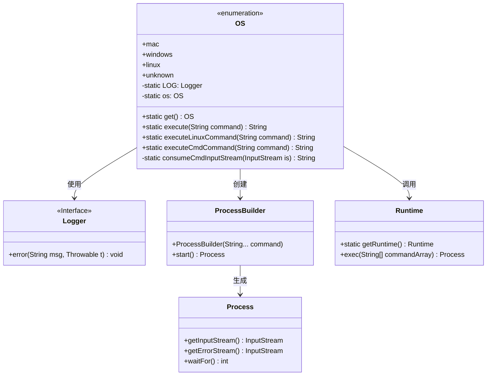
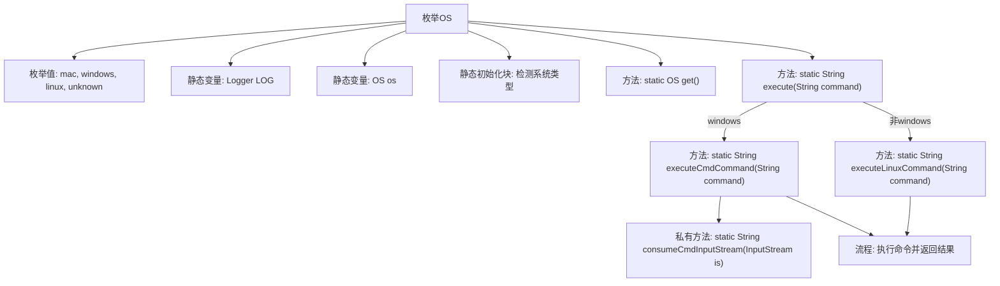
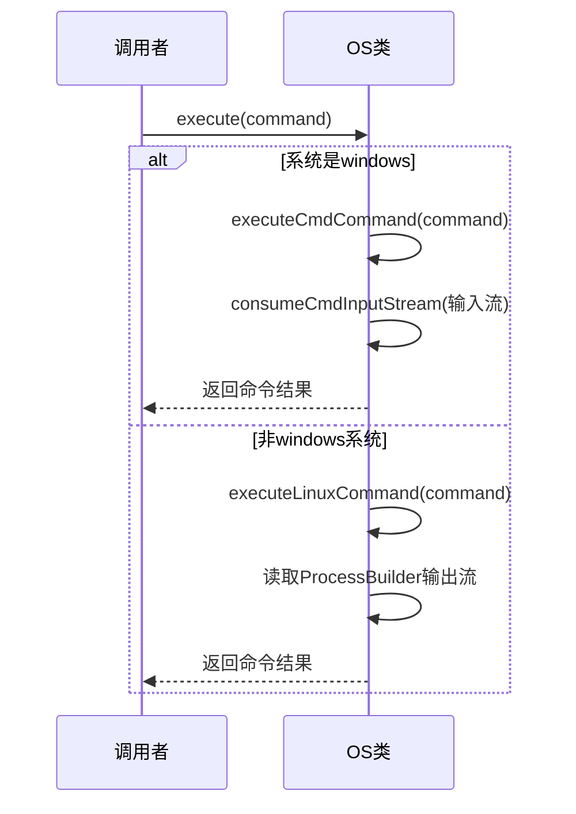

# 基础信息

|      |      |
|------|------|
| 名称 | OS |
| 编码语言 | .java |
| 代码路径 | WeFe/common/java/common-lang/src/main/java/com/welab/wefe/common/util/OS.java |
| 包名 | com.welab.wefe.common.util |
| 依赖项 | ['org.slf4j.Logger', 'org.slf4j.LoggerFactory', 'java.io.BufferedReader', 'java.io.IOException', 'java.io.InputStream', 'java.io.InputStreamReader', 'java.nio.charset.StandardCharsets'] |
| 概述说明 | 该代码定义了一个枚举类OS，包含mac、windows、linux和unknown四种操作系统类型。通过静态初始化块自动检测当前系统类型，并提供执行系统命令的方法，支持Windows和Linux/Mac的不同命令执行方式。 |

# 说明

该代码定义了一个枚举类OS，包含mac、windows、linux和unknown四个枚举值。通过静态初始化块检测当前操作系统类型并赋值给静态变量os。提供了get方法获取当前操作系统类型，以及execute方法执行系统命令，根据操作系统类型调用不同的命令执行方法。对于Linux系统使用sh执行命令，Windows系统则通过powershell执行。命令执行结果通过流读取并返回，错误信息会被记录到日志中。

# 类列表 Class Summary

| 名称   | 类型  | 说明 |
|-------|------|-------------|
| OS | enum | 定义枚举OS表示操作系统类型，包含mac、windows、linux和unknown。静态方法get()返回当前系统类型，execute()根据系统类型执行命令并返回结果，支持Linux和Windows命令执行。 |

## 类 OS

|      |      |
|------|------|
| 访问范围 | public |
| 类型 | enum |
| 名称 | OS |
| 说明 | 定义枚举OS表示操作系统类型，包含mac、windows、linux和unknown。静态方法get()返回当前系统类型，execute()根据系统类型执行命令并返回结果，支持Linux和Windows命令执行。 |

### UML类图

这段代码定义了一个枚举类`OS`，用于检测操作系统类型并提供跨平台的命令执行功能。类图展示了`OS`枚举与`Logger`接口、`ProcessBuilder`、`Process`和`Runtime`类的关系。`OS`通过静态方法`execute()`根据当前操作系统类型选择执行Windows的PowerShell命令或Linux的Shell命令，内部使用`ProcessBuilder`和`Runtime`来创建进程并处理命令输出，同时通过`Logger`记录错误信息。整个设计实现了操作系统类型的自动检测和跨平台命令执行的核心功能。

### 内部方法调用关系图

这段代码实现了一个跨平台的系统命令执行工具。OS枚举通过静态初始化块自动检测操作系统类型，并提供execute()方法统一执行命令。核心流程是：根据系统类型选择执行方式(windows用PowerShell/非windows用sh)，读取进程输出流，处理异常并返回结果。代码通过ProcessBuilder和Runtime两种方式处理不同平台命令，使用GBK编码解决中文乱码问题，并通过日志记录异常信息。

### 字段列表 Field List

| 名称  | 类型  | 说明 |
|-------|-------|------|

### 方法列表

| 名称  | 类型  | 说明 |
|-------|-------|------|

