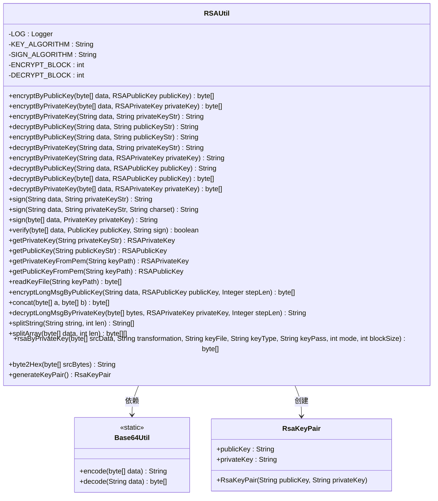
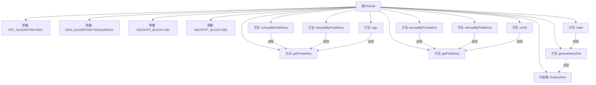

# 基础信息

|      |      |
|------|------|
| 名称 | RSAUtil |
| 编码语言 | .java |
| 代码路径 | WeFe/common/java/common-lang/src/main/java/com/welab/wefe/common/util/RSAUtil.java |
| 包名 | com.welab.wefe.common.util |
| 依赖项 | ['com.alibaba.fastjson.JSON', 'org.apache.commons.codec.binary.Base64', 'org.slf4j.Logger', 'org.slf4j.LoggerFactory', 'org.springframework.util.Base64Utils', 'javax.crypto.Cipher', 'java.io', 'java.nio.charset.StandardCharsets', 'java.security', 'java.security.interfaces.RSAPrivateKey', 'java.security.interfaces.RSAPublicKey', 'java.security.spec.PKCS8EncodedKeySpec', 'java.security.spec.X509EncodedKeySpec', 'java.util.Enumeration'] |
| 概述说明 | RSA工具类，提供公私钥加解密、签名验签、密钥转换及长文本分段处理功能，支持Base64编码。 |

# 说明

该代码实现了一个RSA加密工具类，包含密钥生成、加密解密、签名验签等功能。主要功能包括：使用公钥或私钥进行数据加密解密，支持分段处理大数据；提供字符串与密钥对象转换方法；实现SHA1withRSA签名算法；支持从PEM文件读取密钥；包含密钥对生成功能。类中定义了加密块大小常量，并处理了Base64编解码。工具类封装了完整的RSA操作流程，适用于各种加密场景。

# 类列表 Class Summary

| 名称   | 类型  | 说明 |
|-------|------|-------------|
| RSAUtil | class | RSA工具类，提供公私钥加密解密、签名验签、密钥生成及格式转换功能，支持分段处理长数据。 |

## 类 RSAUtil

|      |      |
|------|------|
| 访问范围 | public |
| 类型 | class |
| 名称 | RSAUtil |
| 说明 | RSA工具类，提供公私钥加密解密、签名验签、密钥生成及格式转换功能，支持分段处理长数据。 |

### UML类图

该代码实现了一个完整的RSA加密工具类，包含密钥生成、加密/解密、签名/验证等核心功能。类图展示了RSAUtil作为主类，通过静态方法提供各种加密操作，依赖Base64Util进行编码转换，并内嵌RsaKeyPair类存储密钥对。关键特性包括分段加密处理大文本、支持PEM格式密钥文件读取、提供多种加密模式（ECB/PKCS1Padding等），以及完整的异常处理机制。

### 内部方法调用关系图

该流程图展示了RSAUtil类的核心结构和主要方法调用关系。类包含4个加密相关常量、6个核心加解密方法（支持公钥/私钥的加密/解密）、2个签名验证方法、2个密钥转换方法、1个密钥对生成方法以及1个内部类RsaKeyPair。箭头表示方法间的调用依赖关系，例如encryptByPublicKey会调用getPublicKey进行密钥转换。整体结构清晰地反映了RSA非对称加密的实现逻辑，包括密钥处理、数据分块、Base64编解码等关键环节。

### 字段列表 Field List

| 名称  | 类型  | 说明 |
|-------|-------|------|
| KEY_ALGORITHM = "RSA" | String | 定义RSA算法的静态常量字符串KEY_ALGORITHM。 |
| LOG = LoggerFactory.getLogger(RSAUtil.class) | Logger | 定义RSAUtil类的私有静态日志常量LOG。 |
| DECRYPT_BLOCK = 256 | int | 私有静态常量DECRYPT_BLOCK值为256，用于解密块大小。 |
| SIGN_ALGORITHM = "SHA1withRSA" | String | 定义常量SIGN_ALGORITHM，值为SHA1withRSA签名算法。 |
| ENCRYPT_BLOCK = 245 | int | 加密块大小为245字节的私有静态常量。 |

### 方法列表

| 名称  | 类型  | 说明 |
|-------|-------|------|
| decryptByPublicKey | String | 使用公钥字符串解密数据，先转换为RSAPublicKey对象再调用解密方法。 |
| decryptLongMsgByPrivateKey | String | 使用RSA私钥分段解密长消息。根据步长或模数长度分组解密，拼接结果后返回。 |
| sign | String | 使用私钥对字节数组数据进行签名，返回Base64编码的签名结果。 |
| decryptByPublicKey | String | 使用RSA公钥分段解密Base64编码数据，支持PKCS1填充，返回UTF-8字符串。 |
| encryptByPublicKey | String | 使用RSA公钥加密数据，输入为字符串和公钥，输出Base64编码的加密结果。 |
| getPublicKeyFromPem | RSAPublicKey | 从PEM文件读取RSA公钥：读取文件内容，使用X509编码密钥规范，通过密钥工厂生成RSAPublicKey对象。 |
| encryptByPrivateKey | String | 使用私钥字符串加密数据，返回加密结果。 |
| encryptByPublicKey | byte[] | 使用RSA公钥加密数据，返回加密后的字节数组。 |
| decryptByPrivateKey | byte[] | 使用私钥解密数据，输入为字节数组和RSA私钥，返回解密后的字节数组。 |
| encryptByPrivateKey | String | 使用RSA私钥加密数据，分块处理并Base64编码返回结果。 |
| sign | String | 使用RSA私钥对数据进行签名，返回Base64编码的签名结果。 |
| decryptByPrivateKey | String | 使用RSA私钥解密数据，包括私钥转换、初始化解密器、Base64解码及UTF-8编码处理。 |
| encryptLongMsgByPublicKey | byte[] | 使用RSA公钥分段加密长文本，默认分块长度为模长/8减11，循环加密后合并结果返回字节数组。 |
| sign | String | 使用RSA私钥对数据进行签名，返回Base64编码的签名结果。 |
| getPublicKey | RSAPublicKey | 该方法将Base64编码的RSA公钥字符串转换为RSAPublicKey对象，使用X509标准解码并生成密钥。 |
| verify | boolean | 验证数据签名的方法：使用公钥和指定算法检查数据与签名是否匹配，返回布尔结果。 |
| concat | byte[] | 静态方法concat合并两个字节数组a和b，返回新数组c，长度等于a加b，使用System.arraycopy依次复制a和b到c中。 |
| decryptByPublicKey | byte[] | 使用RSA公钥解密数据：传入加密数据和公钥，初始化Cipher为解密模式，执行解密并返回结果。 |
| getPrivateKeyFromPem | RSAPrivateKey | 从PEM文件读取RSA私钥，使用PKCS8编码规范生成RSAPrivateKey对象。 |
| readKeyFile | byte[] | 读取密钥文件，过滤以'-'开头的行，返回Base64解码后的字节数组。若文件不存在或读取错误则抛出异常。 |
| getPrivateKey | RSAPrivateKey | 该方法从Base64编码的私钥字符串生成RSA私钥对象，使用PKCS8规范解码并通过密钥工厂转换。 |
| splitString | String[] | 将字符串按指定长度分割成数组，处理余数部分，返回分割后的字符串数组。 |
| splitArray | byte[][] | 将字节数组按指定长度分割成二维数组，处理余数部分，返回分割后的结果。 |
| rsaByPrivateKey | byte[] | 使用私钥对数据进行RSA加密或解密，支持分块处理，需提供密钥文件、类型、密码及操作模式。 |
| encryptByPrivateKey | byte[] | 使用RSA私钥加密数据，返回加密后的字节数组。需传入数据和私钥，可能抛出异常。 |
| byte2Hex | String | 将字节数组转换为十六进制字符串，每个字节转为两位十六进制数，不足补零。 |
| generateKeyPair | RsaKeyPair | 生成RSA密钥对，公钥和私钥经Base64编码后返回。若算法不支持则返回null。密钥长度2048位。 |
| main | void | Java主方法生成RSA密钥对并输出JSON格式结果。 |

