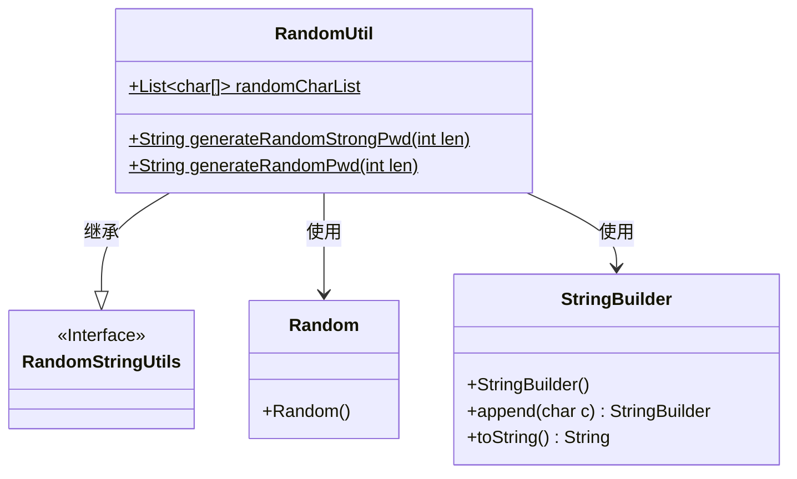
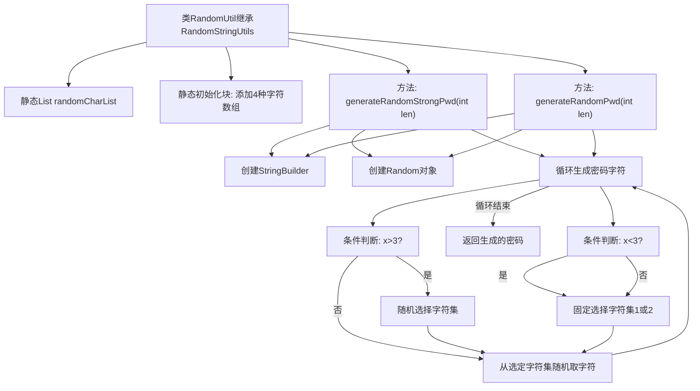

# 基础信息

|      |      |
|------|------|
| 名称 | RandomUtil |
| 编码语言 | .java |
| 代码路径 | WeFe/common/java/common-lang/src/main/java/com/welab/wefe/common/util/RandomUtil.java |
| 包名 | com.welab.wefe.common.util |
| 依赖项 | ['org.apache.commons.lang3.RandomStringUtils', 'java.util'] |
| 概述说明 | RandomUtil类提供生成随机密码功能，包含强密码和普通密码两种方法。强密码混合大小写字母、数字和特殊字符，普通密码仅使用小写字母和数字。 |

# 说明

RandomUtil类继承RandomStringUtils，用于生成随机密码。包含静态字符数组列表randomCharList，初始化时添加大写字母、小写字母、数字和特殊符号四种字符集。提供两个方法：generateRandomStrongPwd生成强密码，前四位分别取自不同字符集，后续随机选择字符集；generateRandomPwd生成普通密码，前三位取自小写字母，后续取自数字。两者均接收长度参数，使用Random类实现随机选择。

# 类列表 Class Summary

| 名称   | 类型  | 说明 |
|-------|------|-------------|
| RandomUtil | class | RandomUtil类提供生成随机密码功能，包含大小写字母、数字和特殊字符。generateRandomStrongPwd生成强密码，确保前四位包含每种字符类型；generateRandomPwd生成普通密码，仅使用小写字母和数字。 |

## 类 RandomUtil

|      |      |
|------|------|
| 访问范围 | public |
| 类型 | class |
| 名称 | RandomUtil |
| 说明 | RandomUtil类提供生成随机密码功能，包含大小写字母、数字和特殊字符。generateRandomStrongPwd生成强密码，确保前四位包含每种字符类型；generateRandomPwd生成普通密码，仅使用小写字母和数字。 |

### UML类图

这段代码展示了一个随机密码生成工具类RandomUtil，它继承自RandomStringUtils接口。类中包含一个静态的字符列表randomCharList，用于存储大写字母、小写字母、数字和特殊符号四种字符集。提供了两个主要方法：generateRandomStrongPwd生成强密码（从所有字符集中随机选取），generateRandomPwd生成普通密码（仅从小写字母和数字中选取）。类依赖于Java的Random类进行随机数生成，并使用StringBuilder构建密码字符串。

### 内部方法调用关系图

这段代码实现了一个随机密码生成工具类，包含两种密码生成方法。静态初始化块预加载了4种字符集(大写字母、小写字母、数字和特殊符号)。generateRandomStrongPwd方法会随机混合所有字符集生成强密码，而generateRandomPwd方法仅使用小写字母和数字生成普通密码。流程图清晰展示了类结构、初始化过程和两种密码生成方法的逻辑流程，包括循环、条件判断和字符选择等关键步骤。

### 字段列表 Field List

| 名称  | 类型  | 说明 |
|-------|-------|------|
| randomCharList = new ArrayList<>() | List<char[]> | 声明一个静态公共列表randomCharList，用于存储字符数组。 |

### 方法列表

| 名称  | 类型  | 说明 |
|-------|-------|------|
| generateRandomStrongPwd | String | 生成随机强密码的方法，前4字符固定位置选取，后续字符随机选取，返回指定长度的密码字符串。 |
| generateRandomPwd | String | 生成随机密码，前3位为特定字符，其余为另一组字符，长度由参数指定。 |

