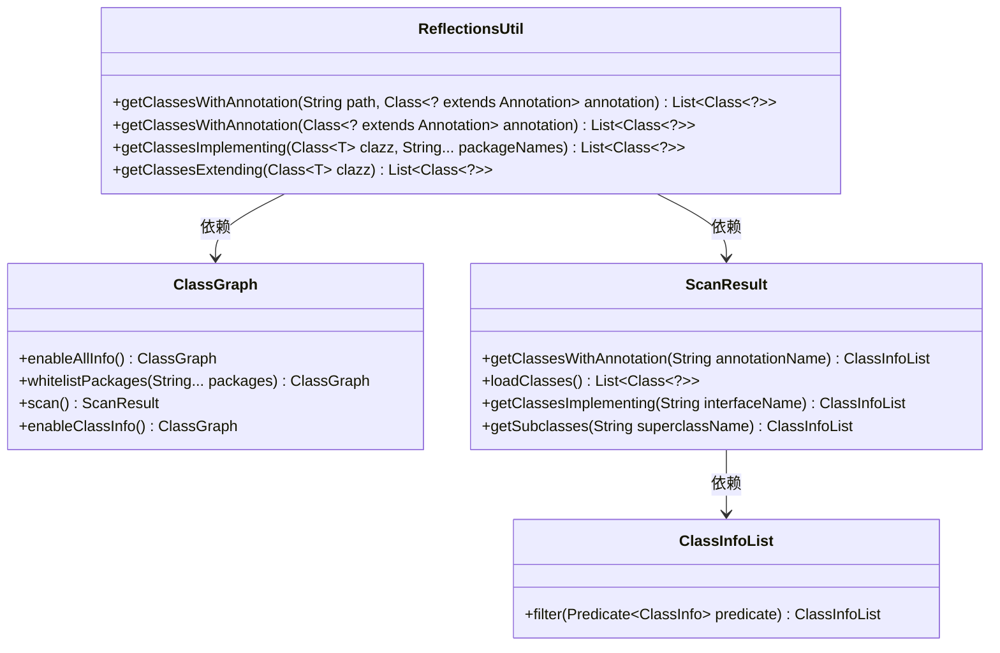
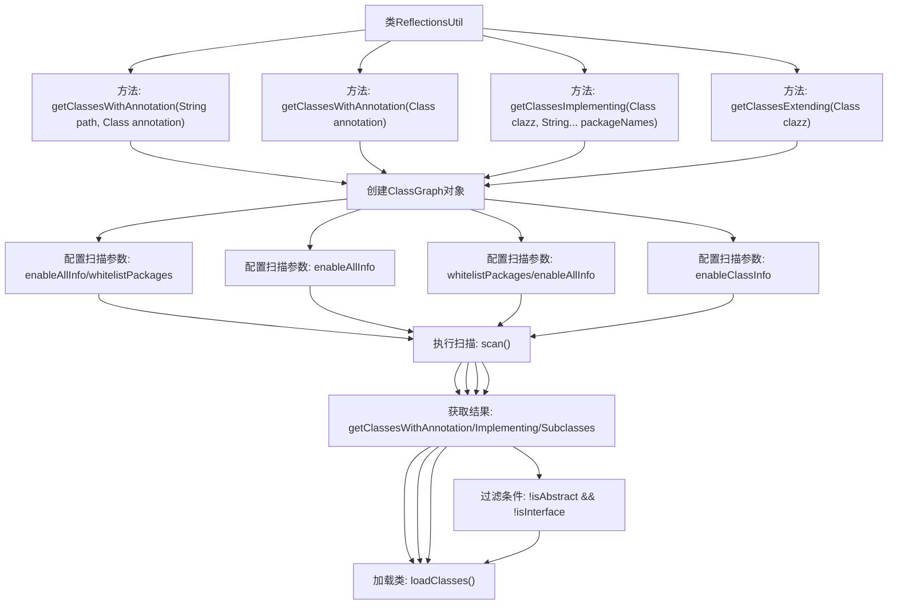

# 基础信息

|      |      |
|------|------|
| 名称 | ReflectionsUtil |
| 编码语言 | .java |
| 代码路径 | WeFe/common/java/common-lang/src/main/java/com/welab/wefe/common/util/ReflectionsUtil.java |
| 包名 | com.welab.wefe.common.util |
| 依赖项 | ['io.github.classgraph.ClassGraph', 'io.github.classgraph.ScanResult', 'java.lang.annotation.Annotation', 'java.util.List'] |
| 概述说明 | ReflectionsUtil类提供四个静态方法：通过注解扫描类、获取接口实现类和子类，使用ClassGraph库实现类路径扫描。 |

# 说明

ReflectionsUtil是一个Java工具类，提供基于ClassGraph库的反射扫描功能。包含四个核心方法：1.扫描指定包路径下包含特定注解的类；2.扫描全路径下包含特定注解的类；3.获取指定接口在特定包下的实现类；4.获取指定类型的非抽象非接口子类。所有方法都使用try-with-resources确保ScanResult资源自动释放，通过ClassGraph构建扫描条件并加载匹配的类信息。

# 类列表 Class Summary

| 名称   | 类型  | 说明 |
|-------|------|-------------|
| ReflectionsUtil | class | ReflectionsUtil类提供四个静态方法：通过注解扫描类、获取接口实现类和指定类型子类，均使用ClassGraph库实现。 |

## 类 ReflectionsUtil

|      |      |
|------|------|
| 访问范围 | public |
| 类型 | class |
| 名称 | ReflectionsUtil |
| 说明 | ReflectionsUtil类提供四个静态方法：通过注解扫描类、获取接口实现类和指定类型子类，均使用ClassGraph库实现。 |

### UML类图

这段代码展示了ReflectionsUtil工具类，它通过ClassGraph库实现类路径扫描功能，包含四种核心方法：通过注解查找类、获取接口实现类和获取类型子类。类图清晰地展示了工具类与ClassGraph库的交互关系，ScanResult处理扫描结果，ClassInfoList提供过滤功能，形成一个完整的类扫描工具链。所有方法都采用try-with-resources确保资源释放，体现了良好的资源管理实践。

### 内部方法调用关系图

这段代码流程图展示了ReflectionsUtil工具类的四个核心反射操作方法。所有方法都基于ClassGraph库实现类路径扫描，通过不同配置参数实现三种功能：获取带注解的类、获取接口实现类和获取类型子类。每个方法都遵循"创建扫描器→配置参数→执行扫描→处理结果"的标准流程，其中getClassesExtending方法额外包含抽象类和接口的过滤逻辑。方法间共享相似的扫描框架但参数配置各异，体现了策略模式的设计思想。

### 字段列表 Field List

| 名称  | 类型  | 说明 |
|-------|-------|------|

### 方法列表

| 名称  | 类型  | 说明 |
|-------|-------|------|
| getClassesWithAnnotation | List<Class<?>> | 扫描指定路径下带有特定注解的类，返回类列表。使用ClassGraph库实现，自动关闭资源。 |
| getClassesWithAnnotation | List<Class<?>> | 扫描类路径，返回带有指定注解的所有类。使用ClassGraph库扫描并加载类信息，自动管理资源。 |
| getClassesImplementing | List<Class<?>> | 该方法扫描指定包中实现给定接口或父类的所有类，返回类对象列表。使用ClassGraph库进行类路径扫描，支持多包名过滤。 |
| getClassesExtending | List<Class<?>> | 获取指定类的所有非抽象、非接口子类。使用ClassGraph扫描并过滤结果，返回符合条件的类列表。 |

