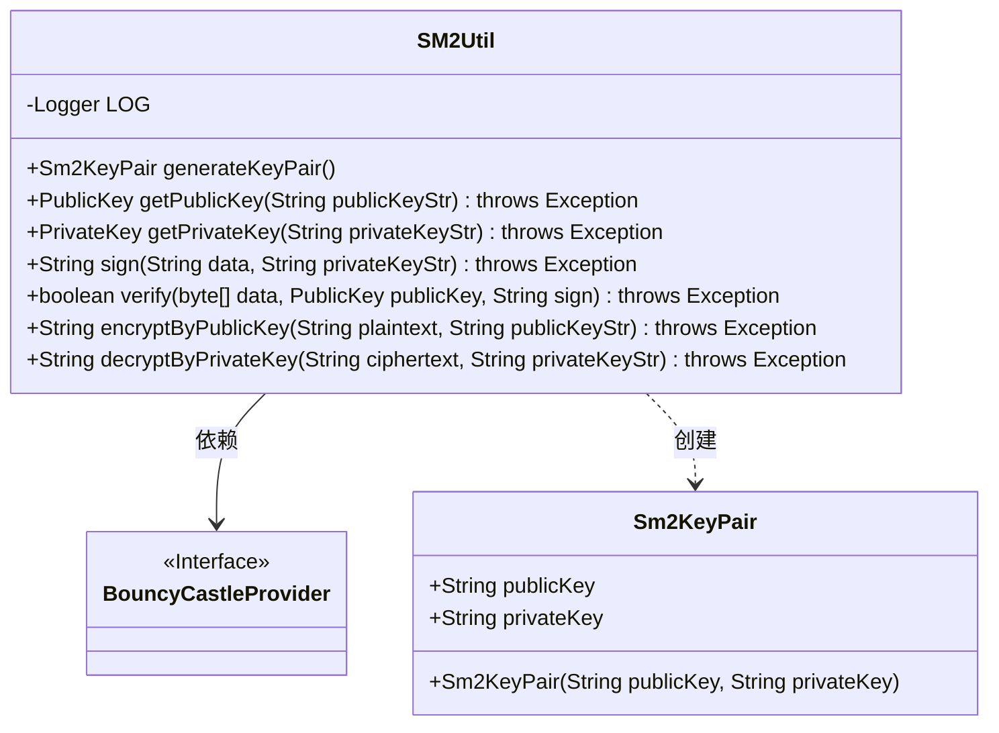

# 基础信息

|      |      |
|------|------|
| 名称 | SM2Util |
| 编码语言 | .java |
| 代码路径 | WeFe/common/java/common-lang/src/main/java/com/welab/wefe/common/util/SM2Util.java |
| 包名 | com.welab.wefe.common.util |
| 依赖项 | ['org.apache.commons.codec.binary.Base64', 'org.bouncycastle.asn1.gm.GMNamedCurves', 'org.bouncycastle.asn1.gm.GMObjectIdentifiers', 'org.bouncycastle.asn1.x9.X9ECParameters', 'org.bouncycastle.crypto.engines.SM2Engine', 'org.bouncycastle.crypto.params.ECDomainParameters', 'org.bouncycastle.crypto.params.ECPrivateKeyParameters', 'org.bouncycastle.crypto.params.ECPublicKeyParameters', 'org.bouncycastle.crypto.params.ParametersWithRandom', 'org.bouncycastle.jcajce.provider.asymmetric.ec.BCECPrivateKey', 'org.bouncycastle.jcajce.provider.asymmetric.ec.BCECPublicKey', 'org.bouncycastle.jce.provider.BouncyCastleProvider', 'org.bouncycastle.jce.spec.ECParameterSpec', 'org.bouncycastle.math.ec.ECPoint', 'org.bouncycastle.util.encoders.Hex', 'org.slf4j.Logger', 'org.slf4j.LoggerFactory', 'java.math.BigInteger', 'java.nio.charset.StandardCharsets', 'java.security', 'java.security.spec.ECGenParameterSpec', 'org.bouncycastle.jce.spec.ECPrivateKeySpec', 'org.bouncycastle.jce.spec.ECPublicKeySpec'] |
| 概述说明 | SM2Util类提供SM2国密算法工具，包括密钥生成、公私钥转换、签名验签、公钥加密和私钥解密功能，基于BouncyCastle实现。 |

# 说明

SM2Util类实现了国密SM2算法的密钥生成、格式转换、签名验签及加解密功能。静态初始化块确保BouncyCastle安全提供者已注册。generateKeyPair方法生成SM2密钥对，返回十六进制字符串格式的公私钥。内部类Sm2KeyPair封装密钥对。getPublicKey/getPrivateKey实现字符串与密钥对象的双向转换。sign/verify方法提供基于SM3杂凑的签名验签功能。encryptByPublicKey/decryptByPrivateKey采用C1C3C2模式实现SM2非对称加解密，均使用Base64编码传输数据。所有操作均依赖BouncyCastle密码库实现。

# 类列表 Class Summary

| 名称   | 类型  | 说明 |
|-------|------|-------------|
| SM2Util | class | SM2Util类提供SM2国密算法工具，包括密钥对生成、公私钥转换、签名验签、公钥加密和私钥解密功能，基于BouncyCastle实现。 |

## 类 SM2Util

|      |      |
|------|------|
| 访问范围 | public |
| 类型 | class |
| 名称 | SM2Util |
| 说明 | SM2Util类提供SM2国密算法工具，包括密钥对生成、公私钥转换、签名验签、公钥加密和私钥解密功能，基于BouncyCastle实现。 |

### UML类图

该代码是一个SM2加密工具类，主要功能包括生成密钥对、公钥/私钥格式转换、签名/验签、加密/解密等操作。类图中包含SM2Util主工具类及其内部类Sm2KeyPair，同时依赖于BouncyCastleProvider加密库接口。SM2Util通过静态方法提供完整的SM2国密算法实现，涉及密钥管理、数据加密和数字签名等核心密码学操作。

### 内部方法调用关系图

```mermaid
graph TD
    A["类SM2Util"]
    B["静态块: 注册BouncyCastleProvider"]
    C["方法: generateKeyPair()"]
    D["内部类: Sm2KeyPair"]
    E["方法: getPublicKey(String)"]
    F["方法: getPrivateKey(String)"]
    G["方法: sign(String, String)"]
    H["方法: verify(byte[], PublicKey, String)"]
    I["方法: encryptByPublicKey(String, String)"]
    J["方法: decryptByPrivateKey(String, String)"]

    A --> B
    A --> C
    A --> D
    A --> E
    A --> F
    A --> G
    A --> H
    A --> I
    A --> J

    C --> C1["创建ECGenParameterSpec"]
    C --> C2["初始化KeyPairGenerator"]
    C --> C3["生成密钥对"]
    C --> C4["转换密钥格式"]
    C --> C5["返回Sm2KeyPair"]

    E --> E1["获取椭圆曲线参数"]
    E --> E2["解码公钥字符串"]
    E --> E3["生成PublicKey对象"]

    F --> F1["转换私钥字符串"]
    F --> F2["生成PrivateKey对象"]

    G --> G1["获取Signature实例"]
    G --> G2["初始化签名"]
    G --> G3["生成签名"]
    G --> G4["返回Base64编码"]

    H --> H1["获取Signature实例"]
    H --> H2["初始化验证"]
    H --> H3["执行验证"]

    I --> I1["获取PublicKey对象"]
    I --> I2["初始化SM2Engine"]
    I --> I3["执行加密"]
    I --> I4["返回Base64编码"]

    J --> J1["获取PrivateKey对象"]
    J --> J2["初始化SM2Engine"]
    J --> J3["执行解密"]
    J --> J4["返回解密结果"]
```

该流程图展示了SM2Util类的完整结构，主要包含密钥生成、格式转换、签名验证和加解密等核心功能。静态块确保BouncyCastleProvider的注册，generateKeyPair()方法实现SM2密钥对生成，内部类Sm2KeyPair封装公私钥字符串。其他方法分别处理公钥/私钥格式转换、数据签名/验证以及基于SM2算法的加密/解密操作，形成完整的国密算法工具链。各方法内部流程清晰展示了从参数准备到核心操作再到结果返回的处理链条。

### 字段列表 Field List

| 名称  | 类型  | 说明 |
|-------|-------|------|
| LOG = LoggerFactory.getLogger(IpAddressUtil.class) | Logger | IpAddressUtil类中定义了一个静态不可变的日志记录器LOG。 |

### 方法列表

| 名称  | 类型  | 说明 |
|-------|-------|------|
| generateKeyPair | Sm2KeyPair | 生成SM2密钥对，包含公钥和私钥的十六进制字符串。使用BouncyCastle库实现，异常时返回null。 |
| sign | String | 该方法使用SM2算法和SM3哈希对输入数据签名。传入数据和私钥字符串，返回Base64编码的签名结果。 |
| getPrivateKey | PrivateKey | 该方法将HEX格式的SM2私钥字符串转换为BCECPrivateKey对象，使用BouncyCastle库处理椭圆曲线参数。 |
| getPublicKey | PublicKey | 该方法通过公钥字符串生成SM2椭圆曲线公钥对象，包括解析曲线参数、解码公钥点并转换为BCECPublicKey实例。 |
| verify | boolean | SM2签名验证方法，使用SM3哈希和BouncyCastle库，传入数据、公钥和签名，返回验证结果。 |
| encryptByPublicKey | String | 使用SM2公钥加密明文，生成Base64编码的密文。 |
| decryptByPrivateKey | String | 使用SM2算法和私钥解密字符串，涉及密钥参数转换、Base64解码及解密处理。 |

