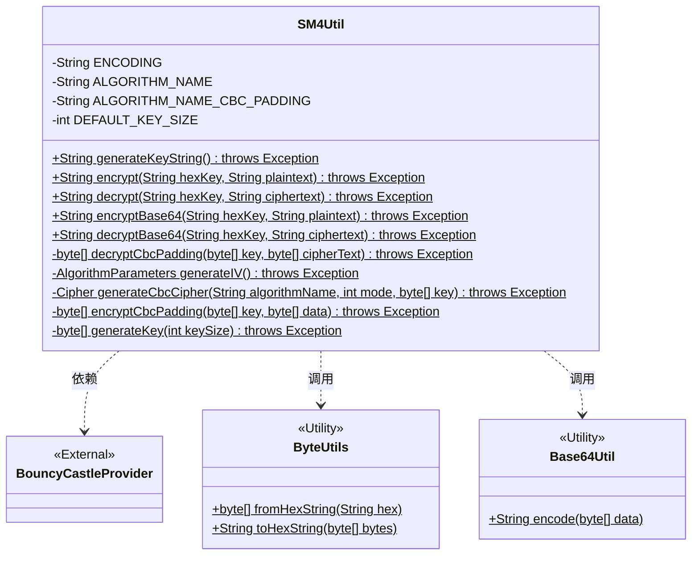
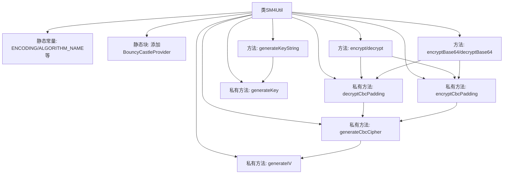
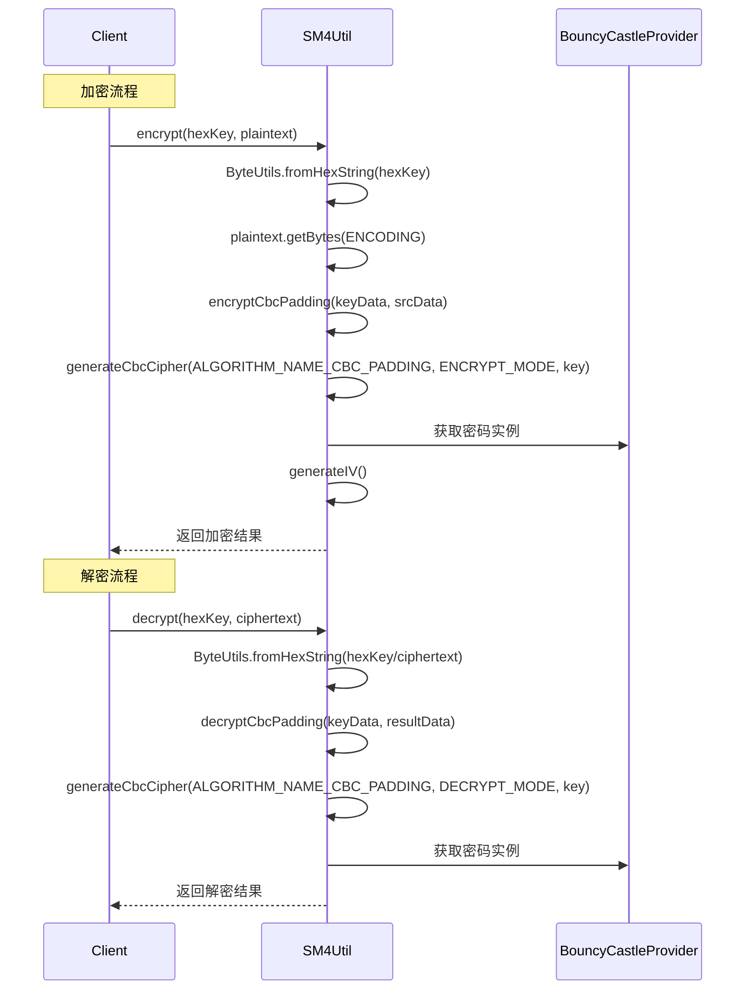

# 基础信息

|      |      |
|------|------|
| 名称 | SM4Util |
| 编码语言 | .java |
| 代码路径 | WeFe/common/java/common-lang/src/main/java/com/welab/wefe/common/util/SM4Util.java |
| 包名 | com.welab.wefe.common.util |
| 依赖项 | ['org.apache.commons.codec.binary.Base64', 'org.apache.commons.codec.binary.Hex', 'org.bouncycastle.jce.provider.BouncyCastleProvider', 'org.bouncycastle.pqc.math.linearalgebra.ByteUtils', 'javax.crypto.Cipher', 'javax.crypto.KeyGenerator', 'javax.crypto.spec.IvParameterSpec', 'javax.crypto.spec.SecretKeySpec', 'java.security.AlgorithmParameters', 'java.security.Key', 'java.security.SecureRandom', 'java.security.Security', 'java.util.Arrays'] |
| 概述说明 | SM4Util类提供SM4加密功能，支持CBC模式，包含密钥生成、加解密方法，支持十六进制和Base64格式。 |

# 说明

SM4Util是一个用于SM4加密解密的工具类，支持CBC模式，使用PKCS5Padding填充。主要功能包括生成128位密钥字符串、十六进制和Base64格式的加密解密。加密解密使用UTF-8编码，密钥为十六进制字符串（不区分大小写）。内部使用BouncyCastleProvider，通过Cipher实现CBC模式的加密解密，初始化向量IV全零。提供生成密钥、CBC模式加密解密及Base64编解码功能。

# 类列表 Class Summary

| 名称   | 类型  | 说明 |
|-------|------|-------------|
| SM4Util | class | SM4Util类提供SM4加密功能，支持CBC模式，包含密钥生成、加解密方法，支持十六进制和Base64格式。 |

## 类 SM4Util

|      |      |
|------|------|
| 访问范围 | public |
| 类型 | class |
| 名称 | SM4Util |
| 说明 | SM4Util类提供SM4加密功能，支持CBC模式，包含密钥生成、加解密方法，支持十六进制和Base64格式。 |

### UML类图

该图展示了SM4Util加密工具类的结构，它是一个静态工具类，提供SM4算法的密钥生成、CBC模式加解密及Base64编码功能。类中包含私有常量定义和9个核心方法，其中5个是公开的静态加密/解密方法，4个是私有辅助方法。该类依赖BouncyCastleProvider安全库，并调用ByteUtils和Base64Util两个工具类进行数据格式转换。所有方法都声明可能抛出异常，体现了加密操作的不确定性。

### 内部方法调用关系图

该流程图展示了SM4Util加密工具类的完整结构，包含常量定义、密钥生成、CBC模式加解密等核心功能。时序图详细描述了加密/解密过程中各组件间的交互顺序，特别是与BouncyCastleProvider的安全服务交互过程。类设计采用分层结构，公开方法依赖底层私有方法实现SM4算法操作，所有加密操作均使用CBC模式和PKCS5填充方案，体现了完整的国密算法实现规范。

### 字段列表 Field List

| 名称  | 类型  | 说明 |
|-------|-------|------|
| DEFAULT_KEY_SIZE = 128 | int | 定义默认密钥大小为128位。 |
| ALGORITHM_NAME = "SM4" | String | 代码定义了一个私有静态常量字符串ALGORITHM_NAME，值为"SM4"，表示使用SM4加密算法。 |
| ALGORITHM_NAME_CBC_PADDING = "SM4/CBC/PKCS5Padding" | String | SM4算法CBC模式，使用PKCS5填充方式。 |
| ENCODING = "UTF-8" | String | 定义UTF-8编码的静态常量字符串。 |

### 方法列表

| 名称  | 类型  | 说明 |
|-------|-------|------|
| generateKeyString | String | 生成十六进制格式的随机密钥字符串，默认长度，可能抛出异常。 |
| encryptCbcPadding | byte[] | 使用CBC模式和填充对数据进行加密，接收密钥和数据，返回加密结果。 |
| encrypt | String | Java方法：使用十六进制密钥对明文进行CBC模式加密，返回十六进制密文。 |
| generateIV | AlgorithmParameters | 生成16字节全零初始化向量(IV)，封装为AlgorithmParameters对象返回。 |
| generateCbcCipher | Cipher | 生成CBC模式加密/解密工具：使用指定算法和密钥初始化Cipher，并自动生成IV。返回配置好的Cipher实例。 |
| generateKey | byte[] | 生成指定长度的加密密钥字节数组，使用BouncyCastle安全随机数生成器。 |
| decryptBase64 | String | 静态方法decryptBase64接收hexKey和ciphertext，将hexKey转为字节数组，解码Base64密文，用CBC模式解密后返回字符串。 |
| encryptBase64 | String | Java方法：使用Base64加密，输入16进制密钥和明文，输出加密后的Base64字符串。 |
| decryptCbcPadding | byte[] | 私有方法解密CBC填充数据，使用指定密钥和密文，返回解密结果。 |
| decrypt | String | Java解密方法：输入十六进制密钥和密文，输出解密后的字符串。使用CBC模式和填充解密，返回指定编码的字符串。 |

