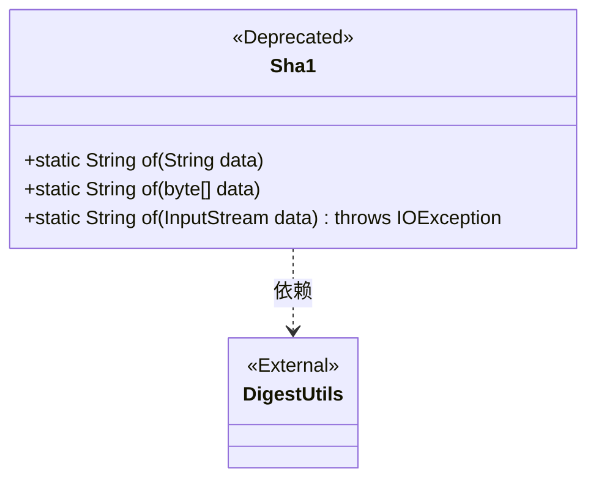
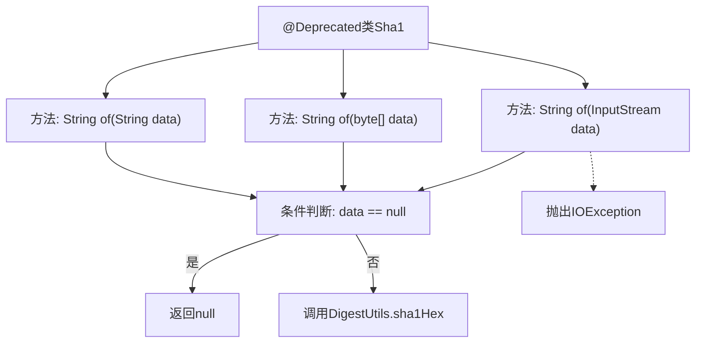

# 基础信息

|      |      |
|------|------|
| 名称 | Sha1 |
| 编码语言 | .java |
| 代码路径 | WeFe/common/java/common-lang/src/main/java/com/welab/wefe/common/util/Sha1.java |
| 包名 | com.welab.wefe.common.util |
| 依赖项 | ['org.apache.commons.codec.digest.DigestUtils', 'java.io.IOException', 'java.io.InputStream'] |
| 概述说明 | 废弃的Sha1类，提供三种静态方法计算字符串、字节数组和输入流的SHA-1哈希值，内部调用DigestUtils.sha1Hex实现。 |

# 说明

这是一个已弃用的Java类Sha1，提供了三种静态方法用于生成字符串、字节数组或输入流的SHA-1哈希值。方法均使用DigestUtils.sha1Hex实现，对null输入返回null，输入流方法可能抛出IOException。

# 类列表 Class Summary

| 名称   | 类型  | 说明 |
|-------|------|-------------|
| Sha1 | class | 废弃的Sha1类，提供三种静态方法计算字符串、字节数组和输入流的SHA1哈希值，内部调用DigestUtils.sha1Hex实现，输入为null时返回null。 |

## 类 Sha1

|      |      |
|------|------|
| 访问范围 | @Deprecated;public |
| 类型 | class |
| 名称 | Sha1 |
| 说明 | 废弃的Sha1类，提供三种静态方法计算字符串、字节数组和输入流的SHA1哈希值，内部调用DigestUtils.sha1Hex实现，输入为null时返回null。 |

### UML类图

类图描述：  
Sha1类是一个被标记为@Deprecated的实用工具类，提供三种静态方法重载，用于计算不同输入类型(String/byte[]/InputStream)的SHA-1哈希值。所有方法都委托给Apache Commons的DigestUtils工具类实现，并在输入为null时返回null。InputStream版本可能抛出IOException异常。类图中明确展示了Sha1对第三方DigestUtils的依赖关系。

### 内部方法调用关系图

这段代码展示了一个标记为@Deprecated的Sha1工具类，包含三个重载的静态方法，分别处理String、byte[]和InputStream类型的数据。每个方法首先检查输入是否为null，如果是则返回null，否则调用Apache Commons Codec库的DigestUtils.sha1Hex方法生成SHA-1哈希值。InputStream版本可能抛出IOException异常。流程图清晰展示了类结构与方法逻辑分支，特别突出了空值检查的核心逻辑和异常处理路径。

### 字段列表 Field List

| 名称  | 类型  | 说明 |
|-------|-------|------|

### 方法列表

| 名称  | 类型  | 说明 |
|-------|-------|------|
| of | String | 该方法接收字节数组，若为空返回null，否则返回其SHA-1哈希值的十六进制字符串。 |
| of | String | 该方法接收字符串参数data，若为null则返回null，否则返回其SHA-1哈希值。 |
| of | String | 该方法接收输入流参数，若为空则返回null，否则计算并返回其SHA-1哈希值的十六进制字符串。可能抛出IOException异常。 |

