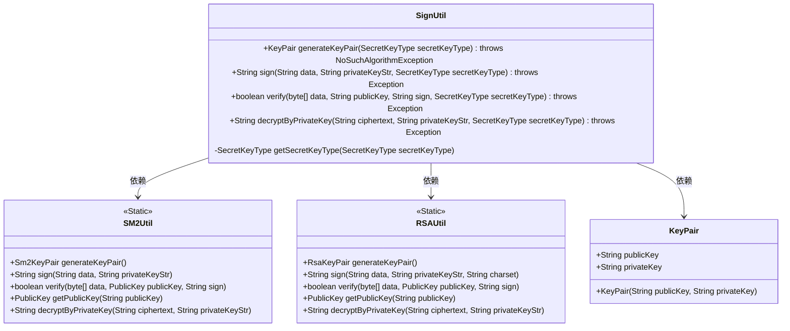
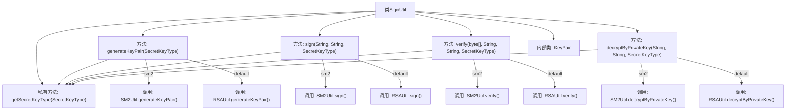

# 基础信息

|      |      |
|------|------|
| 名称 | SignUtil |
| 编码语言 | .java |
| 代码路径 | WeFe/common/java/common-lang/src/main/java/com/welab/wefe/common/util/SignUtil.java |
| 包名 | com.welab.wefe.common.util |
| 依赖项 | ['com.welab.wefe.common.constant.SecretKeyType', 'java.nio.charset.StandardCharsets', 'java.security.NoSuchAlgorithmException'] |
| 概述说明 | SignUtil类提供密钥对生成、签名、验签及解密功能，支持SM2和RSA算法。默认使用RSA，未指定类型时自动选择RSA。包含KeyPair内部类存储公私钥。 |

# 说明

SignUtil类提供密钥生成、签名、验签和私钥解密功能。支持SM2和RSA两种算法，默认使用RSA。generateKeyPair方法生成密钥对；sign方法用私钥对数据签名；verify方法用公钥验证签名；decryptByPrivateKey方法用私钥解密数据。内部类KeyPair封装公钥和私钥字符串。getSecretKeyType方法处理密钥类型为空的情况。

# 类列表 Class Summary

| 名称   | 类型  | 说明 |
|-------|------|-------------|
| SignUtil | class | SignUtil类提供密钥对生成、签名、验签及解密功能，支持SM2和RSA算法。默认使用RSA，包含KeyPair内部类存储公私钥。 |

## 类 SignUtil

|      |      |
|------|------|
| 访问范围 | public |
| 类型 | class |
| 名称 | SignUtil |
| 说明 | SignUtil类提供密钥对生成、签名、验签及解密功能，支持SM2和RSA算法。默认使用RSA，包含KeyPair内部类存储公私钥。 |

### UML类图

该代码实现了一个签名工具类SignUtil，提供密钥对生成、签名、验签和私钥解密功能，支持SM2和RSA两种加密算法。SignUtil通过静态方法调用SM2Util和RSAUtil的具体实现，根据传入的SecretKeyType动态选择加密算法。KeyPair作为内部类存储公钥和私钥字符串。类图展示了SignUtil与SM2Util、RSAUtil的依赖关系，以及KeyPair的内部结构，体现了策略模式的设计思想。

### 内部方法调用关系图

这段代码是用于处理加密签名的工具类，主要功能包括生成密钥对、数据签名、签名验证以及私钥解密。它支持两种加密算法（SM2和RSA），通过SecretKeyType参数动态选择算法实现。内部类KeyPair用于封装公钥和私钥，私有方法getSecretKeyType处理密钥类型的默认值逻辑。所有公开方法都通过switch语句路由到对应的SM2Util或RSAUtil工具类实现具体功能。

### 字段列表 Field List

| 名称  | 类型  | 说明 |
|-------|-------|------|

### 方法列表

| 名称  | 类型  | 说明 |
|-------|-------|------|
| generateKeyPair | KeyPair | 静态方法generateKeyPair根据密钥类型生成SM2或RSA密钥对，返回包含公钥和私钥的KeyPair对象。默认使用RSA算法。 |
| verify | boolean | 静态方法verify根据密钥类型验证数据签名，支持SM2和RSA算法，默认使用RSA。 |
| decryptByPrivateKey | String | 静态方法decryptByPrivateKey根据密钥类型选择SM2或RSA私钥解密，参数为密文、私钥字符串和密钥类型枚举，异常抛出给调用方处理。 |
| sign | String | 静态方法sign根据密钥类型选择SM2或RSA签名，默认使用RSA。参数为数据、私钥和密钥类型，可能抛出异常。 |
| getSecretKeyType | SecretKeyType | 方法返回默认RSA密钥类型或传入的密钥类型。若参数为null则返回RSA。 |

