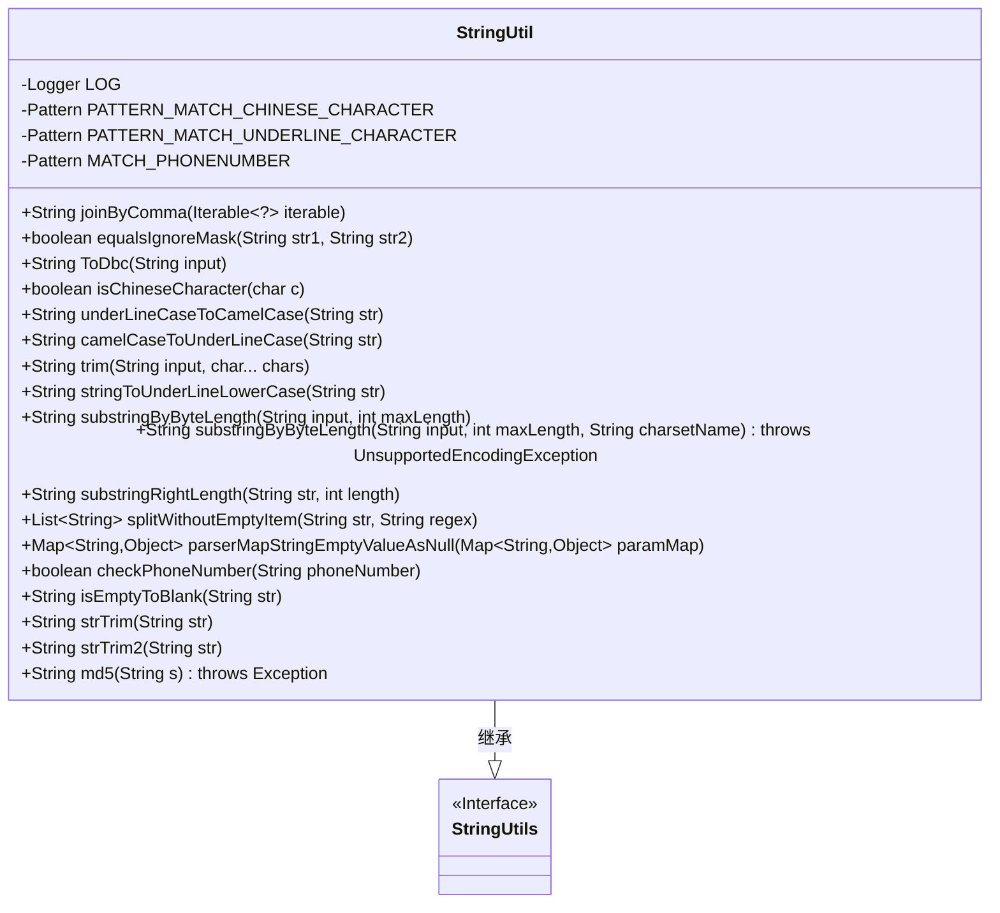

# 基础信息

|      |      |
|------|------|
| 名称 | StringUtil |
| 编码语言 | .java |
| 代码路径 | WeFe/common/java/common-lang/src/main/java/com/welab/wefe/common/util/StringUtil.java |
| 包名 | com.welab.wefe.common.util |
| 依赖项 | ['com.welab.wefe.common.function.CharFunction', 'org.apache.commons.lang3.StringUtils', 'org.slf4j.Logger', 'org.slf4j.LoggerFactory', 'java.io.UnsupportedEncodingException', 'java.nio.charset.StandardCharsets', 'java.security.MessageDigest', 'java.util.ArrayList', 'java.util.List', 'java.util.Map', 'java.util.regex.Matcher', 'java.util.regex.Pattern'] |
| 概述说明 | StringUtil工具类提供字符串处理功能，包括中文字符匹配、下划线驼峰互转、全半角转换、字符串拼接、掩码比较、手机号校验、MD5加密等。 |

# 说明

StringUtil类是一个字符串处理工具类，继承自StringUtils。它提供了多种字符串操作方法，包括：中文字符匹配、下划线匹配、手机号格式校验、列表拼接为逗号分隔字符串、忽略掩码比较字符串、全角半角字符转换、中文字符检查、下划线与驼峰命名互转、字符串修剪、按字节长度截取字符串、字符串分割去空、Map空值处理、手机号校验、空字符串处理、MD5加密等功能。该类封装了常用的字符串操作，提高了代码复用性和开发效率。

# 类列表 Class Summary

| 名称   | 类型  | 说明 |
|-------|------|-------------|
| StringUtil | class | StringUtil工具类提供字符串处理功能，包括中文匹配、下划线驼峰互转、全半角转换、字符串拼接、掩码比较、手机号校验、MD5加密、空格修剪及按字节截取等。 |

## 类 StringUtil

|      |      |
|------|------|
| 访问范围 | public |
| 类型 | class |
| 名称 | StringUtil |
| 说明 | StringUtil工具类提供字符串处理功能，包括中文匹配、下划线驼峰互转、全半角转换、字符串拼接、掩码比较、手机号校验、MD5加密、空格修剪及按字节截取等。 |

### UML类图

类图描述：StringUtil 类继承自 StringUtils 接口，提供了丰富的字符串处理功能，包括字符串连接、比较、格式转换（如全角/半角转换、驼峰/下划线互转）、截取、分割、加密等。该类封装了多个静态工具方法，使用正则表达式处理复杂模式匹配，并包含日志记录能力。通过继承关系，表明它是 StringUtils 的增强实现，适用于各种字符串操作场景。

### 内部方法调用关系图

```mermaid
graph TD
    A["类StringUtil"]
    B["常量: LOG"]
    C["常量: PATTERN_MATCH_CHINESE_CHARACTER"]
    D["常量: PATTERN_MATCH_UNDERLINE_CHARACTER"]
    E["常量: MATCH_PHONENUMBER"]
    F["方法: joinByComma"]
    G["方法: equalsIgnoreMask"]
    H["方法: ToDbc"]
    I["方法: isChineseCharacter"]
    J["方法: underLineCaseToCamelCase"]
    K["方法: camelCaseToUnderLineCase"]
    L["方法: trim"]
    M["方法: stringToUnderLineLowerCase"]
    N["方法: substringByByteLength"]
    O["方法: substringRightLength"]
    P["方法: splitWithoutEmptyItem"]
    Q["方法: parserMapStringEmptyValueAsNull"]
    R["方法: checkPhoneNumber"]
    S["方法: isEmptyToBlank"]
    T["方法: strTrim"]
    U["方法: strTrim2"]
    V["方法: md5"]

    A --> B
    A --> C
    A --> D
    A --> E
    A --> F
    A --> G
    A --> H
    A --> I
    A --> J
    A --> K
    A --> L
    A --> M
    A --> N
    A --> O
    A --> P
    A --> Q
    A --> R
    A --> S
    A --> T
    A --> U
    A --> V
```

该流程图展示了StringUtil类的完整结构，包含4个常量定义和18个核心方法。类继承自StringUtils，主要提供字符串处理功能，包括：字符串连接(joinByComma)、带掩码比较(equalsIgnoreMask)、全角半角转换(ToDbc)、中文字符检测(isChineseCharacter)、驼峰下划线互转(underLineCaseToCamelCase/camelCaseToUnderLineCase)、字符串修剪(trim)、手机号校验(checkPhoneNumber)以及MD5加密(md5)等实用方法。所有方法都考虑了空值处理和边缘情况，体现了健壮的字符串处理能力。

### 字段列表 Field List

| 名称  | 类型  | 说明 |
|-------|-------|------|
| PATTERN_MATCH_UNDERLINE_CHARACTER = Pattern.compile("_(\\w)") | Pattern | 定义正则模式，匹配下划线后跟单词字符并捕获后者。 |
| PATTERN_MATCH_CHINESE_CHARACTER = Pattern.compile("[\\u4e00-\\u9fa5]") | Pattern | 定义正则表达式模式，匹配中文字符范围（\\u4e00-\\u9fa5）。 |
| LOG = LoggerFactory.getLogger(StringUtil.class) | Logger | 定义StringUtil类的静态常量LOG，用于日志记录。 |
| MATCH_PHONENUMBER = Pattern.compile("^((\\+86)|(86))?1[3456789]\\d{9}$") | Pattern | 该代码定义了一个正则表达式模式，用于匹配中国大陆手机号码，包括可选的+86或86前缀，并以1开头后接3-9的数字，共11位。 |

### 方法列表

| 名称  | 类型  | 说明 |
|-------|-------|------|
| camelCaseToUnderLineCase | String | 将驼峰命名字符串转换为下划线命名，忽略空字符串，非首字母大写前加下划线并转小写。 |
| substringRightLength | String | 方法截取字符串右端指定长度，空字符串返回null，不足或负长度返回原字符串。 |
| stringToUnderLineLowerCase | String | 将字符串转为下划线小写格式：去除首尾空格、特殊符号和连续空格，空格转下划线，驼峰转下划线并清理多余下划线。 |
| ToDbc | String | 将全角字符转换为半角字符，包括空格和特定范围内的字符。 |
| isChineseCharacter | boolean | 判断字符是否为中文字符，使用正则匹配模式检查输入字符并返回结果。 |
| equalsIgnoreMask | boolean | 比较两个字符串，忽略星号字符。若长度不同或非星号字符不匹配则返回假，否则返回真。处理空值情况。 |
| substringByByteLength | String | 该方法按字节长度截取字符串，使用UTF-8编码，异常时返回原字符串。 |
| isEmptyToBlank | String | 该方法检查字符串是否为空或为"null"，是则返回空格，否则返回原字符串。 |
| parserMapStringEmptyValueAsNull | Map<String, Object> | 该方法将Map中空字符串值转为null，输入空Map返回null，处理非空Map后返回修改后的Map。 |
| substringByByteLength | String | 该方法按字节长度截取字符串，处理多字节编码，确保结果不超过指定字节数。若输入为空返回null，否则检查长度，必要时调整截取位置避免截断字符。 |
| checkPhoneNumber | boolean | 检查电话号码格式：非空、长度11-14位且符合正则匹配规则。 |
| splitWithoutEmptyItem | List<String> | 静态方法splitWithoutEmptyItem按正则分割字符串并过滤空项，返回非空字符串列表。 |
| underLineCaseToCamelCase | String | 将下划线命名转为驼峰命名，忽略空字符串，匹配下划线后字符转大写。 |
| strTrim | String | 该方法检查字符串是否为空，若空则返回空格，否则去除首尾空格后返回。 |
| joinByComma | String | 静态方法joinByComma接收可迭代对象，若为空返回空字符串，否则用逗号连接元素。 |
| trim | String | 静态方法trim用于去除字符串首尾指定字符。若输入为空直接返回，否则遍历首尾需去除的字符，返回中间子串。 |
| strTrim2 | String | 该方法检查字符串是否为空，若为空则返回原字符串，否则去除两端空格后返回。 |
| md5 | String | Java方法：将输入字符串转为MD5哈希值，返回16进制大写字符串。使用MessageDigest实现，处理字节数组并映射为字符。 |

