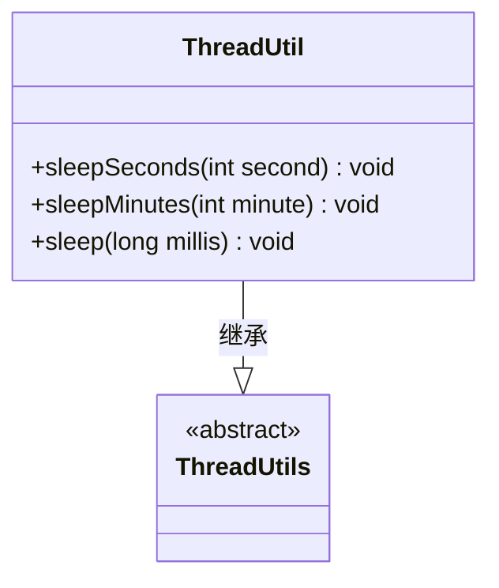
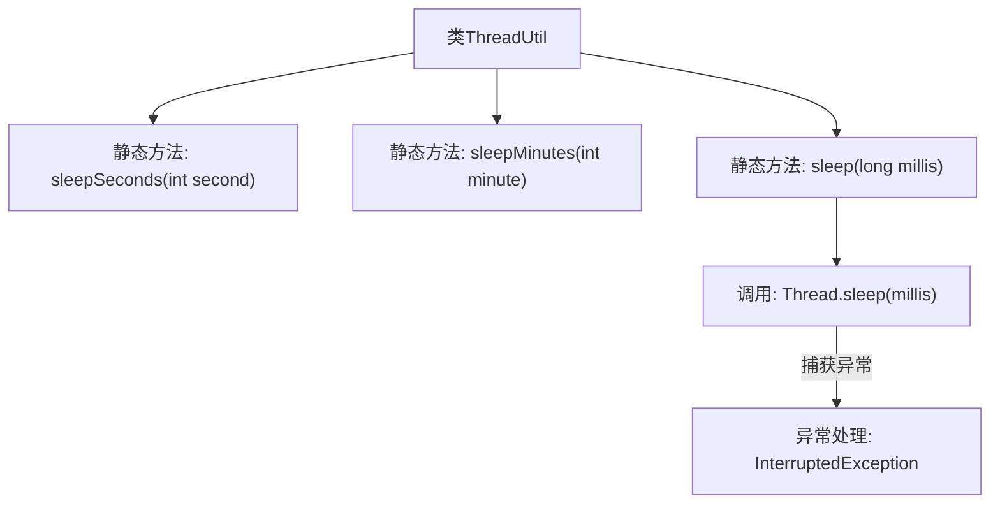

# 基础信息

|      |      |
|------|------|
| 名称 | ThreadUtil |
| 编码语言 | .java |
| 代码路径 | WeFe/common/java/common-lang/src/main/java/com/welab/wefe/common/util/ThreadUtil.java |
| 包名 | com.welab.wefe.common.util |
| 依赖项 | ['org.apache.commons.lang3.ThreadUtils'] |
| 概述说明 | ThreadUtil工具类提供秒、分钟级线程休眠方法，内部调用Thread.sleep并处理中断异常。 |

# 说明

ThreadUtil是一个线程工具类，继承自ThreadUtils。它提供了三个静态方法用于线程休眠：sleepSeconds方法接受秒数参数，将其转换为毫秒后调用sleep方法；sleepMinutes方法接受分钟数参数，转换为毫秒后调用sleep；核心的sleep方法直接使用Thread.sleep实现休眠，捕获InterruptedException异常并打印堆栈。所有方法均为静态可直接调用。

# 类列表 Class Summary

| 名称   | 类型  | 说明 |
|-------|------|-------------|
| ThreadUtil | class | ThreadUtil类提供静态方法sleepSeconds、sleepMinutes和sleep，分别实现秒、分钟和毫秒级线程休眠，异常时打印堆栈。 |

## 类 ThreadUtil

|      |      |
|------|------|
| 访问范围 | public |
| 类型 | class |
| 名称 | ThreadUtil |
| 说明 | ThreadUtil类提供静态方法sleepSeconds、sleepMinutes和sleep，分别实现秒、分钟和毫秒级线程休眠，异常时打印堆栈。 |

### UML类图

这段类图展示了ThreadUtil类继承自ThreadUtils基类的关系。ThreadUtils被标记为抽象类(<<abstract>>)，而ThreadUtil实现了三个静态方法：sleepSeconds()将秒转换为毫秒后休眠，sleepMinutes()将分钟转换为毫秒后休眠，以及核心的sleep()方法直接调用Thread.sleep()并处理中断异常。所有方法都是公有的(用+表示)，体现了线程休眠功能的工具类设计模式。

### 内部方法调用关系图

该流程图展示了ThreadUtil类的静态方法调用关系。sleepSeconds和sleepMinutes方法最终都会调用核心的sleep方法，而sleep方法内部通过Thread.sleep实现线程休眠，并捕获可能的InterruptedException异常。所有方法均为静态方法，可直接通过类名调用，无需实例化。

### 字段列表 Field List

| 名称  | 类型  | 说明 |
|-------|-------|------|

### 方法列表

| 名称  | 类型  | 说明 |
|-------|-------|------|
| sleepMinutes | void | 静态方法sleepMinutes接收分钟数，转换为毫秒后调用sleep实现休眠。 |
| sleepSeconds | void | 定义静态方法sleepSeconds，接收整型参数second，调用sleep方法并转换为毫秒（乘以1000）。 |
| sleep | void | Java静态方法sleep，调用Thread.sleep暂停当前线程指定毫秒，捕获并打印InterruptedException异常。 |

