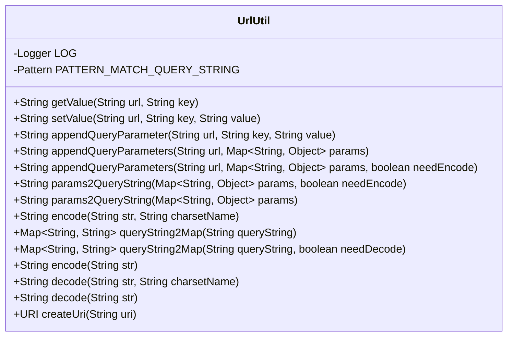

# 基础信息

|      |      |
|------|------|
| 名称 | UrlUtil |
| 编码语言 | .java |
| 代码路径 | WeFe/common/java/common-lang/src/main/java/com/welab/wefe/common/util/UrlUtil.java |
| 包名 | com.welab.wefe.common.util |
| 依赖项 | ['org.apache.commons.lang3.StringUtils', 'org.slf4j.Logger', 'org.slf4j.LoggerFactory', 'java.io.UnsupportedEncodingException', 'java.net.URI', 'java.net.URISyntaxException', 'java.net.URLDecoder', 'java.net.URLEncoder', 'java.nio.charset.StandardCharsets', 'java.util.HashMap', 'java.util.Map', 'java.util.regex.Matcher', 'java.util.regex.Pattern'] |
| 概述说明 | UrlUtil类提供URL处理功能，包括获取、设置、拼接参数，参数编解码，以及URL与Map互转。支持UTF-8编码，简化URL操作。 |

# 说明

UrlUtil类提供URL处理功能，包含获取、设置、拼接查询参数的方法。支持从URL提取指定键的值，修改或添加参数，将Map转为查询字符串，支持编码与解码。包含参数编码（UTF-8默认）、查询字符串与Map互转、URI创建等功能，使用正则匹配参数，处理异常并记录日志。

# 类列表 Class Summary

| 名称   | 类型  | 说明 |
|-------|------|-------------|
| UrlUtil | class | UrlUtil类提供URL处理功能，包括获取、设置、拼接参数，参数编解码，以及URL与Map互转。支持UTF-8编码，简化URL操作。 |

## 类 UrlUtil

|      |      |
|------|------|
| 访问范围 | public |
| 类型 | class |
| 名称 | UrlUtil |
| 说明 | UrlUtil类提供URL处理功能，包括获取、设置、拼接参数，参数编解码，以及URL与Map互转。支持UTF-8编码，简化URL操作。 |

### UML类图

该类图展示了UrlUtil工具类，主要用于URL参数处理。包含核心功能：获取/设置URL参数值、追加查询参数、URL编解码、查询字符串与Map互转、URI创建等。类中使用了Logger记录日志，通过Pattern正则匹配查询字符串，提供多种参数处理的重载方法，支持UTF-8默认编码和自定义编码，并处理了参数编码异常情况。所有方法均为静态方法，可直接通过类名调用。

### 内部方法调用关系图

```mermaid
graph TD
    A["类UrlUtil"]
    B["属性: Logger LOG"]
    C["属性: Pattern PATTERN_MATCH_QUERY_STRING"]
    D["方法: getValue(String url, String key)"]
    E["方法: setValue(String url, String key, String value)"]
    F["方法: appendQueryParameter(String url, String key, String value)"]
    G["方法: appendQueryParameters(String url, Map<String, Object> params)"]
    H["方法: appendQueryParameters(String url, Map<String, Object> params, boolean needEncode)"]
    I["方法: params2QueryString(Map<String, Object> params, boolean needEncode)"]
    J["方法: params2QueryString(Map<String, Object> params)"]
    K["方法: encode(String str, String charsetName)"]
    L["方法: encode(String str)"]
    M["方法: queryString2Map(String queryString)"]
    N["方法: queryString2Map(String queryString, boolean needDecode)"]
    O["方法: decode(String str, String charsetName)"]
    P["方法: decode(String str)"]
    Q["方法: createUri(String uri)"]

    A --> B
    A --> C
    A --> D
    A --> E
    A --> F
    A --> G
    A --> H
    A --> I
    A --> J
    A --> K
    A --> L
    A --> M
    A --> N
    A --> O
    A --> P
    A --> Q
```

这段代码定义了一个UrlUtil类，主要用于处理URL相关的操作。类中包含多个静态方法，用于获取、设置、追加URL参数，以及URL编码和解码等。流程图展示了类的主要属性和方法，包括处理查询字符串、参数编码解码、URI创建等功能。这些方法协同工作，提供了完整的URL处理能力，适用于各种Web开发场景。

### 字段列表 Field List

| 名称  | 类型  | 说明 |
|-------|-------|------|
| PATTERN_MATCH_QUERY_STRING = Pattern.compile("(?<name>[^?&]+)=(?<value>[^?&]+)") | Pattern | Java正则表达式，用于匹配URL查询字符串中的键值对，捕获name和value两组。 |
| LOG = LoggerFactory.getLogger(StringUtil.class) | Logger | 声明一个受保护的静态常量日志对象，用于StringUtil类的日志记录。 |

### 方法列表

| 名称  | 类型  | 说明 |
|-------|-------|------|
| queryString2Map | Map<String, String> | 将查询字符串转换为Map的静态方法，可调用重载方法并默认不处理异常。 |
| params2QueryString | String | 将Map参数转换为查询字符串，支持可选编码。若参数为空返回空字符串，否则拼接键值对，首个"&"会被删除。 |
| encode | String | 静态方法encode接收字符串参数，使用UTF-8编码格式返回编码后的字符串。 |
| encode | String | 该方法用于将字符串按指定字符集进行URL编码，失败时记录错误并返回空字符串。 |
| queryString2Map | Map<String, String> | 将查询字符串解析为Map，支持可选解码。空输入返回空Map，非空时按正则匹配键值对并存入结果。 |
| getValue | String | 从URL中提取指定键的值。先分割问号左右部分，再分割键值对，匹配键名后返回对应值，未找到则返回空字符串。 |
| decode | String | 静态方法decode用于解码URL字符串，指定字符集。若解码失败记录错误并返回空字符串。 |
| params2QueryString | String | 将Map参数转换为查询字符串，默认进行URL编码。 |
| appendQueryParameters | String | 静态方法将URL与参数Map拼接为带查询字符串的URL，空参数时返回原URL，自动处理分隔符?和&。 |
| setValue | String | 该方法用于修改URL中的参数值。若参数存在则替换，否则追加到URL末尾，自动处理问号或连接符。 |
| decode | String | 静态方法decode将字符串按UTF-8编码解码后返回。 |
| createUri | URI | 静态方法createUri接收字符串uri，尝试创建URI对象，失败时记录错误并抛出运行时异常。 |
| appendQueryParameters | String | 静态方法将URL和参数Map拼接为带查询参数的URL。若参数为空则返回原URL，自动处理连接符?和&，支持参数编码。 |
| appendQueryParameter | String | 该方法用于向URL追加查询参数。若URL已有参数则添加&符号，否则添加?符号。最后拼接键值对并对值编码后返回新URL。 |

