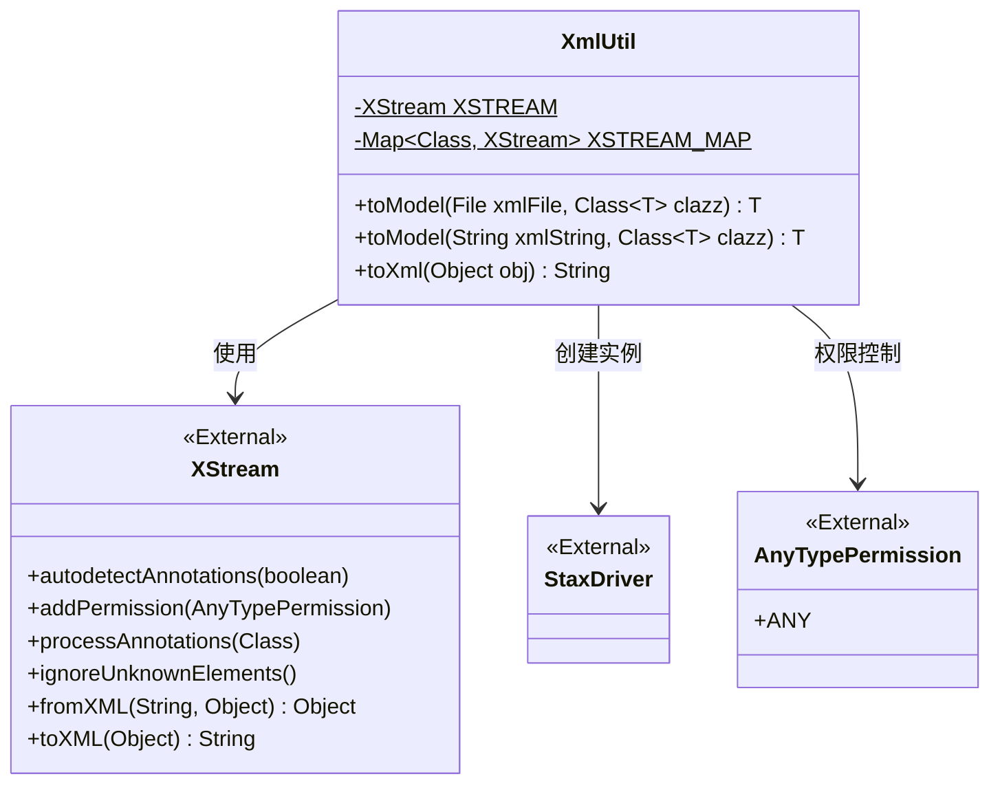
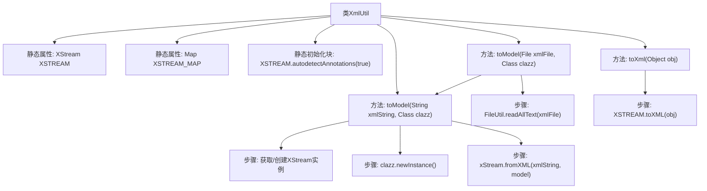

# 基础信息

|      |      |
|------|------|
| 名称 | XmlUtil |
| 编码语言 | .java |
| 代码路径 | WeFe/common/java/common-lang/src/main/java/com/welab/wefe/common/util/XmlUtil.java |
| 包名 | com.welab.wefe.common.util |
| 依赖项 | ['com.thoughtworks.xstream.XStream', 'com.thoughtworks.xstream.io.xml.StaxDriver', 'com.thoughtworks.xstream.security.AnyTypePermission', 'java.io.File', 'java.io.IOException', 'java.util.HashMap', 'java.util.Map'] |
| 概述说明 | XmlUtil类提供XML与对象转换功能，使用线程安全的XStream实例和对象复用来提升性能，支持文件或字符串的XML解析及对象序列化为XML。 |

# 说明

XmlUtil类提供XML与Java对象之间的转换功能。核心使用XStream实现序列化与反序列化，通过静态XSTREAM实例确保线程安全，并采用XSTREAM_MAP缓存已配置的XStream实例以提升性能。主要方法包括：toModel将XML文件或字符串转换为指定类型的对象，要求目标类使用@XStreamAlias注解；toXml将对象序列化为XML字符串。类初始化时自动启用注解检测，处理过程中会忽略未知元素并允许任何类型权限。

# 类列表 Class Summary

| 名称   | 类型  | 说明 |
|-------|------|-------------|
| XmlUtil | class | XmlUtil类提供XML与对象互转功能，使用线程安全的XStream实例，通过缓存提升性能，支持注解配置和未知元素忽略。 |

## 类 XmlUtil

|      |      |
|------|------|
| 访问范围 | public |
| 类型 | class |
| 名称 | XmlUtil |
| 说明 | XmlUtil类提供XML与对象互转功能，使用线程安全的XStream实例，通过缓存提升性能，支持注解配置和未知元素忽略。 |

### UML类图

类图描述：XmlUtil是一个工具类，用于处理XML与Java对象之间的转换。它通过XStream库实现序列化与反序列化，使用静态变量缓存XStream实例以提高性能。类中包含两个核心方法：toModel()将XML转换为对象，toXml()将对象序列化为XML字符串。通过StaxDriver提供XML解析能力，AnyTypePermission控制反序列化权限。

### 内部方法调用关系图

这段代码是用于处理XML与Java对象之间转换的工具类。主要功能包括将XML文件或字符串转换为指定类型的Java对象，以及将Java对象序列化为XML字符串。通过静态XStream实例和缓存机制提升性能，支持注解配置和未知元素忽略。流程图中清晰展示了类结构、方法调用关系和核心处理步骤，包括文件读取、XStream实例管理、对象实例化和XML转换等关键操作。

### 字段列表 Field List

| 名称  | 类型  | 说明 |
|-------|-------|------|
| XSTREAM = new XStream() | XStream | 初始化一个静态不可变的XStream实例。 |
| XSTREAM_MAP = new HashMap<>() | Map<Class, XStream> | 定义静态常量XSTREAM_MAP，用于存储Class类型到XStream对象的映射。 |

### 方法列表

| 名称  | 类型  | 说明 |
|-------|-------|------|
| toXml | String | 将对象转换为XML字符串，使用XSTREAM工具实现。 |
| toModel | T | 将XML字符串转换为指定类实例，复用XStream对象提升性能，处理注解和未知元素，异常返回null。 |
| toModel | T | 将XML文件内容读取为字符串并转换为指定类型的模型对象。 |

