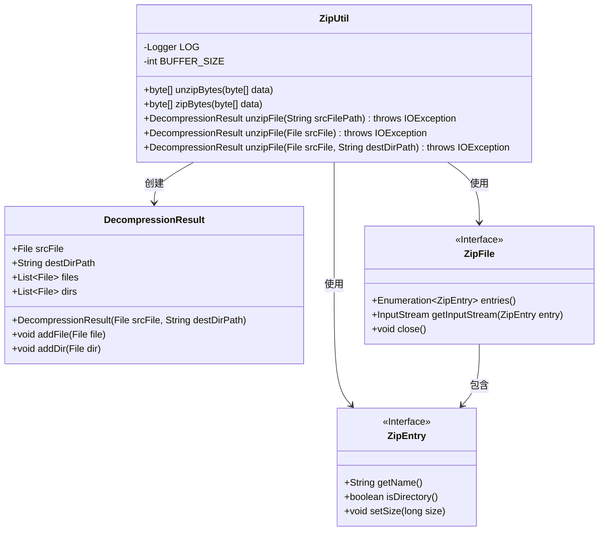
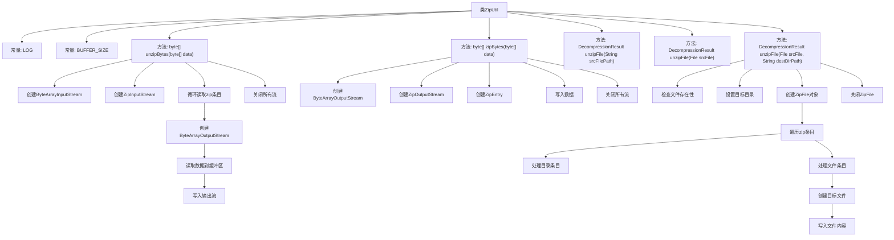
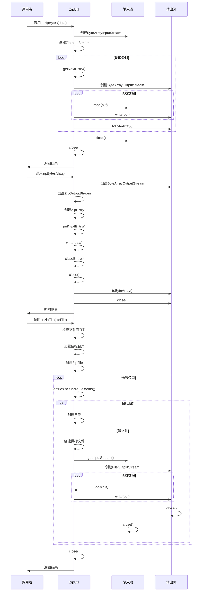

# 基础信息

|      |      |
|------|------|
| 名称 | ZipUtil |
| 编码语言 | .java |
| 代码路径 | WeFe/common/java/common-lang/src/main/java/com/welab/wefe/common/util/ZipUtil.java |
| 包名 | com.welab.wefe.common.util |
| 依赖项 | ['com.welab.wefe.common.file.decompression.dto.DecompressionResult', 'org.slf4j.Logger', 'org.slf4j.LoggerFactory', 'java.io', 'java.util.Enumeration', 'java.util.zip.ZipEntry', 'java.util.zip.ZipFile', 'java.util.zip.ZipInputStream', 'java.util.zip.ZipOutputStream'] |
| 概述说明 | ZipUtil类提供字节数组和文件的压缩解压功能，支持多文件解压，包含异常处理和结果记录。 |

# 说明

ZipUtil是一个Java工具类，提供ZIP文件的压缩和解压功能。它包含三个主要方法：unzipBytes用于解压字节数组数据，zipBytes用于压缩字节数组数据，unzipFile用于解压ZIP文件到指定目录。解压文件时支持处理包含多个文件和目录的ZIP文件，会自动创建目标目录结构，并返回包含解压结果的DecompressionResult对象。类中定义了2KB的缓冲区大小用于IO操作，并处理了各种异常情况。

# 类列表 Class Summary

| 名称   | 类型  | 说明 |
|-------|------|-------------|
| ZipUtil | class | ZipUtil类提供字节数组和文件的压缩解压功能，支持多文件解压到指定目录，包含错误处理和资源管理。 |

## 类 ZipUtil

|      |      |
|------|------|
| 访问范围 | public |
| 类型 | class |
| 名称 | ZipUtil |
| 说明 | ZipUtil类提供字节数组和文件的压缩解压功能，支持多文件解压到指定目录，包含错误处理和资源管理。 |

### UML类图

这段代码展示了一个ZipUtil工具类，主要用于处理ZIP压缩和解压缩操作。类图中包含ZipUtil核心类及其关联的DecompressionResult结果类，以及ZipFile和ZipEntry两个接口。ZipUtil提供了字节数组级别的压缩/解压方法(unzipBytes/zipBytes)和文件级别的解压方法(unzipFile)，其中文件解压方法支持处理包含多个文件的ZIP压缩包，并能将解压结果封装到DecompressionResult对象中返回。所有方法都包含异常处理机制，文件操作时使用了缓冲区(BUFFER_SIZE)来提高IO效率。

### 内部方法调用关系图

这段代码实现了一个ZIP压缩工具类，主要包含三个核心功能：解压字节数组(unzipBytes)、压缩字节数组(zipBytes)和解压文件(unzipFile)。流程图展示了类的结构和主要方法调用关系，时序图详细描述了每个方法的执行流程。该工具类支持内存中直接处理字节数组的压缩解压，也支持对物理ZIP文件的解压操作，能正确处理目录结构和文件内容，具有完善的异常处理和资源管理机制。

### 字段列表 Field List

| 名称  | 类型  | 说明 |
|-------|-------|------|
| LOG = LoggerFactory.getLogger(ZipUtil.class) | Logger | ZipUtil类中定义了一个受保护静态常量LOG，用于日志记录。 |
| BUFFER_SIZE = 2 * 1024 | int | 定义静态常量BUFFER_SIZE，值为2048字节。 |

### 方法列表

| 名称  | 类型  | 说明 |
|-------|-------|------|
| unzipFile | DecompressionResult | 解压ZIP文件到指定目录，处理文件夹和文件，返回解压结果。检查源文件存在性，自动创建目标目录结构，确保流正确关闭。 |
| unzipFile | DecompressionResult | Java静态方法unzipFile，接收源文件路径字符串，解压文件并返回结果，可能抛出IO异常。 |
| unzipBytes | byte[] | 静态方法unzipBytes解压字节数组，读取Zip流并输出解压后的字节数组，处理异常并返回结果。 |
| zipBytes | byte[] | 这是一个Java方法，用于将字节数组压缩为ZIP格式的字节数组。方法创建ZIP输出流，写入数据并返回压缩后的结果。异常时打印错误并返回null。 |
| unzipFile | DecompressionResult | 静态方法unzipFile解压文件，接收File参数，返回DecompressionResult，可抛出IOException。调用重载方法并传入null作为第二参数。 |

