# 基础信息

|      |      |
|------|------|
| 名称 | util |
| 编码语言 | .java |
| 代码路径 | WeFe/common/java/common-lang/src/main/java/com/welab/wefe/common/util |
| 包名 | docs.common.java.common-lang.src.main.java.com.welab.wefe.common.util |
| 概述说明 | 多个Java工具类集合，包括文件类型处理、集合统计、反射扫描、IP地址操作、加密解密、日期处理、字符串操作、XML转换、线程休眠等实用功能，覆盖常见开发需求。 |

# 说明

## 概述  
该模块是一个Java工具库集合，核心职责是为各类基础操作提供通用工具方法，涵盖文件处理、加密解密、集合操作、日期处理等场景。接口规范统一采用静态方法设计，支持泛型、异常处理和日志记录。关键数据结构包括枚举类（如ContentType）、键值对容器（如JObject扩展JSONObject）、加密密钥对（如SM2Util.Sm2KeyPair）等。外部依赖包括BouncyCastle密码库、XStream、ClassGraph等。例如SM4Util依赖BouncyCastle实现国密算法，ReflectionsUtil使用ClassGraph进行类扫描。

## 主要业务场景  
模块支持文件类型识别（如FileType通过文件头检测）、数据加密（如SM2/RSA非对称加密）、集合统计（如MapUtil.element统计）、反射扫描（如ReflectionsUtil获取注解类）等典型场景。交互模式类似工具链设计，例如ContentType.of获取MIME类型后，FileUtil可基于此判断文件类型。功能完整性体现在覆盖国密算法（SM2/SM4）、多格式转换（Base64/ZIP/XML）、敏感数据处理（如Masker手机号脱敏）等。典型应用包括：文件上传时组合FileType+ContentType校验，API调用时通过SignUtil签名验签。例如RSAUtil支持分段加密大数据，UrlUtil处理URL参数编码。

### 包内部结构视图

```mermaid
graph TD
    util --> enums
    util --> MapUtil.java
    util --> ReflectionsUtil.java
    util --> IpAddressUtil.java
    util --> Sha1.java
    util --> ListUtil.java
    util --> StringUtil.java
    util --> EncryptUtils.java
    util --> SignUtil.java
    util --> UrlUtil.java
    util --> DateUtil.java
    util --> SM2Util.java
    util --> SM4Util.java
    util --> ClassUtils.java
    util --> JObject.java
    util --> Masker.java
    util --> OS.java
    util --> Base64Util.java
    util --> ZipUtil.java
    util --> Md5.java
    util --> ImageUtil.java
    util --> FileUtil.java
    util --> XmlUtil.java
    util --> CommentedProperties.java
    util --> AESUtil.java
    util --> RandomUtil.java
    util --> FileType.java
    util --> ThreadUtil.java
    util --> CopyUtil.java
    util --> GzipUtil.java
    util --> HostUtil.java
    util --> AsymmetricCryptoUtil.java
    util --> RSAUtil.java
    enums --> ContentType.java
```

该流程图展示了WeFe项目中common-lang模块下util包的层级结构。根节点util包含28个子节点，其中27个是工具类文件（如MapUtil.java、StringUtil.java等），1个是enums目录。enums目录下又包含ContentType.java枚举文件。整个结构清晰地呈现了该模块中各种工具类的组织方式，涵盖加密、日期处理、文件操作等多种实用功能。

# 文件列表

| 名称   | 类型  | 说明 |
|-------|------|-------------|
| [MapUtil.java](MapUtil.md) | file | MapUtil类提供统计集合元素数量的方法，包含statistics统计整个集合和increment递增单个元素计数功能。 |
| [ReflectionsUtil.java](ReflectionsUtil.md) | file | ReflectionsUtil类提供四个静态方法：通过注解扫描类、获取接口实现类和子类，使用ClassGraph库实现类路径扫描。 |
| [IpAddressUtil.java](IpAddressUtil.md) | file | IpAddressUtil类提供IP地址工具方法，包括检查IP是否同网段、获取IP地址、子网掩码及解析IP列表。核心方法isSameNetworkSegment通过二进制运算比较IP与子网掩码判断同网段。 |
| [Sha1.java](Sha1.md) | file | 废弃的Sha1类，提供三种静态方法计算字符串、字节数组和输入流的SHA-1哈希值，内部调用DigestUtils.sha1Hex实现。 |
| [ListUtil.java](ListUtil.md) | file | ListUtil类提供并行遍历列表、数值求和及元素移动功能。包含parallelEach并发处理、sumLong/sumInt求和及moveElement移动元素位置方法。 |
| [StringUtil.java](StringUtil.md) | file | StringUtil工具类提供字符串处理功能，包括中文字符匹配、下划线驼峰互转、全半角转换、字符串拼接、掩码比较、手机号校验、MD5加密等。 |
| [EncryptUtils.java](EncryptUtils.md) | file | EncryptUtils类提供MD5摘要生成、16进制与二进制互转功能。包含md5、parseHexStr2Byte和parseByte2HexStr三个静态方法。 |
| [SignUtil.java](SignUtil.md) | file | SignUtil类提供密钥对生成、签名、验签及解密功能，支持SM2和RSA算法。默认使用RSA，未指定类型时自动选择RSA。包含KeyPair内部类存储公私钥。 |
| [UrlUtil.java](UrlUtil.md) | file | UrlUtil类提供URL处理功能，包括获取、设置、拼接参数，参数编解码，以及URL与Map互转。支持UTF-8编码，简化URL操作。 |
| [DateUtil.java](DateUtil.md) | file | DateUtil类提供日期时间处理功能，包括常量定义、格式转换、时间差计算、日期增减、范围判断等。支持多种日期格式，如YYYY-MM-DD、YYYYMMDDHHmmss等，可获取小时、星期、月份间隔，检查时间范围，转换毫秒与秒，处理UTC时间等。 |
| [SM2Util.java](SM2Util.md) | file | SM2Util类提供SM2国密算法工具，包括密钥生成、公私钥转换、签名验签、公钥加密和私钥解密功能，基于BouncyCastle实现。 |
| [SM4Util.java](SM4Util.md) | file | SM4Util类提供SM4加密功能，支持CBC模式，包含密钥生成、加解密方法，支持十六进制和Base64格式。 |
| [ClassUtils.java](ClassUtils.md) | file | ClassUtils提供静态方法处理类信息：获取类型简名、列表泛型类型、创建类实例、列出类字段（含父类）、获取泛型类、静态类转JSON及判断抽象类。 |
| [JObject.java](JObject.md) | file | JObject是扩展JSONObject的类，支持序列化，提供键值操作、JSON路径查询、大小写忽略获取值、格式化输出及类型转换功能。 |
| [Masker.java](Masker.md) | file | Masker类提供手机号和邮箱掩码功能。手机号保留前几位和后两位，中间用星号替换；邮箱保留@前部分字符，后接星号和域名。处理边界情况如短输入或无效格式。 |
| [OS.java](OS.md) | file | 该代码定义了一个枚举类OS，包含mac、windows、linux和unknown四种操作系统类型。通过静态初始化块自动检测当前系统类型，并提供执行系统命令的方法，支持Windows和Linux/Mac的不同命令执行方式。 |
| [Base64Util.java](Base64Util.md) | file | Base64工具类，提供字符串与Base64编码互转功能，支持UTF-8编码及ZIP/GZIP压缩选项。 |
| [ZipUtil.java](ZipUtil.md) | file | ZipUtil类提供字节数组和文件的压缩解压功能，支持多文件解压，包含异常处理和结果记录。 |
| [Md5.java](Md5.md) | file | Md5类提供静态方法，支持字符串、字节数组和输入流的MD5哈希计算，空输入返回null。示例计算"hello"的哈希值。 |
| [ImageUtil.java](ImageUtil.md) | file | ImageUtil类提供图片压缩功能，将Base64图片按指定大小和精度递归压缩，支持PNG和JPG格式，返回压缩后的Base64字符串。 |
| [FileUtil.java](FileUtil.md) | file | FileUtil类提供文件操作功能，包括判断文件类型（图片、压缩包）、获取文件后缀、读写文件、创建删除目录、移动复制文件等。 |
| [XmlUtil.java](XmlUtil.md) | file | XmlUtil类提供XML与对象转换功能，使用线程安全的XStream实例和对象复用来提升性能，支持文件或字符串的XML解析及对象序列化为XML。 |
| [CommentedProperties.java](CommentedProperties.md) | file | CommentedProperties类用于管理带注释的属性文件，支持加载、修改、添加和保存属性，保留注释和行顺序。 |
| [AESUtil.java](AESUtil.md) | file | AESUtil类提供AES加密解密功能，支持ECB和CBC模式，包含多种加密方法和异常处理。 |
| [RandomUtil.java](RandomUtil.md) | file | RandomUtil类提供生成随机密码功能，包含强密码和普通密码两种方法。强密码混合大小写字母、数字和特殊字符，普通密码仅使用小写字母和数字。 |
| [FileType.java](FileType.md) | file | FileType类通过文件头识别文件类型，支持图片、文档、音视频等多种格式，提供获取文件头和判断是否为图片的方法。 |
| [ThreadUtil.java](ThreadUtil.md) | file | ThreadUtil工具类提供秒、分钟级线程休眠方法，内部调用Thread.sleep并处理中断异常。 |
| [CopyUtil.java](CopyUtil.md) | file | CopyUtil类提供两个静态方法：getNullPropertyNames获取对象空属性名数组，copyBeanIgnoreNullProterty复制非空属性到目标对象。 |
| [GzipUtil.java](GzipUtil.md) | file | GzipUtil类提供zip和unzip方法，用于字节数组的压缩和解压，处理异常并记录日志。 |
| [HostUtil.java](HostUtil.md) | file | HostUtil类提供获取本地IPv4地址的方法，优先检查eth0和en0网络接口，其次尝试获取主机名和地址，若均失败则返回unknown。 |
| [AsymmetricCryptoUtil.java](AsymmetricCryptoUtil.md) | file | 非对称加密工具类，支持公钥加密和私钥解密，默认RSA，可选SM2。 |
| [RSAUtil.java](RSAUtil.md) | file | RSA工具类，提供公私钥加解密、签名验签、密钥转换及长文本分段处理功能，支持Base64编码。 |
| [enums](enums/_module.md) | package | 枚举ContentType定义了常见文件扩展名、描述及MIME类型，提供根据文件名获取对应MIME类型的方法。 |

