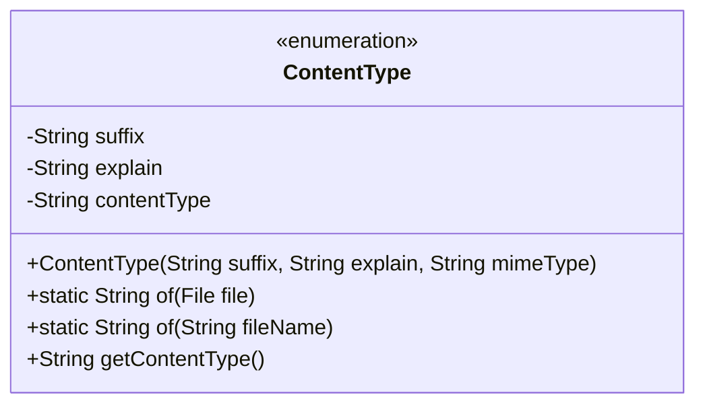
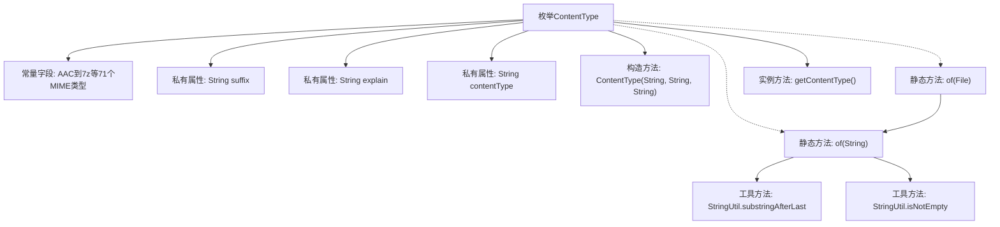

# 基础信息

|      |      |
|------|------|
| 名称 | ContentType |
| 编码语言 | .java |
| 代码路径 | WeFe/common/java/common-lang/src/main/java/com/welab/wefe/common/util/enums/ContentType.java |
| 包名 | com.welab.wefe.common.util.enums |
| 依赖项 | ['com.welab.wefe.common.util.StringUtil', 'java.io.File'] |
| 概述说明 | 枚举ContentType定义了常见文件扩展名、描述及MIME类型，提供根据文件名获取对应MIME类型的方法。 |

# 说明

这是一个枚举类ContentType，定义了多种文件类型的扩展名、描述和对应的MIME类型。每个枚举值包含三个属性：suffix表示文件扩展名，explain为类型说明，contentType是MIME类型。类提供了静态方法of，通过文件名或文件对象获取对应的MIME类型，若未匹配则返回二进制数据的默认类型。该类覆盖了常见格式如音频、视频、文档、图像、压缩文件等，便于在文件处理时快速获取MIME类型信息。

# 类列表 Class Summary

| 名称   | 类型  | 说明 |
|-------|------|-------------|
| ContentType | enum | 枚举ContentType定义了文件扩展名、描述和MIME类型的映射关系，提供根据文件名获取对应MIME类型的方法。 |

## 类 ContentType

|      |      |
|------|------|
| 访问范围 | public |
| 类型 | enum |
| 名称 | ContentType |
| 说明 | 枚举ContentType定义了文件扩展名、描述和MIME类型的映射关系，提供根据文件名获取对应MIME类型的方法。 |

### UML类图

这段代码定义了一个名为ContentType的枚举类，用于管理文件扩展名、类型说明和对应的MIME类型。该类包含三个私有字段：suffix（文件扩展名）、explain（类型说明）和contentType（MIME类型），以及一个构造方法和三个公有方法。静态方法of()用于根据文件名或文件对象获取对应的MIME类型，getContentType()用于获取当前枚举实例的MIME类型。该枚举类提供了大量常见的文件类型及其对应的MIME类型定义，当找不到匹配类型时会默认返回二进制数据的MIME类型。

### 内部方法调用关系图

该流程图展示了ContentType枚举类的完整结构，包含71个预定义的MIME类型常量、三个私有属性字段、构造方法和关键业务方法。核心逻辑是通过文件扩展名匹配对应的MIME类型，当无法匹配时默认返回二进制流类型。静态方法of构成主要处理链路，依赖字符串工具类完成路径解析和空值判断，最终返回对应的contentType字符串。

### 字段列表 Field List

| 名称  | 类型  | 说明 |
|-------|-------|------|

### 方法列表

| 名称  | 类型  | 说明 |
|-------|-------|------|

