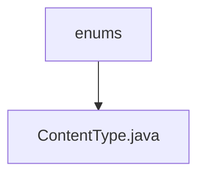

# 基础信息

|      |      |
|------|------|
| 名称 | enums |
| 编码语言 | .java |
| 代码路径 | WeFe/common/java/common-lang/src/main/java/com/welab/wefe/common/util/enums |
| 包名 | docs.common.java.common-lang.src.main.java.com.welab.wefe.common.util.enums |
| 概述说明 | 枚举ContentType定义了常见文件扩展名、描述及MIME类型，提供根据文件名获取对应MIME类型的方法。 |

# 说明

这是一个枚举类ContentType，定义了多种文件类型的扩展名、描述和对应的MIME类型。每个枚举值包含三个属性：suffix表示文件扩展名，explain为类型说明，contentType是MIME类型。类提供了静态方法of，通过文件名或文件对象获取对应的MIME类型，若未匹配则返回二进制数据的默认类型。该类覆盖了常见格式如音频、视频、文档、图像、压缩文件等，便于在文件处理时快速获取MIME类型信息。

### 包内部结构视图

该流程图展示了WeFe项目中枚举工具类的层级关系。顶层节点为"enums"目录，其下包含一个具体的枚举类文件"ContentType.java"。这种结构体现了Java项目中常见的按功能分类的包组织方式，其中枚举类型被集中存放在专门的目录中。

# 文件列表

| 名称   | 类型  | 说明 |
|-------|------|-------------|
| [ContentType.java](ContentType.md) | file | 枚举ContentType定义了常见文件扩展名、描述及MIME类型，提供根据文件名获取对应MIME类型的方法。 |

