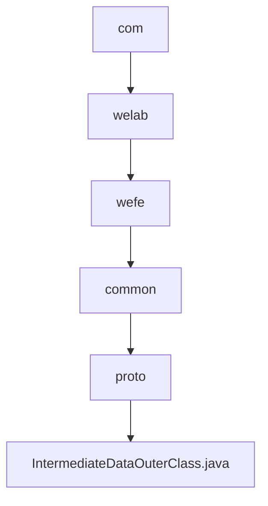

# 基础信息

|      |      |
|------|------|
| 名称 | com |
| 编码语言 | .java |
| 代码路径 | WeFe/common/java/common-proto/src/main/java/com |
| 包名 | docs.common.java.common-proto.src.main.java.com |
| 概述说明 | 这是一个Google Protocol Buffers (protobuf) 定义文件，描述了一个中间数据结构的协议。主要包含三个消息类型：IntermediateDataItem（键值对数据项）、BatchSerializationData（批量序列化数据）和IntermediateData（中间数据容器）。IntermediateData支持两种存储方式：1）多条键值对数据集合；2）整体序列化后的二进制数据。文件定义了数据结构和相关操作方法，用于不同系统间的数据交换。 |

# 说明

该内容定义了一个用于中间数据传输的Protobuf协议，包含三个主要结构：IntermediateDataItem表示键值对数据项，BatchSerializationData表示序列化后的二进制数据块，IntermediateData作为容器支持两种存储模式（多数据项集合或单数据块）。协议通过dataFlag字段区分存储类型，并提供了完整的序列化/反序列化支持。

### 包内部结构视图

该流程图展示了从com目录到最终Java文件的完整层级关系。路径从顶级包com开始，逐级深入到welab、wefe、common和proto子包，最终指向IntermediateDataOuterClass.java源文件。整个过程体现了标准的Java包命名规范和层级结构，共包含5个目录节点和1个文件节点。

# 文件列表

| 名称   | 类型  | 说明 |
|-------|------|-------------|
| [welab](welab/_module.md) | package | 这是一个Google Protocol Buffers (protobuf) 定义文件，描述了一个中间数据结构的协议。主要包含三个消息类型：IntermediateDataItem（键值对数据项）、BatchSerializationData（批量序列化数据）和IntermediateData（中间数据容器）。IntermediateData支持两种存储方式：1）多条键值对数据集合；2）整体序列化后的二进制数据。文件定义了数据结构和相关操作方法，用于不同系统间的数据交换。 |

