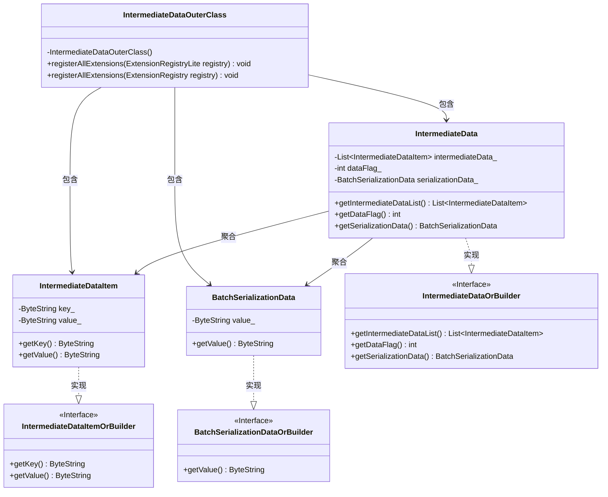

# 基础信息

|      |      |
|------|------|
| 名称 | IntermediateDataOuterClass |
| 编码语言 | .java |
| 代码路径 | WeFe/common/java/common-proto/src/main/java/com/welab/wefe/common/proto/IntermediateDataOuterClass.java |
| 包名 | com.welab.wefe.common.proto |
| 依赖项 | [] |
| 概述说明 | 这是一个Google Protocol Buffers (protobuf) 定义文件，描述了一个中间数据结构的协议。主要包含三个消息类型：IntermediateDataItem（键值对数据项）、BatchSerializationData（批量序列化数据）和IntermediateData（中间数据容器）。IntermediateData支持两种存储方式：1）多条键值对数据集合；2）整体序列化后的二进制数据。文件定义了数据结构和相关操作方法，用于不同系统间的数据交换。 |

# 说明

该内容定义了一个用于中间数据传输的Protobuf协议，包含三个主要结构：IntermediateDataItem表示键值对数据项，BatchSerializationData表示序列化后的二进制数据块，IntermediateData作为容器支持两种存储模式（多数据项集合或单数据块）。协议通过dataFlag字段区分存储类型，并提供了完整的序列化/反序列化支持。

# 类列表 Class Summary

| 名称   | 类型  | 说明 |
|-------|------|-------------|
| IntermediateDataOuterClass | class | 这是一个Protobuf定义文件，包含三个消息类型：IntermediateDataItem（键值对数据项）、BatchSerializationData（批量序列化数据）和IntermediateData（中间数据集合）。主要功能是定义数据结构和序列化方式，支持键值对存储和批量序列化两种数据格式。 |

## 类 IntermediateDataOuterClass

|      |      |
|------|------|
| 访问范围 | public final |
| 类型 | class |
| 名称 | IntermediateDataOuterClass |
| 说明 | 这是一个Protobuf定义文件，包含三个消息类型：IntermediateDataItem（键值对数据项）、BatchSerializationData（批量序列化数据）和IntermediateData（中间数据集合）。主要功能是定义数据结构和序列化方式，支持键值对存储和批量序列化两种数据格式。 |

### UML类图

这段代码定义了一个Protobuf消息结构，主要用于处理中间数据的序列化和反序列化。核心类包括IntermediateData（聚合多个IntermediateDataItem）、BatchSerializationData（批量序列化数据）以及它们的构建器接口。IntermediateDataOuterClass作为容器类提供注册扩展功能，所有消息类都实现了对应的OrBuilder接口以实现构建器模式。数据结构支持两种存储模式：分条存储（IntermediateDataItem列表）和整体序列化存储（BatchSerializationData），通过dataFlag字段进行区分。

### 内部方法调用关系图

```mermaid
graph TD
    A["类IntermediateDataOuterClass"]
    B["静态方法: registerAllExtensions(ExtensionRegistryLite)"]
    C["静态方法: registerAllExtensions(ExtensionRegistry)"]
    D["接口: IntermediateDataItemOrBuilder"]
    E["方法: getKey()"]
    F["方法: getValue()"]
    G["内部类: IntermediateDataItem"]
    H["构造方法: IntermediateDataItem(GeneratedMessageV3.Builder)"]
    I["方法: getKey()"]
    J["方法: getValue()"]
    K["内部类: Builder"]
    L["方法: setKey(ByteString)"]
    M["方法: setValue(ByteString)"]
    N["接口: BatchSerializationDataOrBuilder"]
    O["方法: getValue()"]
    P["内部类: BatchSerializationData"]
    Q["构造方法: BatchSerializationData(GeneratedMessageV3.Builder)"]
    R["方法: getValue()"]
    S["内部类: Builder"]
    T["方法: setValue(ByteString)"]
    U["接口: IntermediateDataOrBuilder"]
    V["方法: getIntermediateDataList()"]
    W["方法: getDataFlag()"]
    X["方法: getSerializationData()"]
    Y["内部类: IntermediateData"]
    Z["构造方法: IntermediateData(GeneratedMessageV3.Builder)"]
    AA["方法: getIntermediateDataList()"]
    AB["方法: getDataFlag()"]
    AC["方法: getSerializationData()"]
    AD["内部类: Builder"]
    AE["方法: addIntermediateData(IntermediateDataItem)"]
    AF["方法: setDataFlag(int)"]
    AG["方法: setSerializationData(BatchSerializationData)"]

    A --> B
    A --> C
    A --> D
    D --> E
    D --> F
    A --> G
    G --> H
    G --> I
    G --> J
    G --> K
    K --> L
    K --> M
    A --> N
    N --> O
    A --> P
    P --> Q
    P --> R
    P --> S
    S --> T
    A --> U
    U --> V
    U --> W
    U --> X
    A --> Y
    Y --> Z
    Y --> AA
    Y --> AB
    Y --> AC
    Y --> AD
    AD --> AE
    AD --> AF
    AD --> AG
```

这段代码定义了一个Protobuf消息结构，包含三个主要部分：IntermediateDataItem（键值对数据项）、BatchSerializationData（批量序列化数据）和IntermediateData（中间数据容器）。IntermediateData可以包含多个IntermediateDataItem或一个BatchSerializationData，通过dataFlag字段区分存储类型。代码采用了Builder模式来构造消息对象，并提供了丰富的接口方法来访问和修改数据。整体结构清晰，层级分明，适合用于分布式系统中中间数据的序列化和传输。

### 字段列表 Field List

| 名称  | 类型  | 说明 |
|-------|-------|------|
| internal_static_com_welab_wefe_common_proto_IntermediateData_descriptor | com.google.protobuf.Descriptors.Descriptor | 私有静态常量，定义IntermediateData的Protobuf描述符。 |
| descriptor | com.google.protobuf.Descriptors.FileDescriptor | 静态私有变量descriptor，类型为com.google.protobuf.Descriptors.FileDescriptor。 |
| internal_static_com_welab_wefe_common_proto_BatchSerializationData_fieldAccessorTable | com.google.protobuf.GeneratedMessageV3.FieldAccessorTable | 私有静态final字段，类型为protobuf的FieldAccessorTable，用于BatchSerializationData的内部结构字段访问。 |
| internal_static_com_welab_wefe_common_proto_IntermediateDataItem_fieldAccessorTable | com.google.protobuf.GeneratedMessageV3.FieldAccessorTable | 定义了一个私有静态final变量，类型为GeneratedMessageV3.FieldAccessorTable，用于访问IntermediateDataItem的内部字段。 |
| internal_static_com_welab_wefe_common_proto_IntermediateDataItem_descriptor | com.google.protobuf.Descriptors.Descriptor | 私有静态最终描述符变量，用于中间数据项的内部协议缓冲区定义。 |
| internal_static_com_welab_wefe_common_proto_IntermediateData_fieldAccessorTable | com.google.protobuf.GeneratedMessageV3.FieldAccessorTable | 私有静态终态字段，类型为protobuf的FieldAccessorTable，用于中间数据模型字段访问。 |
| internal_static_com_welab_wefe_common_proto_BatchSerializationData_descriptor | com.google.protobuf.Descriptors.Descriptor | 私有静态最终描述符，用于BatchSerializationData类的协议缓冲区定义。 |

### 方法列表

| 名称  | 类型  | 说明 |
|-------|-------|------|
| registerAllExtensions | void | 这是一个Java静态方法，用于将所有扩展注册到给定的Protobuf扩展注册表中。方法内部调用了另一个重载方法，将普通注册表转换为Lite版本进行注册。 |
| registerAllExtensions | void | 静态方法registerAllExtensions用于向Protobuf的ExtensionRegistryLite注册扩展，当前为空实现。 |
| getDescriptor | com.google.protobuf.Descriptors.FileDescriptor | 这是一个静态方法，返回protobuf文件描述符descriptor。 |

