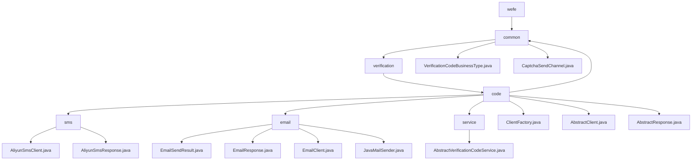

# 基础信息

|      |      |
|------|------|
| 名称 | welab |
| 编码语言 | .java |
| 代码路径 | WeFe/common/java/common-verification-code/src/main/java/com/welab |
| 包名 | docs.common.java.common-verification-code.src.main.java.com.welab |
| 概述说明 | 阿里云短信服务Java客户端，封装SDK提供短信发送功能，支持验证码场景，依赖阿里云SDK。邮件发送模块封装SMTP协议，支持HTML邮件和SSL加密，依赖JavaMail。验证码管理模块定义业务类型和发送渠道枚举，无外部依赖。抽象验证码服务类提供生成、发送和校验功能，有效期2分钟。工厂类根据渠道返回短信或邮件客户端实例。抽象客户端和响应类提供基础封装，需子类实现具体逻辑。 |

# 说明

## 概述  
该模块是统一验证码服务框架，核心职责是提供多通道（短信/邮件）验证码的标准化管理，涵盖生成、发送和校验全流程。接口规范包含抽象客户端（AbstractClient）和响应基类（AbstractResponse），采用工厂模式（ClientFactory）动态选择发送渠道。关键数据结构包括验证码业务枚举（VerificationCodeBusinessType）、渠道枚举（CaptchaSendChannel）和扩展参数映射。外部依赖为阿里云短信SDK和JavaMail库。例如通过ExpiringMap实现2分钟有效期的验证码缓存。

## 主要业务场景  
典型流程为：选择业务类型（如会员注册）→指定发送渠道（短信/邮件）→工厂获取对应客户端→发送并校验验证码。交互模式类似网关路由，通过状态码（如RESP_STATUS_OK）判断结果。功能完整性体现在多通道支持、缓存管理和异常处理，例如短信发送使用AliyunSmsClient，邮件发送依赖JavaMailSender。集成案例包括用户注册时的短信验证码下发和密码找回的邮件通知。

### 包内部结构视图

该流程图展示了WeFe验证码模块的层级结构，从根目录wefe开始，逐级展开到common、verification和code目录。code目录下包含sms、email、common和service子目录，以及多个抽象类和客户端工厂文件。sms和email目录分别包含各自的客户端实现和响应类，common目录包含业务类型和发送渠道枚举，service目录包含抽象验证码服务类。整个结构清晰地呈现了验证码模块的组件关系和代码组织方式。

# 文件列表

| 名称   | 类型  | 说明 |
|-------|------|-------------|
| [wefe](wefe/_module.md) | package | 阿里云短信服务Java客户端，封装SDK提供短信发送功能，支持验证码场景，依赖阿里云SDK。邮件发送模块封装SMTP协议，支持HTML邮件和SSL加密，依赖JavaMail。验证码管理模块定义业务类型和发送渠道枚举，无外部依赖。抽象验证码服务类提供生成、发送和校验功能，有效期2分钟。工厂类根据渠道返回短信或邮件客户端实例。抽象客户端和响应类提供基础封装，需子类实现具体逻辑。 |

