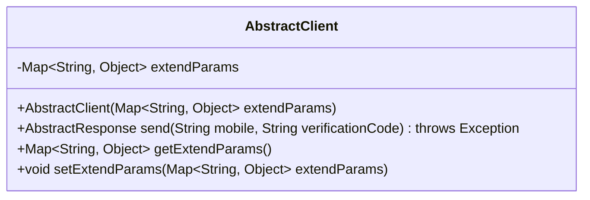
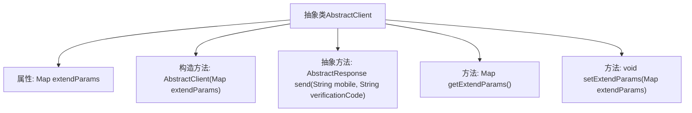

# 基础信息

|      |      |
|------|------|
| 名称 | AbstractClient |
| 编码语言 | .java |
| 代码路径 | WeFe/common/java/common-verification-code/src/main/java/com/welab/wefe/common/verification/code/AbstractClient.java |
| 包名 | com.welab.wefe.common.verification.code |
| 依赖项 | ['java.util.Map'] |
| 概述说明 | 抽象类AbstractClient包含扩展参数和发送短信验证码的抽象方法，提供参数存取功能。 |

# 说明

这是一个名为AbstractClient的抽象类，用于客户端基础功能封装。类中包含一个Map类型的extendParams属性用于存储扩展参数，提供getter和setter方法。构造函数接收extendParams参数进行初始化。定义了一个抽象方法send，接收手机号和验证码参数，返回AbstractResponse对象并可能抛出异常，用于发送验证码短信功能。

# 类列表 Class Summary

| 名称   | 类型  | 说明 |
|-------|------|-------------|
| AbstractClient | class | 抽象类AbstractClient包含扩展参数和发送短信验证码的抽象方法。 |

## 类 AbstractClient

|      |      |
|------|------|
| 访问范围 | public abstract |
| 类型 | class |
| 名称 | AbstractClient |
| 说明 | 抽象类AbstractClient包含扩展参数和发送短信验证码的抽象方法。 |

### UML类图

该类图展示了一个抽象类AbstractClient，它包含一个私有成员extendParams（类型为Map<String, Object>）和四个方法：构造方法、抽象发送方法send()、获取和设置extendParams的方法。AbstractClient作为抽象基类，其send()方法需要子类实现，用于发送验证码短信并返回AbstractResponse类型的响应。该类通过extendParams支持扩展参数，体现了模板方法设计模式的思想，为短信客户端提供了基础框架。

### 内部方法调用关系图

这段代码定义了一个抽象类AbstractClient，包含一个Map类型的extendParams属性和相关操作方法。核心是抽象方法send()用于发送验证码短信，需由子类实现。类结构清晰展示了属性封装、构造方法初始化以及getter/setter方法，体现了面向对象的基本特性。抽象方法的设计强制子类必须实现短信发送逻辑，而extendParams提供了扩展参数的灵活处理能力。

### 字段列表 Field List

| 名称  | 类型  | 说明 |
|-------|-------|------|
| extendParams | Map<String, Object> | 定义了一个名为extendParams的私有Map变量，键为String类型，值为Object类型，用于存储扩展参数。 |

### 方法列表

| 名称  | 类型  | 说明 |
|-------|-------|------|
| send | AbstractResponse | 抽象方法send，接收手机号和验证码参数，返回AbstractResponse，可能抛出异常。 |
| getExtendParams | Map<String, Object> | 获取扩展参数Map，键为String类型，值为Object类型。 |
| setExtendParams | void | 这是一个Java方法，用于设置扩展参数。方法接收一个Map类型的参数，并将其赋值给类的成员变量extendParams。 |

