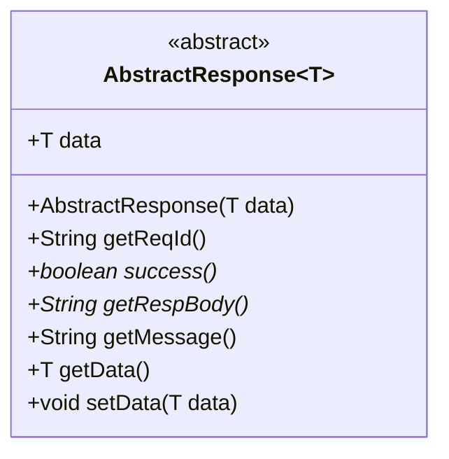
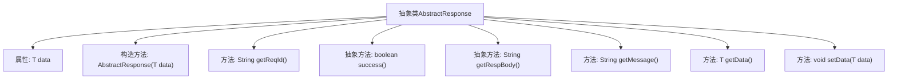

# 基础信息

|      |      |
|------|------|
| 名称 | AbstractResponse |
| 编码语言 | .java |
| 代码路径 | WeFe/common/java/common-verification-code/src/main/java/com/welab/wefe/common/verification/code/AbstractResponse.java |
| 包名 | com.welab.wefe.common.verification.code |
| 依赖项 | ['java.util.UUID'] |
| 概述说明 | 抽象类AbstractResponse<T>包含泛型数据字段data，提供获取请求ID、响应状态、响应内容和消息的方法，支持数据读写。 |

# 说明

AbstractResponse是一个抽象泛型类，用于封装响应数据。它包含一个泛型数据字段data，通过构造方法初始化，并提供getter和setter方法。类中定义了获取请求ID的方法getReqId，返回去除连字符的UUID字符串。抽象方法success用于判断请求是否成功，getRespBody用于获取响应体内容。getMessage方法默认返回null，可被子类覆盖。该类提供了响应数据的基本结构和通用功能，具体实现需由子类完成。

# 类列表 Class Summary

| 名称   | 类型  | 说明 |
|-------|------|-------------|
| AbstractResponse | class | 抽象类AbstractResponse定义通用响应结构，包含泛型数据字段、请求ID生成方法、抽象的成功状态和响应内容方法，以及数据存取方法。 |

## 类 AbstractResponse

|      |      |
|------|------|
| 访问范围 | public abstract |
| 类型 | class |
| 名称 | AbstractResponse |
| 说明 | 抽象类AbstractResponse定义通用响应结构，包含泛型数据字段、请求ID生成方法、抽象的成功状态和响应内容方法，以及数据存取方法。 |

### UML类图

这段类图展示了一个泛型抽象类AbstractResponse<T>，它定义了处理响应数据的通用结构。该类包含一个泛型数据字段data，提供基本的数据存取方法(getData/setData)，同时声明了两个抽象方法success()和getRespBody()要求子类实现。类中还包含生成请求ID的getReqId()方法和可选的getMessage()方法。这个抽象类为各种具体响应类型提供了统一的处理框架，通过泛型T支持不同类型的数据负载。

### 内部方法调用关系图

这段代码描述了一个泛型抽象类AbstractResponse<T>，主要用于封装响应数据。该类包含一个泛型数据字段data，提供构造方法初始化数据，以及获取请求ID、响应状态、响应内容、消息和数据的各种方法。其中success()和getRespBody()是抽象方法，需要子类实现，而getMessage()有默认实现返回null。该设计模式常用于构建可扩展的响应处理框架，允许子类自定义成功判定和响应体格式。

### 字段列表 Field List

| 名称  | 类型  | 说明 |
|-------|-------|------|
| data | T | 公开数据字段，类型为泛型T。 |

### 方法列表

| 名称  | 类型  | 说明 |
|-------|-------|------|
| getRespBody | String | 抽象方法，返回字符串类型的响应体。 |
| getReqId | String | 生成唯一请求ID：使用UUID去除横杠后的字符串。 |
| success | boolean | 抽象方法，返回布尔值表示操作是否成功。 |
| getMessage | String | 方法getMessage返回null。 |
| getData | T | 这是一个Java方法，返回类型为泛型T，功能是获取私有变量data的值。 |
| setData | void | 设置对象数据的方法，将参数data赋值给当前对象的data属性。 |

