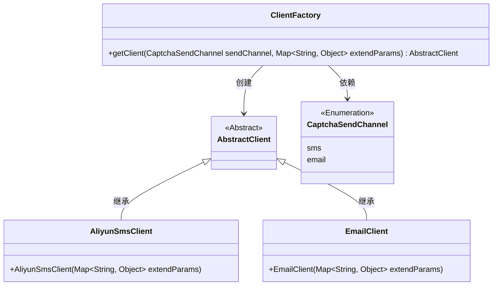
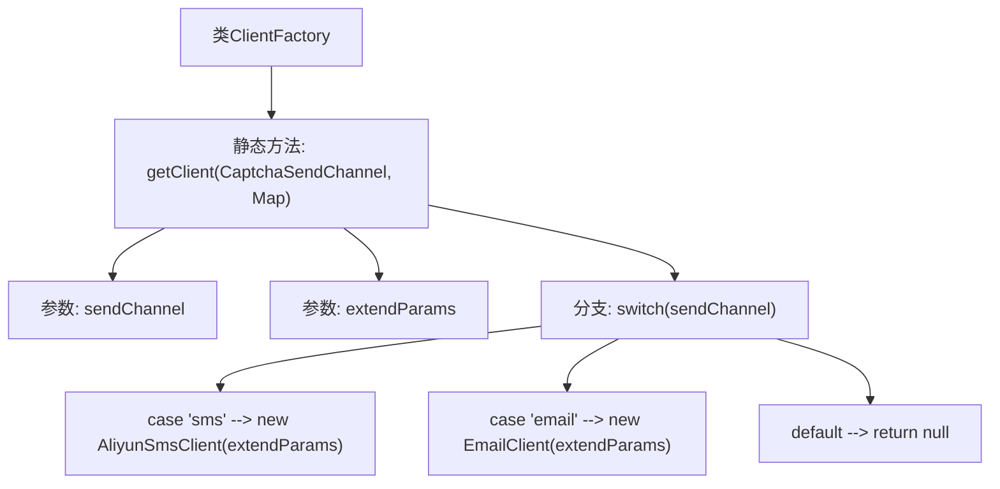

# 基础信息

|      |      |
|------|------|
| 名称 | ClientFactory |
| 编码语言 | .java |
| 代码路径 | WeFe/common/java/common-verification-code/src/main/java/com/welab/wefe/common/verification/code/ClientFactory.java |
| 包名 | com.welab.wefe.common.verification.code |
| 依赖项 | ['com.welab.wefe.common.verification.code.common.CaptchaSendChannel', 'com.welab.wefe.common.verification.code.email.EmailClient', 'com.welab.wefe.common.verification.code.sms.AliyunSmsClient', 'java.util.Map'] |
| 概述说明 | ClientFactory类提供静态方法getClient，根据发送渠道（sms或email）返回对应的验证码发送客户端实例（AliyunSmsClient或EmailClient），参数为发送渠道和扩展参数。 |

# 说明

ClientFactory是一个工厂类，用于根据发送渠道获取对应的验证码发送客户端。它包含一个静态方法getClient，接收两个参数：sendChannel表示发送渠道，extendParams是扩展参数映射。方法通过switch语句判断sendChannel类型，如果是sms则返回AliyunSmsClient实例，如果是email则返回EmailClient实例，其他情况返回null。两个客户端实例化时都会传入extendParams参数。方法可能抛出Exception异常。

# 类列表 Class Summary

| 名称   | 类型  | 说明 |
|-------|------|-------------|
| ClientFactory | class | ClientFactory类提供静态方法getClient，根据sendChannel返回对应验证码发送客户端实例（短信用AliyunSmsClient，邮件用EmailClient），参数为发送渠道和扩展参数。 |

## 类 ClientFactory

|      |      |
|------|------|
| 访问范围 | public |
| 类型 | class |
| 名称 | ClientFactory |
| 说明 | ClientFactory类提供静态方法getClient，根据sendChannel返回对应验证码发送客户端实例（短信用AliyunSmsClient，邮件用EmailClient），参数为发送渠道和扩展参数。 |

### UML类图

这段代码展示了一个客户端工厂模式实现，用于根据不同的验证码发送渠道（短信或邮件）创建对应的客户端实例。ClientFactory类通过静态方法getClient接收枚举参数和扩展参数，动态返回阿里云短信客户端或邮件客户端。类图清晰地体现了抽象类与具体实现的继承关系，以及工厂类对枚举类型的依赖关系，整体结构符合开闭原则，便于扩展新的发送渠道。

### 内部方法调用关系图

这段代码展示了一个工厂模式实现，ClientFactory类通过静态方法getClient根据不同的验证码发送渠道（sms/email）动态创建对应的客户端实例。流程图清晰呈现了方法入口、参数处理、分支判断以及不同渠道的对象创建路径，最后处理默认情况返回null。该设计实现了客户端创建的松耦合，便于扩展新的发送渠道。

### 字段列表 Field List

| 名称  | 类型  | 说明 |
|-------|-------|------|

### 方法列表

| 名称  | 类型  | 说明 |
|-------|-------|------|
| getClient | AbstractClient | 静态方法getClient根据sendChannel返回不同客户端实例：sms返回阿里云短信客户端，email返回邮件客户端，其他情况返回null。 |

