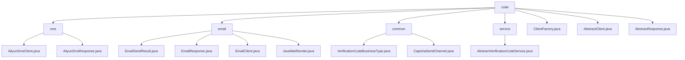

# 基础信息

|      |      |
|------|------|
| 名称 | code |
| 编码语言 | .java |
| 代码路径 | WeFe/common/java/common-verification-code/src/main/java/com/welab/wefe/common/verification/code |
| 包名 | docs.common.java.common-verification-code.src.main.java.com.welab.wefe.common.verification.code |
| 概述说明 | 阿里云短信服务Java客户端，封装SDK提供短信发送功能，支持验证码场景，依赖阿里云SDK。邮件发送模块封装SMTP协议，支持HTML邮件和SSL加密，依赖JavaMail。验证码管理模块定义业务类型和发送渠道枚举，无外部依赖。抽象验证码服务类提供生成、发送和校验功能，有效期2分钟。工厂类根据渠道返回短信或邮件客户端实例。抽象客户端和响应类提供基础封装，需子类实现具体逻辑。 |

# 说明

## 概述  
该模块是统一验证码服务框架，核心职责是提供多通道（短信/邮件）验证码的标准化管理，涵盖生成、发送和校验全流程。接口规范包含抽象客户端（AbstractClient）和响应基类（AbstractResponse），采用工厂模式（ClientFactory）动态选择发送渠道。关键数据结构包括验证码业务枚举（VerificationCodeBusinessType）、渠道枚举（CaptchaSendChannel）和扩展参数映射。外部依赖为阿里云短信SDK和JavaMail库。例如通过ExpiringMap实现2分钟有效期的验证码缓存。

## 主要业务场景  
典型流程为：选择业务类型（如会员注册）→指定发送渠道（短信/邮件）→工厂获取对应客户端→发送并校验验证码。交互模式类似网关路由，通过状态码（如RESP_STATUS_OK）判断结果。功能完整性体现在多通道支持、缓存管理和异常处理，例如短信发送使用AliyunSmsClient，邮件发送依赖JavaMailSender。集成案例包括用户注册时的短信验证码下发和密码找回的邮件通知。

### 包内部结构视图

该流程图展示了验证码模块的层级结构，根节点为code目录，包含sms短信、email邮件、common通用组件、service服务四大子模块。每个子模块下包含具体的实现类文件，如短信模块包含阿里云短信客户端和响应类，邮件模块包含邮件发送结果、响应、客户端和JavaMail发送器等实现类。同时根目录下还有客户端工厂、抽象客户端和抽象响应三个核心基类文件。

# 文件列表

| 名称   | 类型  | 说明 |
|-------|------|-------------|
| [ClientFactory.java](ClientFactory.md) | file | ClientFactory类提供静态方法getClient，根据发送渠道（sms或email）返回对应的验证码发送客户端实例（AliyunSmsClient或EmailClient），参数为发送渠道和扩展参数。 |
| [AbstractClient.java](AbstractClient.md) | file | 抽象类AbstractClient包含扩展参数和发送短信验证码的抽象方法，提供参数存取功能。 |
| [AbstractResponse.java](AbstractResponse.md) | file | 抽象类AbstractResponse<T>包含泛型数据字段data，提供获取请求ID、响应状态、响应内容和消息的方法，支持数据读写。 |
| [service](service/_module.md) | package | 抽象类AbstractVerificationCodeService提供验证码服务，包含发送、校验、生成验证码功能，使用缓存存储验证码，有效期2分钟，支持自定义业务类型和发送渠道。 |
| [common](common/_module.md) | package | VerificationCodeBusinessType枚举定义会员注册和忘记密码验证码业务场景。CaptchaSendChannel枚举定义短信和邮件两种验证码发送渠道。 |
| [email](email/_module.md) | package | EmailSendResult类封装邮件发送结果，含状态码和消息字段。EmailResponse继承AbstractResponse，判断发送成功并返回消息。EmailClient继承AbstractClient，配置并发送邮件。JavaMailSender实现SMTP邮件发送功能，支持HTML格式和SSL加密。 |
| [sms](sms/_module.md) | package | 阿里云短信服务客户端类，继承抽象类，通过send方法发送短信，需手机号和验证码，内部使用阿里云SDK配置请求。响应处理类继承AbstractResponse，封装响应逻辑，含请求ID获取、状态判断等方法，成功状态码为"OK"。 |

