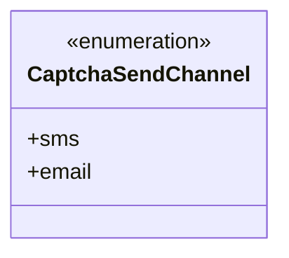
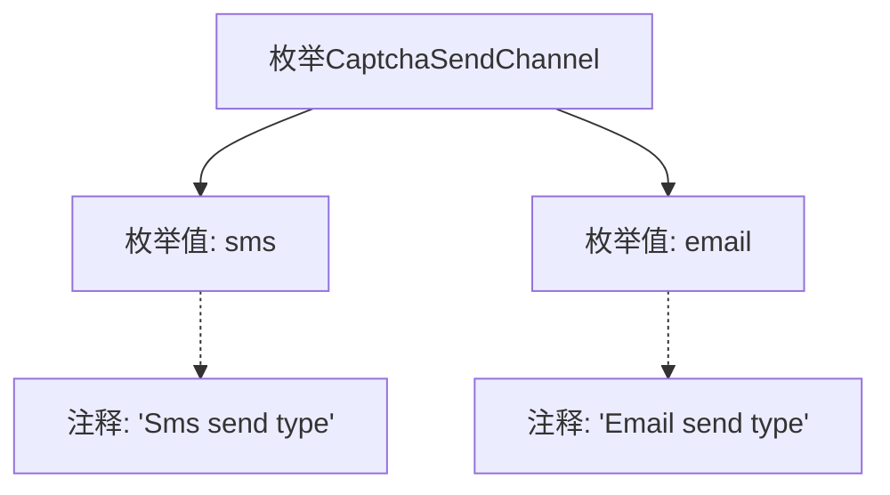

# 基础信息

|      |      |
|------|------|
| 名称 | CaptchaSendChannel |
| 编码语言 | .java |
| 代码路径 | WeFe/common/java/common-verification-code/src/main/java/com/welab/wefe/common/verification/code/common/CaptchaSendChannel.java |
| 包名 | com.welab.wefe.common.verification.code.common |
| 依赖项 | [] |
| 概述说明 | 验证码发送渠道枚举：sms短信和email邮件两种类型。 |

# 说明

这是一个名为CaptchaSendChannel的枚举类型，定义了两个验证码发送渠道。第一个是sms，表示通过短信方式发送验证码；第二个是email，表示通过电子邮件方式发送验证码。每个枚举值都配有对应的注释说明其用途。

# 类列表 Class Summary

| 名称   | 类型  | 说明 |
|-------|------|-------------|
| CaptchaSendChannel | enum | CaptchaSendChannel枚举定义验证码发送渠道，包含sms短信和email邮件两种类型。 |

## 类 CaptchaSendChannel

|      |      |
|------|------|
| 访问范围 | public |
| 类型 | enum |
| 名称 | CaptchaSendChannel |
| 说明 | CaptchaSendChannel枚举定义验证码发送渠道，包含sms短信和email邮件两种类型。 |

### UML类图

这段代码定义了一个名为`CaptchaSendChannel`的枚举类型，用于表示验证码发送的两种渠道：短信(`sms`)和邮件(`email`)。枚举类型在类图中用`<<enumeration>>`标记，清晰地展示了该类型是一个固定值集合。这个简单的枚举结构为系统提供了类型安全的验证码发送方式选择，避免了使用字符串或整数等原始类型可能带来的错误。枚举的两个值`sms`和`email`作为公有成员列出，分别对应注释中描述的短信发送类型和邮件发送类型。

### 内部方法调用关系图

这段流程图展示了CaptchaSendChannel枚举的结构，包含两个枚举值sms和email，每个枚举值都有对应的注释说明其用途。sms表示短信发送类型，email表示邮件发送类型。该枚举用于定义验证码发送的不同渠道类型，结构简单明了，便于在代码中区分不同的验证码发送方式。

### 字段列表 Field List

| 名称  | 类型  | 说明 |
|-------|-------|------|

### 方法列表

| 名称  | 类型  | 说明 |
|-------|-------|------|

