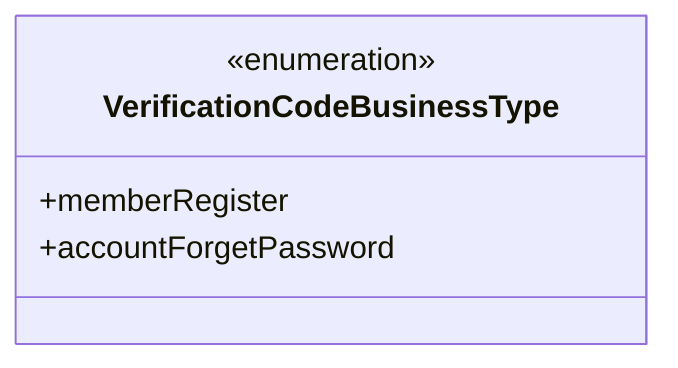
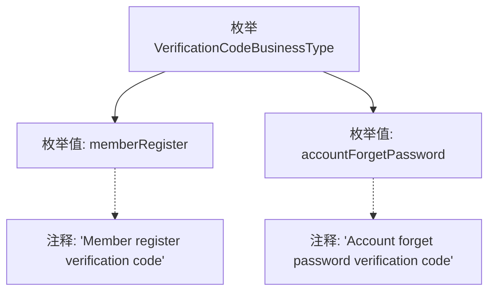

# 基础信息

|      |      |
|------|------|
| 名称 | VerificationCodeBusinessType |
| 编码语言 | .java |
| 代码路径 | WeFe/common/java/common-verification-code/src/main/java/com/welab/wefe/common/verification/code/common/VerificationCodeBusinessType.java |
| 包名 | com.welab.wefe.common.verification.code.common |
| 依赖项 | [] |
| 概述说明 | 枚举VerificationCodeBusinessType定义两种验证码业务类型：会员注册和账户忘记密码。 |

# 说明

该内容定义了一个名为VerificationCodeBusinessType的枚举类型，包含两种业务场景：memberRegister表示会员注册验证码，accountForgetPassword表示账户忘记密码验证码。枚举通过注释清晰说明了每种类型的用途。

# 类列表 Class Summary

| 名称   | 类型  | 说明 |
|-------|------|-------------|
| VerificationCodeBusinessType | enum | 枚举VerificationCodeBusinessType定义两种验证码业务类型：会员注册和账户忘记密码。 |

## 类 VerificationCodeBusinessType

|      |      |
|------|------|
| 访问范围 | public |
| 类型 | enum |
| 名称 | VerificationCodeBusinessType |
| 说明 | 枚举VerificationCodeBusinessType定义两种验证码业务类型：会员注册和账户忘记密码。 |

### UML类图

该代码定义了一个名为VerificationCodeBusinessType的枚举类型，包含两个枚举常量：memberRegister（会员注册验证码）和accountForgetPassword（账户忘记密码验证码）。枚举类型用于表示一组固定的业务类型常量，每个常量对应不同的验证码使用场景。这种设计可以确保类型安全，避免使用魔法字符串，同时提高代码可读性和可维护性。

### 内部方法调用关系图

这段流程图展示了VerificationCodeBusinessType枚举的结构，包含两个枚举值memberRegister和accountForgetPassword，分别带有描述其用途的注释。memberRegister用于会员注册验证码场景，accountForgetPassword用于账户忘记密码验证码场景。该枚举定义了两种明确的业务类型，用于区分不同场景下的验证码用途。

### 字段列表 Field List

| 名称  | 类型  | 说明 |
|-------|-------|------|

### 方法列表

| 名称  | 类型  | 说明 |
|-------|-------|------|

