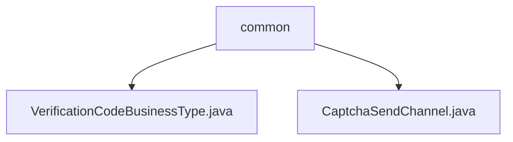

# 基础信息

|      |      |
|------|------|
| 名称 | common |
| 编码语言 | .java |
| 代码路径 | WeFe/common/java/common-verification-code/src/main/java/com/welab/wefe/common/verification/code/common |
| 包名 | docs.common.java.common-verification-code.src.main.java.com.welab.wefe.common.verification.code.common |
| 概述说明 | VerificationCodeBusinessType枚举定义会员注册和忘记密码验证码业务场景。CaptchaSendChannel枚举定义短信和邮件两种验证码发送渠道。 |

# 说明

## 概述  
该模块核心职责是管理验证码的业务类型和发送渠道，提供标准化的枚举定义。接口规范包含两类枚举：VerificationCodeBusinessType定义业务场景（如会员注册），CaptchaSendChannel定义发送方式（如短信）。关键数据结构为业务类型枚举（含注册/密码找回）和渠道枚举（短信/邮件）。外部依赖无。例如会员注册需短信验证码。

## 主要业务场景  
模块支持典型验证码流程：先选择业务类型（例如密码找回），再通过指定渠道（如邮件）发送。交互模式为枚举值匹配，确保业务与渠道对应。功能完整覆盖验证码生成到发送环节，适用于账户安全相关场景。API类型为枚举类，集成案例包括注册时短信验证码发送。

### 包内部结构视图

该流程图展示了WeFe验证码模块中common目录下的文件结构。顶层节点为common文件夹，包含两个Java文件：VerificationCodeBusinessType.java和CaptchaSendChannel.java，分别表示验证码业务类型枚举类和验证码发送渠道枚举类。整个结构清晰地反映了验证码通用功能的代码组织方式。

# 文件列表

| 名称   | 类型  | 说明 |
|-------|------|-------------|
| [VerificationCodeBusinessType.java](VerificationCodeBusinessType.md) | file | 枚举VerificationCodeBusinessType定义两种验证码业务类型：会员注册和账户忘记密码。 |
| [CaptchaSendChannel.java](CaptchaSendChannel.md) | file | 验证码发送渠道枚举：sms短信和email邮件两种类型。 |

