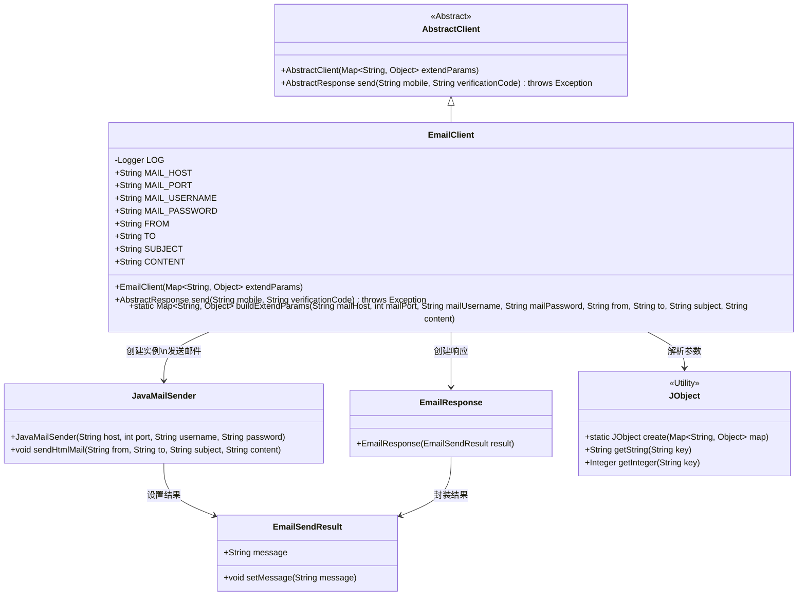
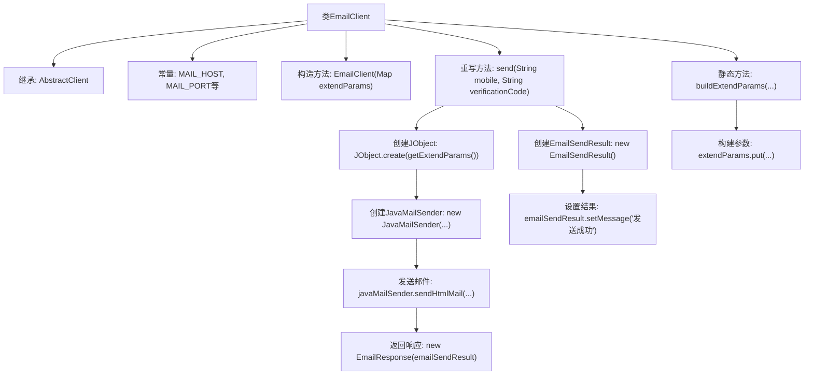

# 基础信息

|      |      |
|------|------|
| 名称 | EmailClient |
| 编码语言 | .java |
| 代码路径 | WeFe/common/java/common-verification-code/src/main/java/com/welab/wefe/common/verification/code/email/EmailClient.java |
| 包名 | com.welab.wefe.common.verification.code.email |
| 依赖项 | ['com.welab.wefe.common.util.JObject', 'com.welab.wefe.common.verification.code.AbstractClient', 'com.welab.wefe.common.verification.code.AbstractResponse', 'org.slf4j.Logger', 'org.slf4j.LoggerFactory', 'java.util.HashMap', 'java.util.Map'] |
| 概述说明 | EmailClient类继承AbstractClient，提供邮件发送功能，包含主机、端口、用户名等常量，通过send方法发送邮件，buildExtendParams构建参数。 |

# 说明

EmailClient是一个继承自AbstractClient的邮件客户端类，用于发送邮件。它包含多个静态常量定义邮件相关参数，如主机、端口、用户名、密码、发件人、收件人、主题和内容。构造函数接收扩展参数映射。send方法使用JavaMailSender发送HTML邮件，返回包含发送结果的EmailResponse。buildExtendParams方法用于构建包含邮件参数的映射。整个过程包括初始化邮件发送器、设置邮件内容并执行发送。

# 类列表 Class Summary

| 名称   | 类型  | 说明 |
|-------|------|-------------|
| EmailClient | class | EmailClient类继承AbstractClient，用于发送邮件。包含邮件配置常量，构造方法接收扩展参数。send方法使用JavaMailSender发送HTML邮件，返回EmailResponse。buildExtendParams方法构建邮件参数Map。 |

## 类 EmailClient

|      |      |
|------|------|
| 访问范围 | public |
| 类型 | class |
| 名称 | EmailClient |
| 说明 | EmailClient类继承AbstractClient，用于发送邮件。包含邮件配置常量，构造方法接收扩展参数。send方法使用JavaMailSender发送HTML邮件，返回EmailResponse。buildExtendParams方法构建邮件参数Map。 |

### UML类图

类图描述：该图展示了EmailClient继承自AbstractClient，通过JavaMailSender发送邮件并返回EmailResponse的过程。EmailClient使用JObject解析参数，JavaMailSender操作EmailSendResult设置发送状态，最终由EmailResponse封装结果。整个结构清晰地呈现了邮件发送组件的协作关系。

### 内部方法调用关系图

这段代码展示了一个EmailClient类，继承自AbstractClient，主要用于发送电子邮件。类中定义了邮件相关的常量参数，包含构造方法和两个主要方法：send()用于实际发送邮件，buildExtendParams()用于构建邮件发送所需的参数。send()方法通过JavaMailSender发送HTML格式邮件，并返回包含发送结果的EmailResponse对象。整个流程清晰展示了从参数准备到邮件发送的完整过程。

### 字段列表 Field List

| 名称  | 类型  | 说明 |
|-------|-------|------|
| FROM = "from" | String | 定义公共静态常量字符串FROM，值为"from"。 |
| TO = "to" | String | 定义不可变静态字符串常量TO，值为"to"。 |
| MAIL_PORT = "mailPort" | String | 定义邮件端口常量字符串MAIL_PORT，值为"mailPort"。 |
| MAIL_HOST = "mailHost" | String | 定义了一个公共静态不可变字符串常量MAIL_HOST，值为"mailHost"。 |
| LOG = LoggerFactory.getLogger(EmailClient.class) | Logger | 定义一个受保护的日志对象LOG，用于EmailClient类的日志记录。 |
| CONTENT = "content" | String | 定义了一个公共静态不可变字符串常量CONTENT，值为"content"。 |
| MAIL_PASSWORD = "mailPassword" | String | 定义了一个公共静态常量字符串MAIL_PASSWORD，值为"mailPassword"。 |
| SUBJECT = "subject" | String | 定义了一个公共静态不可变字符串常量SUBJECT，值为"subject"。 |
| MAIL_USERNAME = "mailUsername" | String | 定义了一个公共静态常量字符串MAIL_USERNAME，值为"mailUsername"。 |

### 方法列表

| 名称  | 类型  | 说明 |
|-------|-------|------|
| send | AbstractResponse | 该方法通过JavaMailSender发送HTML邮件，使用扩展参数配置主机、端口、用户名和密码，返回发送成功响应。 |
| buildExtendParams | Map<String, Object> | 构建邮件参数的静态方法，接收主机、端口、账号、密码、发件人、收件人、主题和内容，返回包含这些参数的Map。 |

