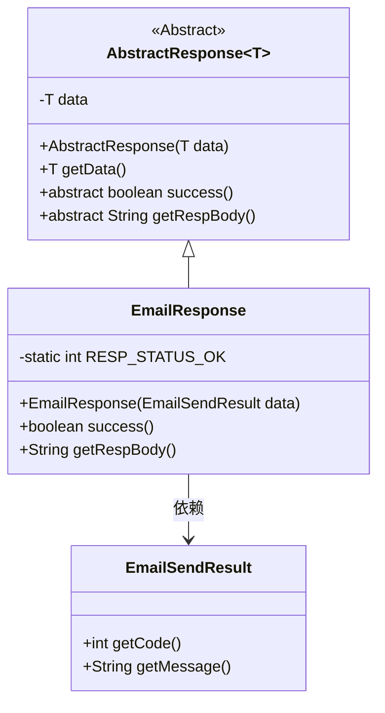
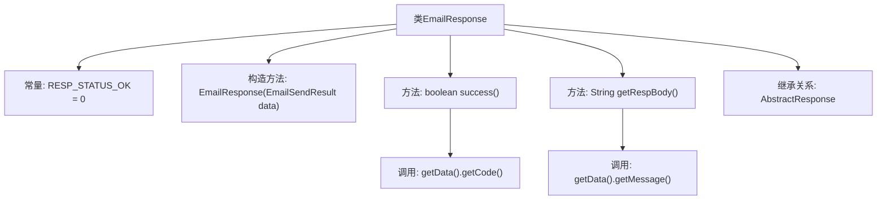

# 基础信息

|      |      |
|------|------|
| 名称 | EmailResponse |
| 编码语言 | .java |
| 代码路径 | WeFe/common/java/common-verification-code/src/main/java/com/welab/wefe/common/verification/code/email/EmailResponse.java |
| 包名 | com.welab.wefe.common.verification.code.email |
| 依赖项 | ['com.welab.wefe.common.verification.code.AbstractResponse'] |
| 概述说明 | EmailResponse类继承AbstractResponse，包含成功状态码0，通过构造函数传入EmailSendResult数据，判断成功条件为状态码匹配，返回数据中的消息体。 |

# 说明

EmailResponse类继承自AbstractResponse，泛型类型为EmailSendResult。该类定义了成功响应码RESP_STATUS_OK为0。构造函数接收EmailSendResult类型数据并调用父类构造方法。重写了success方法，通过比较RESP_STATUS_OK与数据对象的code值判断是否成功。重写了getRespBody方法，返回数据对象的message字段内容。

# 类列表 Class Summary

| 名称   | 类型  | 说明 |
|-------|------|-------------|
| EmailResponse | class | EmailResponse类继承AbstractResponse，包含成功状态码0，通过EmailSendResult判断操作是否成功并返回消息。 |

## 类 EmailResponse

|      |      |
|------|------|
| 访问范围 | public |
| 类型 | class |
| 名称 | EmailResponse |
| 说明 | EmailResponse类继承AbstractResponse，包含成功状态码0，通过EmailSendResult判断操作是否成功并返回消息。 |

### UML类图

这段代码展示了一个电子邮件响应系统的类结构。EmailResponse继承自泛型抽象类AbstractResponse<EmailSendResult>，实现了success()和getRespBody()方法。EmailSendResult类提供获取状态码和消息的方法。RESP_STATUS_OK是成功响应的静态常量。类图清晰地展示了继承关系和依赖关系，体现了响应结果的处理逻辑。

### 内部方法调用关系图

这段代码展示了一个EmailResponse类，继承自AbstractResponse<EmailSendResult>，主要用于处理电子邮件发送的响应。类中包含一个成功状态码常量RESP_STATUS_OK，构造方法接收EmailSendResult类型数据。核心功能包括success()方法通过比较响应码判断操作是否成功，getRespBody()方法获取响应消息体。两个方法都依赖于父类的getData()方法访问底层数据对象。

### 字段列表 Field List

| 名称  | 类型  | 说明 |
|-------|-------|------|
| RESP_STATUS_OK = 0 | int | 定义静态常量RESP_STATUS_OK，值为0，表示响应状态正常。 |

### 方法列表

| 名称  | 类型  | 说明 |
|-------|-------|------|
| success | boolean | 检查响应状态码是否等于成功状态码RESP_STATUS_OK。 |
| getRespBody | String | 方法getRespBody返回数据对象中的消息内容。 |

