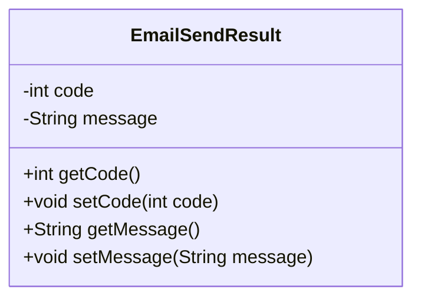
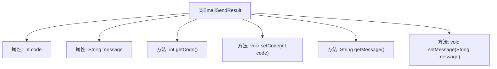

# 基础信息

|      |      |
|------|------|
| 名称 | EmailSendResult |
| 编码语言 | .java |
| 代码路径 | WeFe/common/java/common-verification-code/src/main/java/com/welab/wefe/common/verification/code/email/EmailSendResult.java |
| 包名 | com.welab.wefe.common.verification.code.email |
| 依赖项 | [] |
| 概述说明 | EmailSendResult类包含code和message属性，提供getter和setter方法。 |

# 说明

这是一个名为EmailSendResult的Java类，用于表示电子邮件发送结果。它包含两个私有字段：整型的code用于存储状态码，字符串类型的message用于存储结果消息。类提供了标准的getter和setter方法，分别用于获取和设置这两个字段的值。这个类主要用于封装邮件发送后的返回结果数据。

# 类列表 Class Summary

| 名称   | 类型  | 说明 |
|-------|------|-------------|
| EmailSendResult | class | EmailSendResult类包含code和message属性，提供getter和setter方法用于访问和修改这两个字段。 |

## 类 EmailSendResult

|      |      |
|------|------|
| 访问范围 | public |
| 类型 | class |
| 名称 | EmailSendResult |
| 说明 | EmailSendResult类包含code和message属性，提供getter和setter方法用于访问和修改这两个字段。 |

### UML类图

这段代码定义了一个名为EmailSendResult的类，用于封装电子邮件发送结果的相关信息。该类包含两个私有字段：code表示状态码，message表示状态信息，同时提供了对应的getter和setter方法用于访问和修改这些字段。这是一个典型的数据传输对象(DTO)设计，用于在不同层之间传递电子邮件发送的结果状态，其结构简单清晰，适合序列化和反序列化操作。

### 内部方法调用关系图

这段代码定义了一个名为EmailSendResult的类，用于表示电子邮件发送的结果。该类包含两个私有属性：code（整型）和message（字符串），分别表示发送结果的状态码和描述信息。类中提供了四个公共方法：getCode和setCode用于获取和设置状态码，getMessage和setMessage用于获取和设置描述信息。这个类通常用于封装电子邮件发送后的返回结果，便于在程序中传递和处理发送状态。

### 字段列表 Field List

| 名称  | 类型  | 说明 |
|-------|-------|------|
| message | String | 声明一个私有字符串变量message。 |
| code | int | 私有整型变量code。 |

### 方法列表

| 名称  | 类型  | 说明 |
|-------|-------|------|
| setMessage | void | 这是一个Java方法，用于设置类中的message属性值。方法接收一个字符串参数message，并将其赋值给类的成员变量this.message。 |
| setCode | void | 设置整型变量code的值。 |
| getMessage | String | 这是一个Java方法，返回字符串类型的message变量值。 |
| getCode | int | 方法返回整型变量code的值。 |

