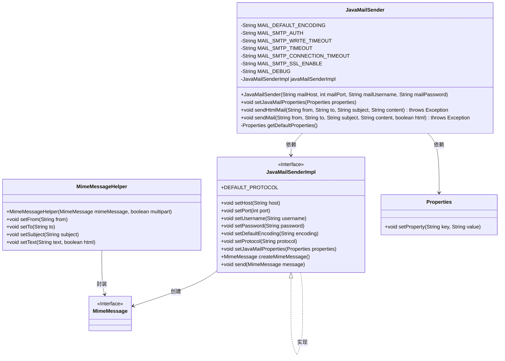
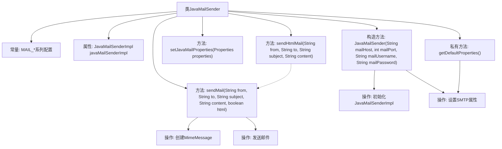

# 基础信息

|      |      |
|------|------|
| 名称 | JavaMailSender |
| 编码语言 | .java |
| 代码路径 | WeFe/common/java/common-verification-code/src/main/java/com/welab/wefe/common/verification/code/email/JavaMailSender.java |
| 包名 | com.welab.wefe.common.verification.code.email |
| 依赖项 | ['org.springframework.mail.javamail.JavaMailSenderImpl', 'org.springframework.mail.javamail.MimeMessageHelper', 'javax.mail.internet.MimeMessage', 'java.util.Properties'] |
| 概述说明 | JavaMailSender类封装邮件发送功能，支持SMTP认证、SSL加密和超时设置，提供发送HTML和普通邮件的方法。 |

# 说明

JavaMailSender是一个用于发送邮件的类，包含默认编码UTF-8和SMTP相关配置如认证、超时设置、SSL启用和调试模式。构造函数需要邮件服务器地址、端口、用户名和密码。提供设置邮件属性和发送邮件的方法，支持HTML格式。发送邮件时设置发件人、收件人、主题和内容，使用MimeMessageHelper处理邮件内容。默认属性包括SMTP认证、读写超时、连接超时、SSL启用和调试模式。

# 类列表 Class Summary

| 名称   | 类型  | 说明 |
|-------|------|-------------|
| JavaMailSender | class | JavaMailSender类封装邮件发送功能，支持SMTP认证、SSL加密，默认超时30秒，可发送HTML或普通邮件。 |

## 类 JavaMailSender

|      |      |
|------|------|
| 访问范围 | public |
| 类型 | class |
| 名称 | JavaMailSender |
| 说明 | JavaMailSender类封装邮件发送功能，支持SMTP认证、SSL加密，默认超时30秒，可发送HTML或普通邮件。 |

### UML类图

类图描述：该图展示了JavaMailSender邮件发送系统的核心结构。JavaMailSender类封装了邮件发送功能，依赖于JavaMailSenderImpl接口实现具体操作，通过MimeMessage和MimeMessageHelper构建邮件内容，使用Properties配置SMTP参数。系统支持HTML邮件发送，包含连接超时、SSL加密等默认配置，体现了邮件服务的完整处理流程。

### 内部方法调用关系图

这段代码实现了一个基于JavaMail的邮件发送工具类。流程图展示了类结构，包括常量定义、核心构造方法和邮件发送方法。构造方法初始化邮件发送器并设置SMTP连接参数，sendMail方法通过MimeMessageHelper构建邮件内容并发送，sendHtmlMail是其简化版。私有方法getDefaultProperties提供了默认的SMTP配置参数。整个流程严格遵循邮件发送的初始化-构建-发送流程，支持HTML邮件和自定义属性配置。

### 字段列表 Field List

| 名称  | 类型  | 说明 |
|-------|-------|------|
| MAIL_SMTP_TIMEOUT = "30000" | String | 定义邮件SMTP超时时间为30000毫秒的静态常量。 |
| MAIL_DEBUG = "true" | String | 代码定义了一个私有静态常量字符串MAIL_DEBUG，值为"true"，用于控制邮件调试功能。 |
| MAIL_SMTP_CONNECTION_TIMEOUT = "30000" | String | 定义SMTP邮件连接超时时间为30000毫秒的静态常量。 |
| MAIL_DEFAULT_ENCODING = "UTF-8" | String | 定义邮件默认编码为UTF-8的静态常量。 |
| MAIL_SMTP_AUTH = "true" | String | 定义常量字符串MAIL_SMTP_AUTH，值为"true"，用于SMTP认证启用标识。 |
| javaMailSenderImpl | JavaMailSenderImpl | 私有Java邮件发送器实例。 |
| MAIL_SMTP_SSL_ENABLE = "true" | String | 代码定义常量MAIL_SMTP_SSL_ENABLE，值为"true"，表示启用SMTP的SSL加密。 |
| MAIL_SMTP_WRITE_TIMEOUT = "30000" | String | 定义邮件SMTP写操作超时时间为30000毫秒的静态常量。 |

### 方法列表

| 名称  | 类型  | 说明 |
|-------|-------|------|
| setJavaMailProperties | void | 该方法用于设置JavaMail属性，通过传入Properties对象配置邮件发送器的相关参数。 |
| sendHtmlMail | void | 发送HTML邮件的公共方法，参数包括发件人、收件人、主题和内容，调用sendMail并设置HTML标志为true，可能抛出异常。 |
| sendMail | void | 发送邮件方法，参数包括发件人、收件人、主题、内容和是否HTML格式，使用JavaMailSenderImpl发送。 |
| getDefaultProperties | Properties | 方法getDefaultProperties创建并返回包含SMTP邮件服务器默认配置的Properties对象，设置认证、超时、SSL和调试参数。 |

