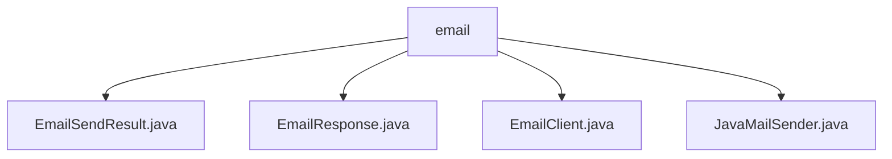

# 基础信息

|      |      |
|------|------|
| 名称 | email |
| 编码语言 | .java |
| 代码路径 | WeFe/common/java/common-verification-code/src/main/java/com/welab/wefe/common/verification/code/email |
| 包名 | docs.common.java.common-verification-code.src.main.java.com.welab.wefe.common.verification.code.email |
| 概述说明 | EmailSendResult类封装邮件发送结果，含状态码和消息字段。EmailResponse继承AbstractResponse，判断发送成功并返回消息。EmailClient继承AbstractClient，配置并发送邮件。JavaMailSender实现SMTP邮件发送功能，支持HTML格式和SSL加密。 |

# 说明

## 概述  
该模块核心职责是封装邮件发送功能及结果处理，类似邮件网关模式。主要包含EmailClient发送邮件、JavaMailSender底层实现、EmailSendResult结果封装和EmailResponse响应处理四个组件。接口规范统一采用状态码(code)和消息(message)的响应格式，关键数据结构为EmailSendResult的状态码-消息对。外部依赖仅为SMTP协议和JavaMail库。例如EmailClient通过JavaMailSender发送HTML邮件并返回EmailResponse。

## 主要业务场景  
典型流程为：EmailClient配置SMTP参数→调用JavaMailSender发送邮件→返回EmailResponse包装的EmailSendResult。交互模式采用建造者模式构建参数，如buildExtendParams组装邮件要素。完整功能覆盖邮件发送、状态反馈和结果解析，支持HTML内容和SSL加密。例如发送验证码时，通过RESP_STATUS_OK(0)判断成功与否，失败时从message字段获取错误详情。

### 包内部结构视图

该流程图展示了邮件验证码模块的文件结构，根节点为email文件夹，包含四个Java类文件：EmailSendResult.java、EmailResponse.java、EmailClient.java和JavaMailSender.java，这些文件共同构成了邮件验证码功能的核心实现。

# 文件列表

| 名称   | 类型  | 说明 |
|-------|------|-------------|
| [EmailSendResult.java](EmailSendResult.md) | file | EmailSendResult类包含code和message属性，提供getter和setter方法。 |
| [EmailResponse.java](EmailResponse.md) | file | EmailResponse类继承AbstractResponse，包含成功状态码0，通过构造函数传入EmailSendResult数据，判断成功条件为状态码匹配，返回数据中的消息体。 |
| [EmailClient.java](EmailClient.md) | file | EmailClient类继承AbstractClient，提供邮件发送功能，包含主机、端口、用户名等常量，通过send方法发送邮件，buildExtendParams构建参数。 |
| [JavaMailSender.java](JavaMailSender.md) | file | JavaMailSender类封装邮件发送功能，支持SMTP认证、SSL加密和超时设置，提供发送HTML和普通邮件的方法。 |

