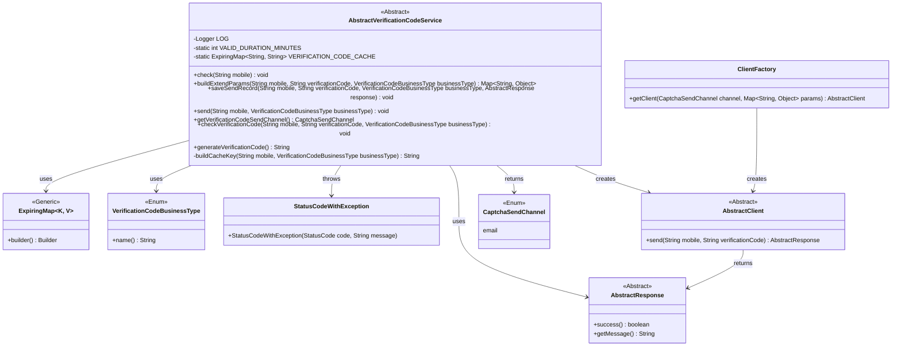
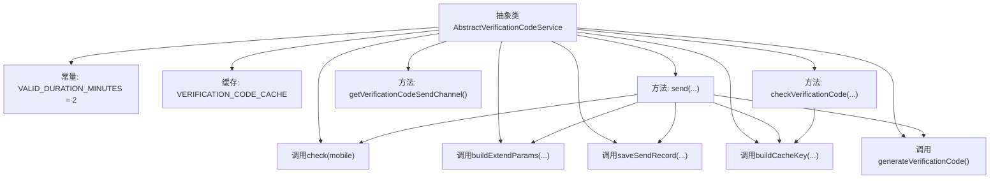
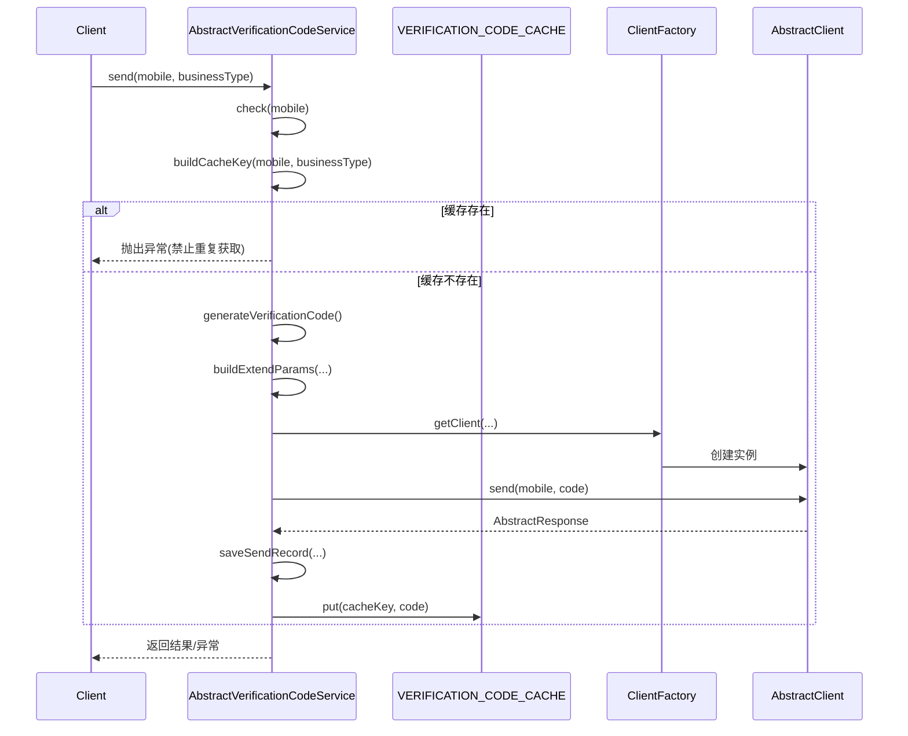

# 基础信息

|      |      |
|------|------|
| 名称 | AbstractVerificationCodeService |
| 编码语言 | .java |
| 代码路径 | WeFe/common/java/common-verification-code/src/main/java/com/welab/wefe/common/verification/code/service/AbstractVerificationCodeService.java |
| 包名 | com.welab.wefe.common.verification.code.service |
| 依赖项 | ['com.welab.wefe.common.StatusCode', 'com.welab.wefe.common.exception.StatusCodeWithException', 'com.welab.wefe.common.util.StringUtil', 'com.welab.wefe.common.verification.code.AbstractClient', 'com.welab.wefe.common.verification.code.AbstractResponse', 'com.welab.wefe.common.verification.code.ClientFactory', 'com.welab.wefe.common.verification.code.common.CaptchaSendChannel', 'com.welab.wefe.common.verification.code.common.VerificationCodeBusinessType', 'net.jodah.expiringmap.ExpiringMap', 'org.slf4j.Logger', 'org.slf4j.LoggerFactory', 'java.util.Map', 'java.util.concurrent.TimeUnit'] |
| 概述说明 | 抽象类AbstractVerificationCodeService提供验证码服务，包含发送、校验、生成验证码功能，使用缓存存储验证码，有效期2分钟，支持自定义业务类型和发送渠道。 |

# 说明

这是一个抽象验证码服务类，提供验证码生成、发送和校验功能。验证码有效期为2分钟，使用ExpiringMap缓存存储验证码。主要方法包括发送验证码、校验验证码有效性、生成6位随机验证码等。发送流程包含手机号检查、验证码生成、客户端调用发送、记录保存和缓存更新。校验时检查手机号和验证码非空，并与缓存中的值比对。该类为抽象类，要求子类实现检查手机号、构建扩展参数和保存发送记录的具体逻辑。默认使用邮件渠道发送验证码。

# 类列表 Class Summary

| 名称   | 类型  | 说明 |
|-------|------|-------------|
| AbstractVerificationCodeService | class | 抽象类AbstractVerificationCodeService提供验证码服务，包含发送、校验、生成验证码功能，使用缓存存储验证码，有效期2分钟，支持自定义发送渠道和业务类型。 |

## 类 AbstractVerificationCodeService

|      |      |
|------|------|
| 访问范围 | public abstract |
| 类型 | class |
| 名称 | AbstractVerificationCodeService |
| 说明 | 抽象类AbstractVerificationCodeService提供验证码服务，包含发送、校验、生成验证码功能，使用缓存存储验证码，有效期2分钟，支持自定义发送渠道和业务类型。 |

### UML类图

该代码是一个抽象类`AbstractVerificationCodeService`，用于处理验证码的发送和验证逻辑。它包含验证码缓存、发送记录保存、验证码生成等功能，并通过抽象方法要求子类实现具体的业务逻辑检查、参数构建和记录保存。类图中展示了与验证码业务类型、异常处理、客户端工厂等组件的交互关系，体现了验证码服务的核心流程和扩展点设计。

### 内部方法调用关系图

该流程图展示了验证码服务类的核心结构和调用关系，包含4个抽象方法和5个具体实现方法。时序图详细描述了发送验证码的完整流程：先进行手机号校验，检查缓存防止重复发送，生成随机6位验证码后通过客户端渠道发送，最后保存发送记录并缓存验证码。所有操作都包含异常处理机制，确保系统健壮性。缓存采用ExpiringMap实现自动过期清理，验证码有效期为2分钟。

### 字段列表 Field List

| 名称  | 类型  | 说明 |
|-------|-------|------|
| VALID_DURATION_MINUTES = 2 | int | 静态常量VALID_DURATION_MINUTES值为2，表示有效持续时间为2分钟。 |
| VERIFICATION_CODE_CACHE = ExpiringMap.builder()            .expiration(VALID_DURATION_MINUTES, TimeUnit.MINUTES)            .build() | ExpiringMap<String, String> | 创建了一个静态的ExpiringMap缓存，用于存储验证码，设置过期时间为VALID_DURATION_MINUTES分钟。 |
| LOG = LoggerFactory.getLogger(AbstractVerificationCodeService.class) | Logger | 声明一个受保护的最终日志记录器，用于AbstractVerificationCodeService类的日志输出。 |

### 方法列表

| 名称  | 类型  | 说明 |
|-------|-------|------|
| checkVerificationCode | void | 验证手机号和验证码有效性，空值或错误时抛出异常。 |
| saveSendRecord | void | 抽象方法：保存发送记录，参数包括手机号、验证码、业务类型和响应对象。 |
| buildExtendParams | Map<String, Object> | 抽象方法：构建扩展参数，需传入手机号、验证码和业务类型，可能抛出异常。 |
| check | void | 抽象方法check，接收字符串mobile参数，可能抛出StatusCodeWithException异常。 |
| send | void | 发送验证码方法：检查手机号，生成验证码，通过客户端发送，记录发送结果，缓存验证码，处理异常。 |
| generateVerificationCode | String | 生成6位随机数字验证码，范围100000到999999。 |
| buildCacheKey | String | 生成缓存键的方法，将手机号和业务类型拼接成字符串，用下划线连接。 |
| getVerificationCodeSendChannel | CaptchaSendChannel | 方法返回验证码发送渠道，固定为email。 |

