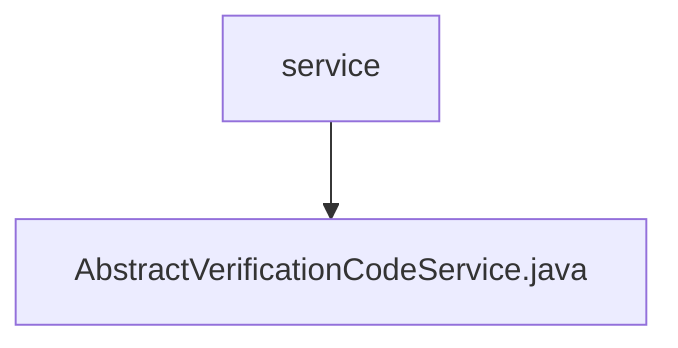

# 基础信息

|      |      |
|------|------|
| 名称 | service |
| 编码语言 | .java |
| 代码路径 | WeFe/common/java/common-verification-code/src/main/java/com/welab/wefe/common/verification/code/service |
| 包名 | docs.common.java.common-verification-code.src.main.java.com.welab.wefe.common.verification.code.service |
| 概述说明 | 抽象类AbstractVerificationCodeService提供验证码服务，包含发送、校验、生成验证码功能，使用缓存存储验证码，有效期2分钟，支持自定义业务类型和发送渠道。 |

# 说明

这是一个抽象验证码服务类，提供验证码生成、发送和校验功能。验证码有效期为2分钟，使用ExpiringMap缓存存储验证码。主要方法包括发送验证码、校验验证码有效性、生成6位随机验证码等。发送流程包含手机号检查、验证码生成、客户端调用发送、记录保存和缓存更新。校验时检查手机号和验证码非空，并与缓存中的值比对。该类为抽象类，要求子类实现检查手机号、构建扩展参数和保存发送记录的具体逻辑。默认使用邮件渠道发送验证码。

### 包内部结构视图

该流程图展示了verification模块中service目录的层级结构，其中service作为父节点包含一个子节点AbstractVerificationCodeService.java，表示这是一个抽象验证码服务类文件。整个结构简洁明了，体现了Java项目中典型的服务层文件组织方式。

# 文件列表

| 名称   | 类型  | 说明 |
|-------|------|-------------|
| [AbstractVerificationCodeService.java](AbstractVerificationCodeService.md) | file | 抽象类AbstractVerificationCodeService提供验证码服务，包含发送、校验、生成验证码功能，使用缓存存储验证码，有效期2分钟，支持自定义业务类型和发送渠道。 |

