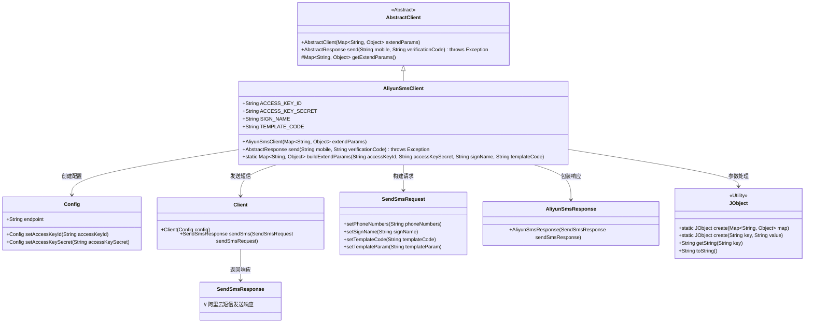
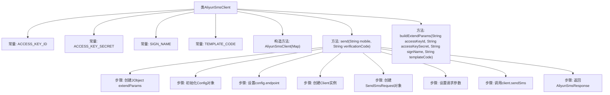

# 基础信息

|      |      |
|------|------|
| 名称 | AliyunSmsClient |
| 编码语言 | .java |
| 代码路径 | WeFe/common/java/common-verification-code/src/main/java/com/welab/wefe/common/verification/code/sms/AliyunSmsClient.java |
| 包名 | com.welab.wefe.common.verification.code.sms |
| 依赖项 | ['com.aliyun.dysmsapi20170525.Client', 'com.aliyun.dysmsapi20170525.models.SendSmsRequest', 'com.aliyun.dysmsapi20170525.models.SendSmsResponse', 'com.aliyun.teaopenapi.models.Config', 'com.welab.wefe.common.util.JObject', 'com.welab.wefe.common.verification.code.AbstractClient', 'com.welab.wefe.common.verification.code.AbstractResponse', 'java.util.HashMap', 'java.util.Map'] |
| 概述说明 | 阿里云短信客户端类，继承抽象客户端，通过配置密钥、签名和模板发送短信验证码。 |

# 说明

这是一个阿里云短信服务客户端类，继承自抽象客户端类。类中定义了四个静态常量表示配置参数键名。构造函数接收扩展参数映射。主要功能是通过send方法发送短信，需传入手机号和验证码，内部使用阿里云SDK配置客户端并构建请求，包括设置签名、模板代码和模板参数。还提供了构建扩展参数映射的静态工具方法，用于封装访问密钥、签名和模板代码等配置信息。

# 类列表 Class Summary

| 名称   | 类型  | 说明 |
|-------|------|-------------|
| AliyunSmsClient | class | 阿里云短信客户端类，继承抽象客户端，包含发送短信方法，需配置密钥、签名和模板代码。 |

## 类 AliyunSmsClient

|      |      |
|------|------|
| 访问范围 | public |
| 类型 | class |
| 名称 | AliyunSmsClient |
| 说明 | 阿里云短信客户端类，继承抽象客户端，包含发送短信方法，需配置密钥、签名和模板代码。 |

### UML类图

该类图展示了阿里云短信客户端的核心结构，AliyunSmsClient继承自AbstractClient，通过Config配置客户端信息，使用Client发送短信请求。流程涉及参数处理（JObject）、请求构建（SendSmsRequest）和响应包装（AliyunSmsResponse），完整实现了短信发送功能。各组件职责明确，通过组合方式实现高内聚低耦合的设计目标。

### 内部方法调用关系图

该流程图展示了阿里云短信客户端类的核心结构和工作流程。类包含4个常量字段、1个构造方法和2个主要方法。send方法流程详细描述了从参数处理到最终响应的完整短信发送过程，包括配置初始化、请求构建和API调用等关键步骤。buildExtendParams方法则用于构建扩展参数字典，为客户端初始化提供必要参数。整个设计体现了对阿里云短信API的封装和简化调用。

### 字段列表 Field List

| 名称  | 类型  | 说明 |
|-------|-------|------|
| TEMPLATE_CODE = "templateCode" | String | 定义了一个公共静态不可变字符串常量TEMPLATE_CODE，值为"templateCode"。 |
| ACCESS_KEY_SECRET = "accessKeySecret" | String | 定义了一个不可变的静态字符串常量ACCESS_KEY_SECRET，值为"accessKeySecret"。 |
| SIGN_NAME = "signName" | String | 定义了一个公共静态常量字符串SIGN_NAME，值为"signName"。 |
| ACCESS_KEY_ID = "accessKeyId" | String | 定义常量字符串ACCESS_KEY_ID，值为"accessKeyId"。 |

### 方法列表

| 名称  | 类型  | 说明 |
|-------|-------|------|
| send | AbstractResponse | 该方法通过阿里云短信服务发送验证码，配置密钥、签名和模板后调用API发送短信并返回响应。 |
| buildExtendParams | Map<String, Object> | 构建扩展参数Map，包含密钥ID、密钥、签名和模板代码。 |

