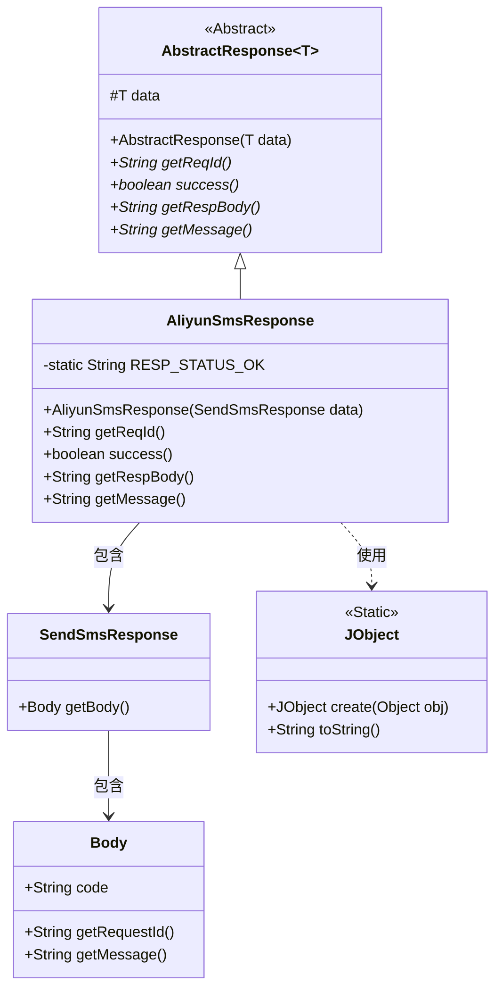
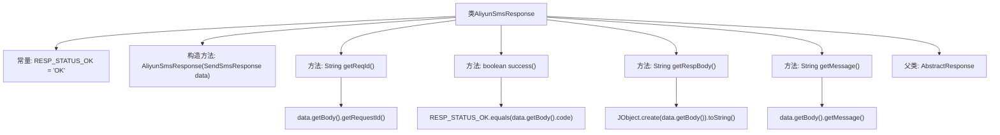

# 基础信息

|      |      |
|------|------|
| 名称 | AliyunSmsResponse |
| 编码语言 | .java |
| 代码路径 | WeFe/common/java/common-verification-code/src/main/java/com/welab/wefe/common/verification/code/sms/AliyunSmsResponse.java |
| 包名 | com.welab.wefe.common.verification.code.sms |
| 依赖项 | ['com.aliyun.dysmsapi20170525.models.SendSmsResponse', 'com.welab.wefe.common.util.JObject', 'com.welab.wefe.common.verification.code.AbstractResponse'] |
| 概述说明 | 阿里云短信响应类，继承抽象响应类，包含请求ID、成功状态判断、响应体和消息获取方法。 |

# 说明

这是一个名为AliyunSmsResponse的Java类，继承自AbstractResponse，泛型类型为SendSmsResponse。该类封装了阿里云短信服务的响应处理逻辑，包含四个核心方法：getReqId用于获取请求ID，success通过比较状态码判断请求是否成功，getRespBody将响应体转为JSON字符串，getMessage获取响应消息。类中定义了常量RESP_STATUS_OK表示成功状态码"OK"。构造函数接收SendSmsResponse对象并传递给父类。

# 类列表 Class Summary

| 名称   | 类型  | 说明 |
|-------|------|-------------|
| AliyunSmsResponse | class | 阿里云短信响应类，继承抽象响应类，包含请求ID、状态判断、响应体和消息获取方法。成功状态为"OK"。 |

## 类 AliyunSmsResponse

|      |      |
|------|------|
| 访问范围 | public |
| 类型 | class |
| 名称 | AliyunSmsResponse |
| 说明 | 阿里云短信响应类，继承抽象响应类，包含请求ID、状态判断、响应体和消息获取方法。成功状态为"OK"。 |

### UML类图

这段代码展示了一个阿里云短信响应处理类AliyunSmsResponse，它继承自泛型抽象类AbstractResponse。类图清晰地呈现了继承关系和组件依赖：AliyunSmsResponse通过SendSmsResponse获取响应数据，其中包含Body对象用于存储状态码、请求ID等信息。JObject工具类被用于JSON序列化操作。该设计实现了响应状态判断、请求追踪和消息获取等核心功能，RESP_STATUS_OK常量用于验证请求是否成功。

### 内部方法调用关系图

该流程图展示了AliyunSmsResponse类的结构，包括常量定义、构造方法和四个重写方法。类继承自AbstractResponse<SendSmsResponse>，各方法通过调用data对象的getBody()方法获取底层数据，分别实现请求ID获取、状态判断、响应体转换和消息提取功能。success()方法通过比较状态码与常量"OK"来判断请求是否成功。

### 字段列表 Field List

| 名称  | 类型  | 说明 |
|-------|-------|------|
| RESP_STATUS_OK = "OK" | String | 定义静态常量字符串RESP_STATUS_OK，值为"OK"。 |

### 方法列表

| 名称  | 类型  | 说明 |
|-------|-------|------|
| getReqId | String | 该方法重写getReqId，返回data.body中的requestId字段值。 |
| getRespBody | String | 该方法返回将data.getBody()转换为JSON字符串的结果。 |
| getMessage | String | 重写getMessage方法，返回data对象中body的message属性值。 |
| success | boolean | 检查HTTP响应状态码是否为成功状态。 |

