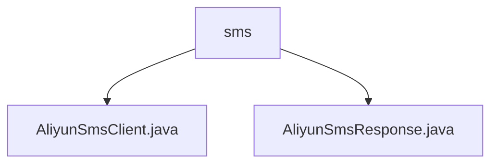

# 基础信息

|      |      |
|------|------|
| 名称 | sms |
| 编码语言 | .java |
| 代码路径 | WeFe/common/java/common-verification-code/src/main/java/com/welab/wefe/common/verification/code/sms |
| 包名 | docs.common.java.common-verification-code.src.main.java.com.welab.wefe.common.verification.code.sms |
| 概述说明 | 阿里云短信服务客户端类，继承抽象类，通过send方法发送短信，需手机号和验证码，内部使用阿里云SDK配置请求。响应处理类继承AbstractResponse，封装响应逻辑，含请求ID获取、状态判断等方法，成功状态码为"OK"。 |

# 说明

## 概述  
该模块是阿里云短信服务的Java客户端实现，核心职责是通过封装阿里云SDK提供短信发送能力（例如验证码通知）。接口规范包括发送短信的Send方法和响应处理类，遵循抽象客户端和响应基类的设计模式。关键数据结构包含配置参数映射（如访问密钥、签名模板）和响应对象（封装请求ID/状态码）。外部依赖仅为阿里云短信SDK。例如通过静态工具方法构建扩展参数映射，简化配置过程。

## 主要业务场景  
典型场景是触发短信验证码发送，流程为：客户端配置密钥和模板→构造请求（含手机号/验证码）→调用Send方法→解析响应状态。交互模式类似请求-响应模型，通过AliyunSmsResponse判断发送结果（例如状态码为"OK"表示成功）。功能完整性体现在异常处理、响应解析和配置封装，例如自动将模板参数转为JSON格式。API类型为同步调用，集成案例包括用户注册时的验证码下发。

### 包内部结构视图

该流程图展示了短信验证码模块的代码结构，其中sms文件夹包含两个Java文件：AliyunSmsClient.java和AliyunSmsResponse.java，分别对应阿里云短信服务的客户端实现和响应对象。整个结构简洁清晰，体现了短信验证码功能的核心组件。

# 文件列表

| 名称   | 类型  | 说明 |
|-------|------|-------------|
| [AliyunSmsClient.java](AliyunSmsClient.md) | file | 阿里云短信客户端类，继承抽象客户端，通过配置密钥、签名和模板发送短信验证码。 |
| [AliyunSmsResponse.java](AliyunSmsResponse.md) | file | 阿里云短信响应类，继承抽象响应类，包含请求ID、成功状态判断、响应体和消息获取方法。 |

