# 基础信息

|      |      |
|------|------|
| 名称 | wefe |
| 编码语言 | .java |
| 代码路径 | WeFe/common/java/common-web/src/main/java/com/welab/wefe |
| 包名 | docs.common.java.common-web.src.main.java.com.welab.wefe |
| 概述说明 | 该模块集成了Web API开发框架，包含日志记录、用户活动管理、权限控制、流量限制、验证码服务、文档生成等核心功能。采用注解驱动和反射机制，支持多格式文档输出和自动化校验。通过线程安全设计和防御式编程保障稳定性，适用于多角色系统和微服务场景。 |

# 说明

## 概述  
该模块是Web应用开发的全栈解决方案，核心职责包括API全生命周期管理（请求处理/权限控制/日志记录）和开发支持工具（文档生成/安全策略）。接口规范遵循分层设计，如AbstractApi基类体系、@Api注解元数据和ApiResult统一响应结构。关键数据结构涵盖日志实体（ApiLog）、权限模型（Caller枚举）、安全策略（LoginSecurityPolicy）和文档模型（ApiItem）。外部依赖包括Spring框架、SM4加密库、FastJson和并发工具类。例如通过TempRsaCache实现临时密钥管理，类似网关层的安全拦截机制。

## 主要业务场景  
模块支撑多角色系统的典型交互链：从请求入站（BaseController路由）→安全校验（LoginSecurityPolicy/RSA解密）→业务执行（ApiExecutor反射调用）→响应处理（DTO转换/日志记录）。完整功能矩阵包含：1）安全控制（如验证码服务+小黑屋机制）；2）流量治理（IP/手机号双维度限流）；3）开发辅助（API文档自动化生成）。典型集成案例表现为链式配置（Launcher初始化）、注解驱动（如@FlowLimitByMobile）和工具类组合（CurrentAccountUtil+ModelMapper），适用于中台服务快速构建。

### 包内部结构视图

```mermaid
graph TD
    wefe --> common
    wefe --> web
    common --> delegate
    common --> controller
    common --> api
    common --> api_document
    common --> util
    common --> service
    common --> dto
    common --> function
    common --> config
    delegate --> api_log
    api_log --> ApiLog.java
    api_log --> ApiCallerType.java
    api_log --> AbstractApiLogger.java
    controller --> BaseController.java
    api --> dev
    api --> base
    dev --> Apis.java
    dev --> ErrorSqlList.java
    dev --> EnvApi.java
    dev --> DownloadLogFile.java
    dev --> SlowSqlList.java
    dev --> FindLogFileException.java
    dev --> HttpBinApi.java
    dev --> CreateTestDataSetApi.java
    base --> Caller.java
    base --> FlowLimitByMobile.java
    base --> FlowLimitByIp.java
    base --> Api.java
    base --> AbstractNoneOutputApi.java
    base --> AbstractApi.java
    base --> AbstractNoneInputApi.java
    api_document --> model
    model --> ApiItem.java
    model --> ApiParamField.java
    model --> ApiParam.java
    api_document --> MarkdownFormatter.java
    api_document --> AbstractApiDocumentFormatter.java
    api_document --> JsonFormatter.java
    api_document --> HtmlFormatter.java
    util --> DatabaseEncryptConverter.java
    util --> HttpServletRequestUtil.java
    util --> DatabaseEncryptUtil.java
    util --> CurrentAccountUtil.java
    util --> ModelMapper.java
    service --> account
    account --> HistoryPasswordItem.java
    account --> SsoAccountInfo.java
    account --> AccountInfo.java
    service --> flowlimit
    flowlimit --> AbstractMemoryFlowLimitService.java
    flowlimit --> FlowLimitByIpService.java
    flowlimit --> AbstractFlowLimitService.java
    flowlimit --> FlowLimitByMobileService.java
    service --> CaptchaService.java
    dto --> AbstractWithFilesApiInput.java
    dto --> AbstractTimedApiOutput.java
    dto --> GatewayMemberInfo.java
    dto --> Captcha.java
    dto --> NoneApiOutput.java
    dto --> UploadFileApiOutput.java
    dto --> PageableApiInput.java
    dto --> ApiResult.java
    dto --> UniqueIDApiInput.java
    dto --> AbstractApiOutput.java
    dto --> AbstractApiInput.java
    dto --> NoneApiInput.java
    dto --> PageableApiOutput.java
    dto --> AbstractSecureBoostInput.java
    dto --> AbstractLRInput.java
    dto --> AbstractGridSearchParam.java
    dto --> SignedApiInput.java
    function --> FlowLimitByMobileFunction.java
    function --> CheckSessionTokenFunction.java
    function --> BeforeApiExecuteFunction.java
    function --> AfterApiExecuteFunction.java
    function --> ApiPermissionPolicyFunction.java
    function --> OnApiExceptionFunction.java
    function --> FlowLimitByIpFunction.java
    config --> AppConfig.java
    config --> ApiBeanNameGenerator.java
    config --> MyCorsFilter.java
    config --> CommonConfig.java
    web --> TempRsaCache.java
    web --> Launcher.java
    web --> LoginSecurityPolicy.java
    web --> ApiExecutor.java
```

该流程图展示了WeFe项目中common-web模块的完整目录结构，从顶层wefe节点开始，逐级展开至各个子模块和文件。主要包含common和web两大分支，其中common下又细分为delegate、controller、api等12个子模块，每个子模块包含具体的Java类文件。整个结构清晰展示了项目代码的组织方式，体现了模块化设计思想，便于开发者快速定位文件位置。

# 文件列表

| 名称   | 类型  | 说明 |
|-------|------|-------------|
| [common](common/_module.md) | package | 该模块集成了Web API开发框架，包含日志记录、用户活动管理、权限控制、流量限制、验证码服务、文档生成等核心功能。采用注解驱动和反射机制，支持多格式文档输出和自动化校验。通过线程安全设计和防御式编程保障稳定性，适用于多角色系统和微服务场景。 |

