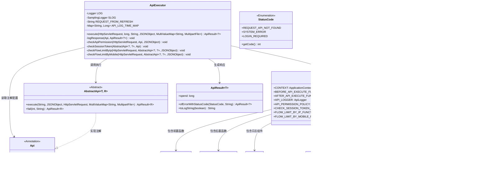

# 基础信息

|      |      |
|------|------|
| 名称 | ApiExecutor |
| 编码语言 | .java |
| 代码路径 | WeFe/common/java/common-web/src/main/java/com/welab/wefe/common/web/ApiExecutor.java |
| 包名 | com.welab.wefe.common.web |
| 依赖项 | ['com.alibaba.fastjson.JSONObject', 'com.welab.wefe.common.SamplingLogger', 'com.welab.wefe.common.StatusCode', 'com.welab.wefe.common.TimeSpan', 'com.welab.wefe.common.exception.StatusCodeWithException', 'com.welab.wefe.common.web.api.base.AbstractApi', 'com.welab.wefe.common.web.api.base.Api', 'com.welab.wefe.common.web.api.base.FlowLimitByIp', 'com.welab.wefe.common.web.api.base.FlowLimitByMobile', 'com.welab.wefe.common.web.dto.ApiResult', 'org.apache.commons.lang3.StringUtils', 'org.slf4j.Logger', 'org.slf4j.LoggerFactory', 'org.slf4j.MDC', 'org.springframework.beans.BeansException', 'org.springframework.util.MultiValueMap', 'org.springframework.web.multipart.MultipartFile', 'javax.servlet.http.HttpServletRequest', 'java.util.Map', 'java.util.concurrent.ConcurrentHashMap'] |
| 概述说明 | ApiExecutor类实现API执行逻辑，包含权限检查、流量控制、日志记录等功能，处理请求并返回结果。 |

# 说明

ApiExecutor类是一个处理API请求的核心执行器，包含日志记录、权限检查、流量控制等功能。它通过反射动态查找并执行对应的API实现类，支持请求参数解析、前置后置处理钩子、异常捕获及响应日志记录。类中实现了IP和手机号流量控制检查，并提供了灵活的日志采样机制以减少磁盘占用。执行过程包括API路径匹配、权限验证、流量控制、业务逻辑执行及结果处理，最终返回包含耗时等信息的ApiResult对象。

# 类列表 Class Summary

| 名称   | 类型  | 说明 |
|-------|------|-------------|
| ApiExecutor | class | ApiExecutor类处理API请求，包括查找API、权限检查、流量控制、执行API及日志记录。支持前置后置操作，返回结果包含耗时和状态。 |

## 类 ApiExecutor

|      |      |
|------|------|
| 访问范围 | public |
| 类型 | class |
| 名称 | ApiExecutor |
| 说明 | ApiExecutor类处理API请求，包括查找API、权限检查、流量控制、执行API及日志记录。支持前置后置操作，返回结果包含耗时和状态。 |

### UML类图

这段代码展示了一个API执行器的核心结构，主要包含ApiExecutor类及其相关依赖。ApiExecutor通过Spring上下文获取具体API实现(AbstractApi)，在执行前后进行权限检查、流量控制等操作，并通过Launcher类集成了各种可配置的扩展功能。类图清晰地展示了各组件间的协作关系，包括注解配置读取、执行流程控制、异常处理和日志记录等关键功能模块，体现了高度可扩展的API网关设计模式。

### 内部方法调用关系图

这段代码展示了一个API执行器的完整流程，主要处理HTTP请求的解析、权限验证、流量控制、业务逻辑执行和响应记录。流程图清晰地展示了类结构和方法调用关系，时序图则详细描述了从客户端请求到返回响应的完整处理过程，包括异常处理和后置操作。该设计具有完善的日志记录、权限控制和流量限制机制，体现了健壮的API网关处理能力。

### 字段列表 Field List

| 名称  | 类型  | 说明 |
|-------|-------|------|
| LOG = LoggerFactory.getLogger(ApiExecutor.class) | Logger | 定义ApiExecutor类的静态常量LOG，用于日志记录。 |
| REQUEST_FROM_REFRESH = "request-from-refresh" | String | 静态常量字符串REQUEST_FROM_REFRESH，值为"request-from-refresh"。 |
| SLOG | SamplingLogger | 受保护静态常量采样日志器SLOG。 |
| API_LOG_TIME_MAP = new ConcurrentHashMap<>() | Map<String, Long> | 私有静态常量API_LOG_TIME_MAP，使用线程安全的ConcurrentHashMap存储字符串到长整型的映射。 |

### 方法列表

| 名称  | 类型  | 说明 |
|-------|-------|------|
| checkSessionToken | void | 检查会话令牌有效性：跳过无需登录接口；未设置检查方法时不执行；注释部分显示原检查逻辑（未启用）。 |
| checkFlowLimitByIp | void | 检查IP流量限制：若未设置限制函数或注解无效则跳过，否则调用限制检查函数。 |
| logResponse | void | 该方法根据注解配置控制API响应日志打印频率，避免频繁记录。通过时间间隔检查决定是否省略日志，减少磁盘占用。最后按日志级别输出响应内容，限制长度避免过大。 |
| execute | ApiResult<?> | 该方法处理API请求：查找对应接口，检查权限和流量限制，执行前后可自定义操作，记录日志并返回结果。异常时返回错误信息。 |
| checkApiPermission | void | 检查API权限：若未设置权限策略则跳过，否则调用策略检查方法。 |
| checkFlowLimitByMobile | void | 检查手机号流量限制功能，若未启用或参数无效则跳过，否则执行限制检查。 |

