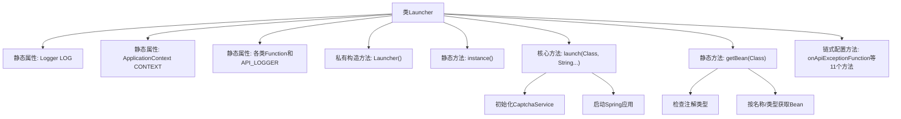

# 基础信息

|      |      |
|------|------|
| 名称 | Launcher |
| 编码语言 | .java |
| 代码路径 | WeFe/common/java/common-web/src/main/java/com/welab/wefe/common/web/Launcher.java |
| 包名 | com.welab.wefe.common.web |
| 依赖项 | ['com.welab.wefe.common.util.StringUtil', 'com.welab.wefe.common.web.delegate.api_log.AbstractApiLogger', 'com.welab.wefe.common.web.function', 'com.welab.wefe.common.web.service.CaptchaService', 'org.slf4j.Logger', 'org.slf4j.LoggerFactory', 'org.springframework.boot.SpringApplication', 'org.springframework.context.ApplicationContext', 'org.springframework.stereotype.Component', 'org.springframework.stereotype.Repository', 'org.springframework.stereotype.Service'] |
| 概述说明 | Launcher类是一个启动器，包含API权限检查、令牌验证、流量控制等功能，提供事件触发和日志记录，支持Spring应用启动和Bean获取。 |

# 说明

Launcher类是一个核心启动类，用于初始化和管理API服务的各种配置和功能。它包含多个静态变量，用于设置API权限检查策略、会话令牌检查、IP和手机号流量控制、API执行前后事件以及异常处理。类提供了链式调用的方法，允许灵活配置这些功能。启动方法launch负责初始化验证码服务并启动Spring应用上下文。此外，还提供了获取Spring Bean的辅助方法，支持通过注解值或类型获取Bean实例。该类设计为单例模式，禁止外部实例化，通过静态instance方法获取实例。

# 类列表 Class Summary

| 名称   | 类型  | 说明 |
|-------|------|-------------|
| Launcher | class | Launcher类为API启动器，包含权限检查、流量控制、前后置事件及异常处理等配置方法，支持Spring应用启动和Bean获取。 |


## 类 Launcher

|      |      |
|------|------|
| 访问范围 | public |
| 类型 | class |
| 名称 | Launcher |
| 说明 | Launcher类为API启动器，包含权限检查、流量控制、前后置事件及异常处理等配置方法，支持Spring应用启动和Bean获取。 |


### UML类图

```mermaid
classDiagram
    class Launcher {
        -static Logger LOG
        +static ApplicationContext CONTEXT
        +static ApiPermissionPolicyFunction API_PERMISSION_POLICY
        +static CheckSessionTokenFunction CHECK_SESSION_TOKEN_FUNCTION
        +static FlowLimitByIpFunction FLOW_LIMIT_BY_IP_FUNCTION
        +static FlowLimitByMobileFunction FLOW_LIMIT_BY_MOBILE_FUNCTION
        +static String API_PACKAGE_PATH
        +static BeforeApiExecuteFunction BEFORE_API_EXECUTE_FUNCTION
        +static AfterApiExecuteFunction AFTER_API_EXECUTE_FUNCTION
        +static OnApiExceptionFunction ON_API_EXCEPTION_FUNCTION
        +static AbstractApiLogger API_LOGGER
        -Launcher()
        +static Launcher instance()
        +void launch(Class<?> primarySource, String... args)
        +static ~T~ getBean(Class~T~ requiredType)
        +Launcher onApiExceptionFunction(OnApiExceptionFunction func)
        +Launcher beforeApiExecuteFunction(BeforeApiExecuteFunction func)
        +Launcher afterApiExecuteFunction(AfterApiExecuteFunction func)
        +Launcher apiLogger(AbstractApiLogger logger)
        +Launcher apiPermissionPolicy(ApiPermissionPolicyFunction func)
        +Launcher checkSessionTokenFunction(CheckSessionTokenFunction func)
        +Launcher flowLimitByIpFunctionFunction(FlowLimitByIpFunction func)
        +Launcher flowLimitByMobileFunctionFunction(FlowLimitByMobileFunction func)
        +Launcher apiPackagePath(String path)
        +Launcher apiPackageClass(Class<?> packageClass)
    }

    <<Interface>> ApiPermissionPolicyFunction
    <<Interface>> CheckSessionTokenFunction
    <<Interface>> FlowLimitByIpFunction
    <<Interface>> FlowLimitByMobileFunction
    <<Interface>> BeforeApiExecuteFunction
    <<Interface>> AfterApiExecuteFunction
    <<Interface>> OnApiExceptionFunction

    class AbstractApiLogger {
        <<abstract>>
    }

    Launcher --> ApiPermissionPolicyFunction : 配置
    Launcher --> CheckSessionTokenFunction : 配置
    Launcher --> FlowLimitByIpFunction : 配置
    Launcher --> FlowLimitByMobileFunction : 配置
    Launcher --> BeforeApiExecuteFunction : 配置
    Launcher --> AfterApiExecuteFunction : 配置
    Launcher --> OnApiExceptionFunction : 配置
    Launcher --> AbstractApiLogger : 配置
```

该图展示了Launcher类的结构及其与多个功能接口的关系。Launcher是一个核心启动类，通过静态字段维护各种API策略函数（如权限检查、流量控制等）和日志组件，提供链式配置方法。类图中明确区分了接口（用<<Interface>>标记）和抽象类，并显示了Launcher对这些组件的单向依赖关系。所有配置接口均通过Launcher的实例方法进行设置，体现了高度可配置的设计模式。


### 内部方法调用关系图



该流程图展示了Launcher类的核心结构，它是一个典型的应用启动器模式实现。类包含静态配置属性、私有构造方法、实例获取方法和核心启动逻辑。主要流程分为三部分：1) 通过静态属性存储全局配置；2) 通过launch()方法初始化服务并启动Spring应用；3) 提供getBean()方法从上下文获取组件。特别值得注意的是11个链式配置方法，采用Builder模式允许流畅地配置各类策略函数。

### 字段列表 Field List

| 名称  | 类型  | 说明 |
|-------|-------|------|
| CHECK_SESSION_TOKEN_FUNCTION | CheckSessionTokenFunction | 静态公共会话令牌检查函数实例声明。 |
| API_PERMISSION_POLICY | ApiPermissionPolicyFunction | 声明了一个静态的ApiPermissionPolicyFunction类型的API_PERMISSION_POLICY变量。 |
| BEFORE_API_EXECUTE_FUNCTION | BeforeApiExecuteFunction | 静态变量BEFORE_API_EXECUTE_FUNCTION，用于API执行前的操作。 |
| API_PACKAGE_PATH | String | 静态字符串变量API_PACKAGE_PATH，用于存储API包路径。 |
| CONTEXT | ApplicationContext | 静态公共应用上下文变量CONTEXT。 |
| FLOW_LIMIT_BY_MOBILE_FUNCTION | FlowLimitByMobileFunction | 静态公共变量FLOW_LIMIT_BY_MOBILE_FUNCTION，类型为FlowLimitByMobileFunction。 |
| FLOW_LIMIT_BY_IP_FUNCTION | FlowLimitByIpFunction | 静态变量FLOW_LIMIT_BY_IP_FUNCTION，用于IP流量限制功能。 |
| AFTER_API_EXECUTE_FUNCTION | AfterApiExecuteFunction | 静态变量AFTER_API_EXECUTE_FUNCTION，类型为AfterApiExecuteFunction，用于API执行后的操作。 |
| API_LOGGER | AbstractApiLogger | 声明一个静态公共变量API_LOGGER，类型为AbstractApiLogger。 |
| ON_API_EXCEPTION_FUNCTION | OnApiExceptionFunction | 定义静态API异常处理函数变量。 |
| LOG = LoggerFactory.getLogger(Launcher.class) | Logger | 定义Launcher类的私有静态日志对象LOG，使用LoggerFactory创建。 |

### 方法列表

| 名称  | 类型  | 说明 |
|-------|-------|------|
| onApiExceptionFunction | Launcher | 设置API异常处理函数并返回当前对象实例。 |
| launch | void | 启动方法，初始化验证码服务并运行Spring应用。 |
| afterApiExecuteFunction | Launcher | 该方法设置API执行后的回调函数并返回当前对象实例。 |
| getBean | T | 静态方法通过类注解获取Bean名，若无则按类型获取，否则按名称获取。 |
| apiLogger | Launcher | 该方法设置API日志记录器并返回当前对象实例。 |
| apiPermissionPolicy | Launcher | 设置API权限策略函数并返回当前对象实例。 |
| beforeApiExecuteFunction | Launcher | 该方法用于设置API执行前的回调函数，接受一个函数参数并返回当前对象实例。 |
| flowLimitByIpFunctionFunction | Launcher | Java方法：设置IP限流函数并返回当前对象实例。 |
| flowLimitByMobileFunctionFunction | Launcher | 该方法设置流量限制函数并返回当前对象实例。 |
| apiPackagePath | Launcher | 设置API包路径并返回当前对象实例。 |
| apiPackageClass | Launcher | Java方法设置API包路径并返回当前对象实例。 |
| checkSessionTokenFunction | Launcher | 设置会话令牌检查函数并返回当前对象实例。 |
| instance | Launcher | 静态方法instance()返回Launcher的新实例。 |


