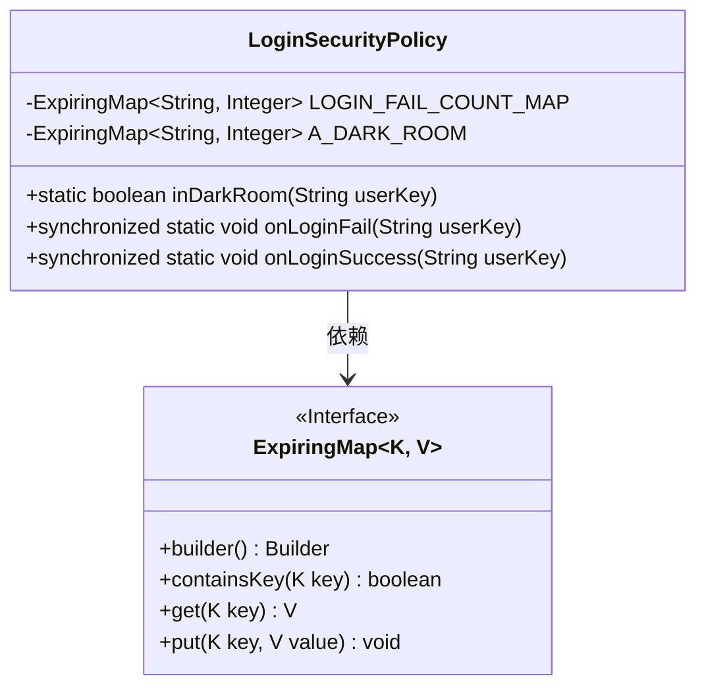
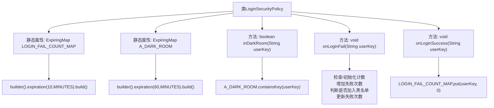

# 基础信息

|      |      |
|------|------|
| 名称 | LoginSecurityPolicy |
| 编码语言 | .java |
| 代码路径 | WeFe/common/java/common-web/src/main/java/com/welab/wefe/common/web/LoginSecurityPolicy.java |
| 包名 | com.welab.wefe.common.web |
| 依赖项 | ['net.jodah.expiringmap.ExpiringMap', 'java.util.concurrent.TimeUnit'] |
| 概述说明 | LoginSecurityPolicy类管理登录安全策略，包含两个过期映射：LOGIN_FAIL_COUNT_MAP记录1分钟内登录失败次数，10分钟过期；A_DARK_ROOM记录过多失败的用户，60分钟过期。方法包括检查用户是否在小黑屋、记录登录失败和成功事件。失败超过5次进入小黑屋。 |

# 说明

LoginSecurityPolicy类实现了用户登录安全策略，包含两个过期映射表：LOGIN_FAIL_COUNT_MAP记录每分钟用户名登录失败次数，10分钟过期；A_DARK_ROOM存储多次失败被关小黑屋的用户，60分钟过期。提供三个方法：inDarkRoom检查用户是否在小黑屋；onLoginFail记录失败次数，超过5次则关入小黑屋；onLoginSuccess重置用户失败次数。通过同步方法保证线程安全。

# 类列表 Class Summary

| 名称   | 类型  | 说明 |
|-------|------|-------------|
| LoginSecurityPolicy | class | 登录安全策略类，记录用户登录失败次数，10分钟过期。失败超5次进入小黑屋1小时。提供检查小黑屋状态、记录登录成功/失败的方法。 |

## 类 LoginSecurityPolicy

|      |      |
|------|------|
| 访问范围 | public |
| 类型 | class |
| 名称 | LoginSecurityPolicy |
| 说明 | 登录安全策略类，记录用户登录失败次数，10分钟过期。失败超5次进入小黑屋1小时。提供检查小黑屋状态、记录登录成功/失败的方法。 |

### UML类图

这段代码展示了一个登录安全策略类，使用两个ExpiringMap分别记录登录失败次数和被封禁用户。LOGIN_FAIL_COUNT_MAP保存10分钟内用户登录失败次数，A_DARK_ROOM保存60分钟内被封禁用户。提供三个静态方法：检查是否被封禁、记录登录失败（超过5次则封禁）和重置登录失败计数。通过同步方法保证线程安全，有效防止暴力破解攻击。

### 内部方法调用关系图

这段代码实现了一个登录安全策略系统，主要包含两个核心功能：登录失败次数统计和用户黑名单管理。通过ExpiringMap实现带过期时间的缓存，LOGIN_FAIL_COUNT_MAP记录10分钟内用户的失败次数，A_DARK_ROOM存储60分钟内被拉黑的用户。当用户连续失败超过5次时会被加入黑名单，成功登录则重置失败计数。所有操作都通过synchronized保证线程安全，防止并发问题。

### 字段列表 Field List

| 名称  | 类型  | 说明 |
|-------|-------|------|
| LOGIN_FAIL_COUNT_MAP = ExpiringMap            .builder()            .expiration(10, TimeUnit.MINUTES)            .build() | ExpiringMap<String, Integer> | 定义一个私有静态的ExpiringMap，键为字符串，值为整数，用于记录登录失败次数，设置10分钟自动过期。 |
| A_DARK_ROOM = ExpiringMap            .builder()            .expiration(60, TimeUnit.MINUTES)            .build() | ExpiringMap<String, Integer> | 创建一个静态的ExpiringMap实例A_DARK_ROOM，设置60分钟过期时间。 |

### 方法列表

| 名称  | 类型  | 说明 |
|-------|-------|------|
| inDarkRoom | boolean | 方法inDarkRoom检查userKey是否存在于A_DARK_ROOM中，返回布尔值。 |
| onLoginFail | void | 同步方法记录用户登录失败次数，超过5次将用户加入黑名单。 |
| onLoginSuccess | void | 同步静态方法onLoginSuccess接收userKey参数，将LOGIN_FAIL_COUNT_MAP中对应键的值重置为0。 |

