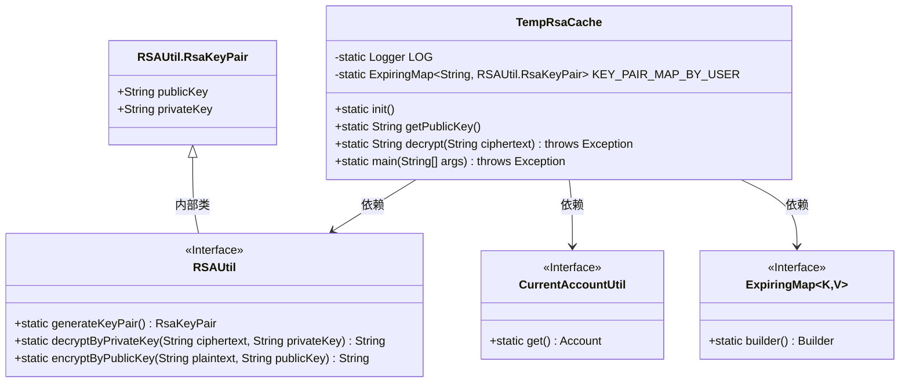
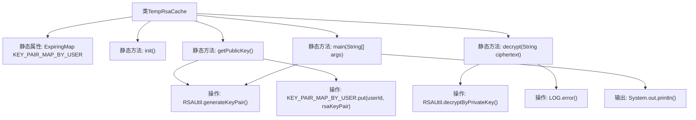

# 基础信息

|      |      |
|------|------|
| 名称 | TempRsaCache |
| 编码语言 | .java |
| 代码路径 | WeFe/common/java/common-web/src/main/java/com/welab/wefe/common/web/TempRsaCache.java |
| 包名 | com.welab.wefe.common.web |
| 依赖项 | ['com.welab.wefe.common.util.RSAUtil', 'com.welab.wefe.common.web.util.CurrentAccountUtil', 'net.jodah.expiringmap.ExpirationPolicy', 'net.jodah.expiringmap.ExpiringMap', 'org.slf4j.Logger', 'org.slf4j.LoggerFactory', 'java.util.concurrent.TimeUnit'] |
| 概述说明 | TempRsaCache类管理用户RSA密钥对缓存，60分钟过期。提供生成公钥和解密功能，解密失败时记录错误日志。 |

# 说明

TempRsaCache类是一个使用RSA加密的临时缓存工具，通过ExpiringMap存储用户ID与RSA密钥对的映射关系，60分钟无访问自动过期。提供获取公钥和解密功能，解密失败时记录错误日志。main方法演示了密钥生成、加密和解密流程。

# 类列表 Class Summary

| 名称   | 类型  | 说明 |
|-------|------|-------------|
| TempRsaCache | class | TempRsaCache类管理用户RSA密钥对缓存，60分钟过期，提供公钥获取和解密功能，解密失败记录日志。 |

## 类 TempRsaCache

|      |      |
|------|------|
| 访问范围 | public |
| 类型 | class |
| 名称 | TempRsaCache |
| 说明 | TempRsaCache类管理用户RSA密钥对缓存，60分钟过期，提供公钥获取和解密功能，解密失败记录日志。 |

### UML类图

该类图展示了TempRsaCache类的结构及其依赖关系。TempRsaCache使用ExpiringMap来缓存RSA密钥对，并通过RSAUtil生成密钥对和加解密。CurrentAccountUtil提供当前用户信息。RSAUtil.RsaKeyPair是RSAUtil的内部类，存储公钥和私钥。ExpiringMap是一个泛型接口，用于实现带过期时间的缓存功能。

### 内部方法调用关系图

这段代码流程图展示了TempRsaCache类的核心结构和功能。该类通过静态ExpiringMap维护用户与RSA密钥对的映射关系，提供公钥获取(getPublicKey)和解密(decrypt)功能。getPublicKey方法会生成新密钥对并存入缓存，decrypt方法使用私钥解密数据并在失败时记录错误日志。main方法演示了完整的加密解密流程，包括密钥生成、数据加密、解密和结果输出。整个流程突出了基于用户ID的密钥管理和异常处理机制。

### 字段列表 Field List

| 名称  | 类型  | 说明 |
|-------|-------|------|
| KEY_PAIR_MAP_BY_USER = ExpiringMap            .builder()            .expirationPolicy(ExpirationPolicy.ACCESSED)            .expiration(60, TimeUnit.MINUTES)            .build() | ExpiringMap<String, RSAUtil.RsaKeyPair> | 使用ExpiringMap存储用户RSA密钥对，访问后60分钟自动过期。 |
| LOG = LoggerFactory.getLogger(TempRsaCache.class) | Logger | 类TempRsaCache中定义了一个静态不可变的日志记录器实例LOG。 |

### 方法列表

| 名称  | 类型  | 说明 |
|-------|-------|------|
| getPublicKey | String | 生成RSA密钥对并存储，返回公钥。 |
| init | void | 空方法定义，无具体实现。 |
| main | void | 生成RSA密钥对，打印公钥私钥，加密明文并打印密文，解密后打印结果。 |
| decrypt | String | 静态方法decrypt通过私钥解密RSA密文，失败时记录错误日志并抛出异常。 |

