# 基础信息

|      |      |
|------|------|
| 名称 | web |
| 编码语言 | .java |
| 代码路径 | WeFe/common/java/common-web/src/main/java/com/welab/wefe/common/web |
| 包名 | docs.common.java.common-web.src.main.java.com.welab.wefe.common.web |
| 概述说明 | 该模块集成了Web API开发框架，包含日志记录、用户活动管理、权限控制、流量限制、验证码服务、文档生成等核心功能。采用注解驱动和反射机制，支持多格式文档输出和自动化校验。通过线程安全设计和防御式编程保障稳定性，适用于多角色系统和微服务场景。 |

# 说明

## 概述  
该模块是Web应用开发的全栈解决方案，核心职责包括API全生命周期管理（请求处理/权限控制/日志记录）和开发支持工具（文档生成/安全策略）。接口规范遵循分层设计，如AbstractApi基类体系、@Api注解元数据和ApiResult统一响应结构。关键数据结构涵盖日志实体（ApiLog）、权限模型（Caller枚举）、安全策略（LoginSecurityPolicy）和文档模型（ApiItem）。外部依赖包括Spring框架、SM4加密库、FastJson和并发工具类。例如通过TempRsaCache实现临时密钥管理，类似网关层的安全拦截机制。

## 主要业务场景  
模块支撑多角色系统的典型交互链：从请求入站（BaseController路由）→安全校验（LoginSecurityPolicy/RSA解密）→业务执行（ApiExecutor反射调用）→响应处理（DTO转换/日志记录）。完整功能矩阵包含：1）安全控制（如验证码服务+小黑屋机制）；2）流量治理（IP/手机号双维度限流）；3）开发辅助（API文档自动化生成）。典型集成案例表现为链式配置（Launcher初始化）、注解驱动（如@FlowLimitByMobile）和工具类组合（CurrentAccountUtil+ModelMapper），适用于中台服务快速构建。

### 包内部结构视图

```mermaid
graph TD
    web --> delegate
    web --> controller
    web --> api
    web --> api_document
    web --> util
    web --> service
    web --> dto
    web --> function
    web --> config
    web --> TempRsaCache.java
    web --> Launcher.java
    web --> LoginSecurityPolicy.java
    web --> ApiExecutor.java
    delegate --> api_log
    api_log --> ApiLog.java
    api_log --> ApiCallerType.java
    api_log --> AbstractApiLogger.java
    controller --> BaseController.java
    api --> dev
    api --> base
    api --> LogoutApi.java
    dev --> Apis.java
    dev --> ErrorSqlList.java
    dev --> EnvApi.java
    dev --> DownloadLogFile.java
    dev --> SlowSqlList.java
    dev --> FindLogFileException.java
    dev --> HttpBinApi.java
    dev --> CreateTestDataSetApi.java
    base --> Caller.java
    base --> FlowLimitByMobile.java
    base --> FlowLimitByIp.java
    base --> Api.java
    base --> AbstractNoneOutputApi.java
    base --> AbstractApi.java
    base --> AbstractNoneInputApi.java
    api_document --> model
    api_document --> MarkdownFormatter.java
    api_document --> AbstractApiDocumentFormatter.java
    api_document --> JsonFormatter.java
    api_document --> HtmlFormatter.java
    model --> ApiItem.java
    model --> ApiParamField.java
    model --> ApiParam.java
    util --> DatabaseEncryptConverter.java
    util --> HttpServletRequestUtil.java
    util --> DatabaseEncryptUtil.java
    util --> CurrentAccountUtil.java
    util --> ModelMapper.java
    service --> account
    service --> flowlimit
    service --> CaptchaService.java
    account --> HistoryPasswordItem.java
    account --> SsoAccountInfo.java
    account --> AccountInfo.java
    flowlimit --> AbstractMemoryFlowLimitService.java
    flowlimit --> FlowLimitByIpService.java
    flowlimit --> AbstractFlowLimitService.java
    flowlimit --> FlowLimitByMobileService.java
    dto --> AbstractWithFilesApiInput.java
    dto --> AbstractTimedApiOutput.java
    dto --> GatewayMemberInfo.java
    dto --> Captcha.java
    dto --> NoneApiOutput.java
    dto --> UploadFileApiOutput.java
    dto --> PageableApiInput.java
    dto --> ApiResult.java
    dto --> UniqueIDApiInput.java
    dto --> AbstractApiOutput.java
    dto --> AbstractApiInput.java
    dto --> NoneApiInput.java
    dto --> PageableApiOutput.java
    dto --> AbstractSecureBoostInput.java
    dto --> AbstractLRInput.java
    dto --> AbstractGridSearchParam.java
    dto --> SignedApiInput.java
    function --> FlowLimitByMobileFunction.java
    function --> CheckSessionTokenFunction.java
    function --> BeforeApiExecuteFunction.java
    function --> AfterApiExecuteFunction.java
    function --> ApiPermissionPolicyFunction.java
    function --> OnApiExceptionFunction.java
    function --> FlowLimitByIpFunction.java
    config --> AppConfig.java
    config --> ApiBeanNameGenerator.java
    config --> MyCorsFilter.java
    config --> CommonConfig.java
```

该流程图展示了WeFe项目的web模块目录结构，从根目录web开始，逐级展开其子目录和文件。主要包含delegate、controller、api、api_document等核心目录，每个目录下又有各自的子目录和实现类文件。例如api目录下分为dev和base两个子模块，分别包含不同的API实现类；service目录下包含account和flowlimit等子服务模块。整体结构清晰展示了项目的分层设计和功能模块划分。

# 文件列表

| 名称   | 类型  | 说明 |
|-------|------|-------------|
| [TempRsaCache.java](TempRsaCache.md) | file | TempRsaCache类管理用户RSA密钥对缓存，60分钟过期。提供生成公钥和解密功能，解密失败时记录错误日志。 |
| [Launcher.java](Launcher.md) | file | Launcher类是一个启动器，包含API权限检查、令牌验证、流量控制等功能，提供事件触发和日志记录，支持Spring应用启动和Bean获取。 |
| [LoginSecurityPolicy.java](LoginSecurityPolicy.md) | file | LoginSecurityPolicy类管理登录安全策略，包含两个过期映射：LOGIN_FAIL_COUNT_MAP记录1分钟内登录失败次数，10分钟过期；A_DARK_ROOM记录过多失败的用户，60分钟过期。方法包括检查用户是否在小黑屋、记录登录失败和成功事件。失败超过5次进入小黑屋。 |
| [ApiExecutor.java](ApiExecutor.md) | file | ApiExecutor类实现API执行逻辑，包含权限检查、流量控制、日志记录等功能，处理请求并返回结果。 |
| [dto](dto/_module.md) | package | AbstractWithFilesApiInput处理文件上传；AbstractTimedApiOutput含时间属性；GatewayMemberInfo存储成员信息；Captcha处理验证码；NoneApiOutput表示空响应；UploadFileApiOutput存储文件ID；PageableApiInput处理分页；ApiResult封装API响应；UniqueIDApiInput处理唯一ID；AbstractApiOutput为输出基类；AbstractApiInput处理输入；NoneApiInput表示无输入；PageableApiOutput封装分页数据；AbstractSecureBoostInput和AbstractLRInput处理模型参数；AbstractGridSearchParam处理网格搜索；SignedApiInput处理签名输入。 |
| [config](config/_module.md) | package | Spring Boot配置类实现跨域和JSON序列化设置，包含CORS过滤器、FastJson配置及敏感值处理。ApiBeanNameGenerator生成带Api注解的bean名称，校验路径格式。MyCorsFilter处理CORS请求，验证源并设置响应头。CommonConfig管理通用设置如日志路径、环境变量和数据库加密。 |
| [function](function/_module.md) | package | FlowLimitByMobileFunction检查移动设备流量限制。CheckSessionTokenFunction验证会话令牌有效性。BeforeApiExecuteFunction在API执行前操作。AfterApiExecuteFunction处理API执行后回调。ApiPermissionPolicyFunction检查API权限。OnApiExceptionFunction处理API异常。FlowLimitByIpFunction检查IP流量限制。 |
| [service](service/_module.md) | package | 账户管理模块统一管理用户信息和密码安全，提供标准化接口和数据结构。流量限制模块基于键值策略控制API访问频率，支持IP和手机号限流。验证码服务生成并验证Base64图片验证码，有效期60秒，线程安全。 |
| [util](util/_module.md) | package | DatabaseEncryptConverter类实现属性与数据库列的加密解密转换。HttpServletRequestUtil工具类获取客户端IP，处理代理和本地场景。DatabaseEncryptUtil提供数据库加密解密功能，依赖SM4Util实现。CurrentAccountUtil管理登录用户信息，使用ThreadLocal存储。ModelMapper工具类实现对象映射转换，采用单例模式。 |
| [api_document](api_document/_module.md) | package | 该模块通过反射和注解自动生成API文档，支持JSON、Markdown和HTML格式。核心包括ApiItem三级模型，处理泛型、校验规则和字段过滤，类似Swagger但代码优先。 |
| [api](api/_module.md) | package | 开发辅助API模块提供监控、日志和测试数据生成功能，基于AbstractApi基类。Web API框架支持身份识别、限流和请求处理，使用Api注解和抽象类简化开发。LogoutApi处理无参退出登录请求。 |
| [controller](controller/_module.md) | package | BaseController提供REST接口，包含下载文件、处理静态资源、GET/POST请求功能，支持参数合并和文件上传，统一返回ApiResult格式。 |
| [delegate](delegate/_module.md) | package | ApiLog类记录API调用日志，包含请求响应信息。ApiCallerType枚举定义调用者类型，目前仅支持User。AbstractApiLogger抽象类管理日志和用户活动时间，提供忽略API列表和更新功能。 |

