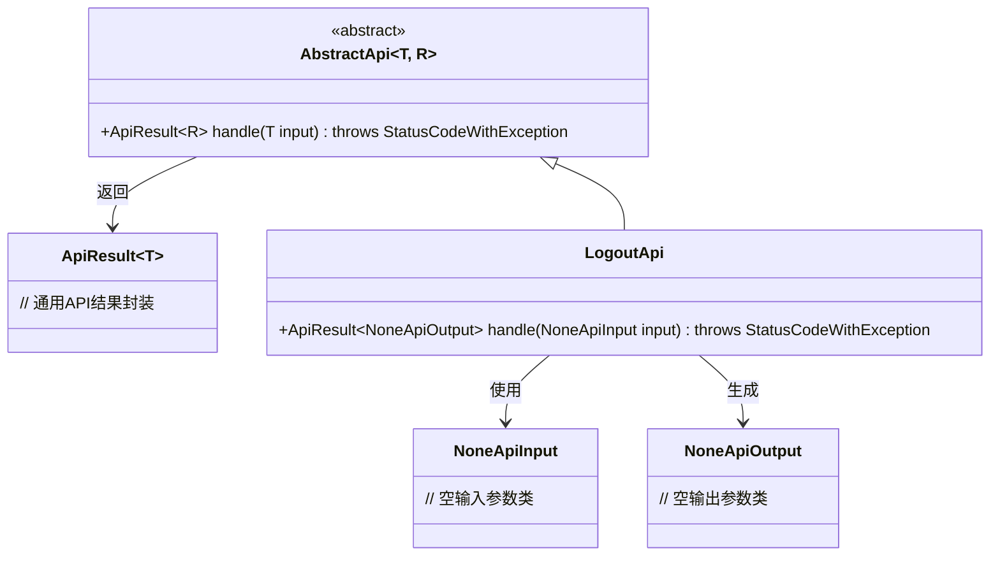
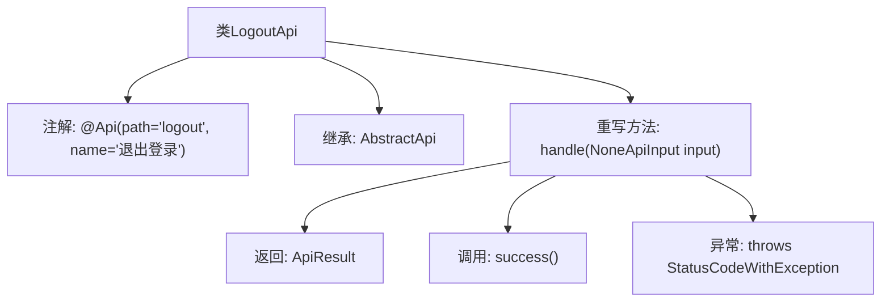

# 基础信息

|      |      |
|------|------|
| 名称 | LogoutApi |
| 编码语言 | .java |
| 代码路径 | WeFe/common/java/common-web/src/main/java/com/welab/wefe/common/web/api/LogoutApi.java |
| 包名 | com.welab.wefe.common.web.api |
| 依赖项 | ['com.welab.wefe.common.exception.StatusCodeWithException', 'com.welab.wefe.common.web.api.base.AbstractApi', 'com.welab.wefe.common.web.api.base.Api', 'com.welab.wefe.common.web.dto.ApiResult', 'com.welab.wefe.common.web.dto.NoneApiInput', 'com.welab.wefe.common.web.dto.NoneApiOutput'] |
| 概述说明 | 这是一个退出登录的API类，继承自AbstractApi，处理无输入输出的请求，成功时返回空结果。 |

# 说明

这段内容描述了一个名为LogoutApi的Java类，用于处理用户退出登录的API请求。该类继承自AbstractApi基类，泛型参数指定输入为NoneApiInput、输出为NoneApiOutput。通过@Api注解定义了API路径为"logout"、名称为"退出登录"。核心方法handle接收NoneApiInput参数并返回ApiResult封装的结果，处理逻辑为空操作直接返回成功状态。整个类结构表明这是一个无参数、无返回值的简单退出登录接口实现。

# 类列表 Class Summary

| 名称   | 类型  | 说明 |
|-------|------|-------------|
| LogoutApi | class | 这是一个退出登录的API类，继承自AbstractApi，处理无输入输出的请求，成功时返回空结果。 |

## 类 LogoutApi

|      |      |
|------|------|
| 访问范围 | @Api(path = "logout", name = "退出登录");public |
| 类型 | class |
| 名称 | LogoutApi |
| 说明 | 这是一个退出登录的API类，继承自AbstractApi，处理无输入输出的请求，成功时返回空结果。 |

### UML类图

类图描述：该代码展示了一个退出登录API的实现结构。LogoutApi继承自泛型抽象类AbstractApi，指定NoneApiInput作为输入类型，NoneApiOutput作为输出类型。类图中包含核心的抽象API基类、空参数类、结果封装类及其继承关系，体现了模板方法模式的应用，通过泛型实现了输入输出类型的灵活定义。

### 内部方法调用关系图

这段代码描述了一个名为LogoutApi的类，用于处理用户退出登录的API请求。该类继承自AbstractApi基类，并重写了handle方法，该方法接收NoneApiInput类型的输入参数，返回ApiResult<NoneApiOutput>类型的结果。在handle方法内部调用了success()方法返回成功状态，同时声明可能抛出StatusCodeWithException异常。类上标注了@Api注解，指定了API路径为"logout"，名称为"退出登录"。

### 字段列表 Field List

| 名称  | 类型  | 说明 |
|-------|-------|------|

### 方法列表

| 名称  | 类型  | 说明 |
|-------|-------|------|
| handle | ApiResult<NoneApiOutput> | 这是一个Java方法，重写父类方法，处理无输入参数请求，返回成功结果，无输出数据。 |

