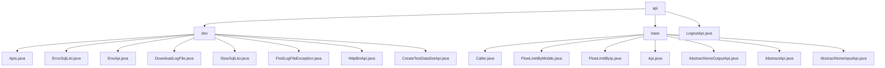

# 基础信息

|      |      |
|------|------|
| 名称 | api |
| 编码语言 | .java |
| 代码路径 | WeFe/common/java/common-web/src/main/java/com/welab/wefe/common/web/api |
| 包名 | docs.common.java.common-web.src.main.java.com.welab.wefe.common.web.api |
| 概述说明 | 开发辅助API模块提供监控、日志和测试数据生成功能，基于AbstractApi基类。Web API框架支持身份识别、限流和请求处理，使用Api注解和抽象类简化开发。LogoutApi处理无参退出登录请求。 |

# 说明

## 概述  
该模块是Web API开发框架与辅助工具集合，核心职责包括基础请求处理（身份认证/流量控制）和开发支持功能（监控/日志）。接口规范统一继承AbstractApi体系（如AbstractNoneInputApi），使用@Api定义元数据，响应均为ApiResult封装结构。关键数据结构涵盖监控实体（ErrorSql）、权限标识（Caller枚举）和空参占位符（NoneApiInput）。外部依赖涉及Spring框架、CommonConfig配置服务和并发工具类。例如LogoutApi实现无状态退出，EnvApi提供环境变量查询。

## 主要业务场景  
适用于多角色系统开发和调试场景，类似运维中控台模式。基础框架处理三类需求：身份区分（如Caller.Board标记管理端）、流量控制（如@FlowLimitByMobile限流）和请求管道（如签名验证）。开发辅助功能包括SQL监控（ErrorSqlList）、日志检索（FindLogFileException）和测试数据生成（CreateTestDataSetApi）。典型交互含无参查询（系统时间）和参数操作（删除记录），例如HttpBinApi可组合构建调试工具链。

### 包内部结构视图

该流程图展示了WeFe项目中common-web模块下的API结构，分为dev、base两个主要子目录和LogoutApi.java独立文件。dev目录包含9个开发相关API类，base目录包含7个基础API类和抽象类，整体呈现清晰的层级关系。

# 文件列表

| 名称   | 类型  | 说明 |
|-------|------|-------------|
| [LogoutApi.java](LogoutApi.md) | file | 这是一个退出登录的API类，继承自AbstractApi，处理无输入输出的请求，成功时返回空结果。 |
| [base](base/_module.md) | package | Caller枚举定义三种调用者身份。FlowLimitByMobile和FlowLimitByIp注解分别限制移动端和IP访问频率。Api注解标记接口类并配置访问控制。AbstractApi抽象类提供API通用框架，其子类AbstractNoneOutputApi和AbstractNoneInputApi分别处理无输出和无输入的API请求。 |
| [dev](dev/_module.md) | package | Apis类获取API列表，支持json、markdown或html格式。ErrorSqlList返回错误SQL列表。EnvApi提供系统环境信息。DownloadLogFile处理日志下载。SlowSqlList返回慢SQL列表。FindLogFileException搜索日志异常。HttpBinApi查看HTTP请求信息。CreateTestDataSetApi生成测试数据集。 |

