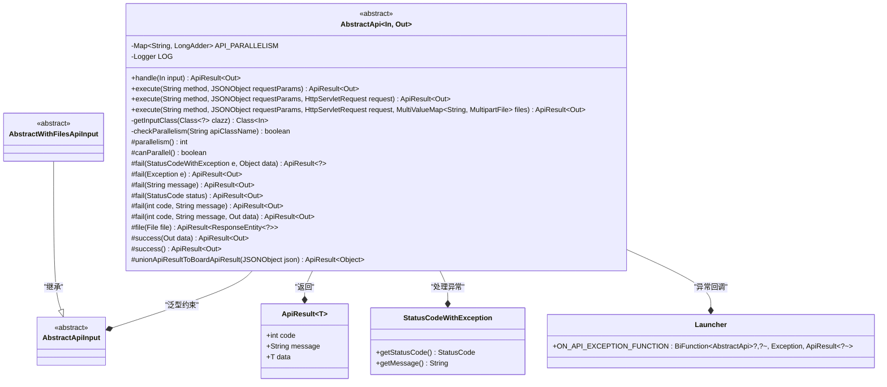
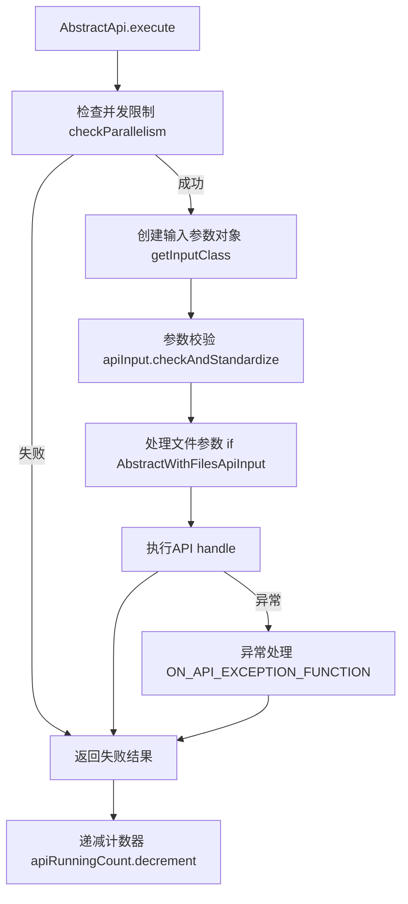
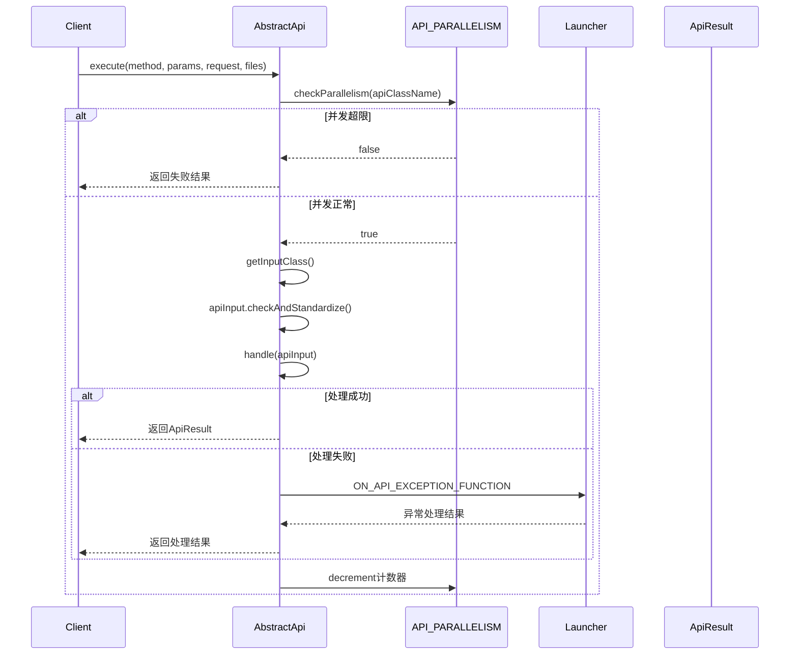

# 基础信息

|      |      |
|------|------|
| 名称 | AbstractApi |
| 编码语言 | .java |
| 代码路径 | WeFe/common/java/common-web/src/main/java/com/welab/wefe/common/web/api/base/AbstractApi.java |
| 包名 | com.welab.wefe.common.web.api.base |
| 依赖项 | ['com.alibaba.fastjson.JSONObject', 'com.welab.wefe.common.StatusCode', 'com.welab.wefe.common.exception.StatusCodeWithException', 'com.welab.wefe.common.util.enums.ContentType', 'com.welab.wefe.common.web.Launcher', 'com.welab.wefe.common.web.dto.AbstractApiInput', 'com.welab.wefe.common.web.dto.AbstractWithFilesApiInput', 'com.welab.wefe.common.web.dto.ApiResult', 'org.slf4j.Logger', 'org.slf4j.LoggerFactory', 'org.springframework.core.io.FileSystemResource', 'org.springframework.http.HttpHeaders', 'org.springframework.http.MediaType', 'org.springframework.http.ResponseEntity', 'org.springframework.util.MultiValueMap', 'org.springframework.web.multipart.MultipartFile', 'javax.servlet.http.HttpServletRequest', 'java.io.File', 'java.lang.reflect.ParameterizedType', 'java.lang.reflect.Type', 'java.util.Map', 'java.util.concurrent.ConcurrentHashMap', 'java.util.concurrent.atomic.LongAdder'] |
| 概述说明 | 抽象API基类，支持并发控制、参数校验、异常处理和文件上传，提供统一执行入口和结果封装。 |

# 说明

AbstractApi是一个抽象泛型类，定义了API执行的通用框架。它使用ConcurrentHashMap跟踪各API的并发量，通过checkParallelism方法进行并发控制。核心方法execute处理请求流程：包括参数转换、校验、文件处理，并调用子类实现的handle方法。提供丰富的错误处理机制，支持自定义异常代理（ON_API_EXCEPTION_FUNCTION）。包含多种结果封装方法（success/fail/file），支持文件下载响应。通过泛型反射获取输入参数类型，允许子类重写parallelism和canParallel方法调整并发策略。整个类实现了API从请求到响应的完整生命周期管理。

# 类列表 Class Summary

| 名称   | 类型  | 说明 |
|-------|------|-------------|
| AbstractApi | class | 抽象类AbstractApi实现API基础框架，含并发控制、参数校验、异常处理和结果封装。子类需实现handle方法处理业务逻辑。支持文件上传和自定义并发限制。 |

## 类 AbstractApi

|      |      |
|------|------|
| 访问范围 | public abstract |
| 类型 | class |
| 名称 | AbstractApi |
| 说明 | 抽象类AbstractApi实现API基础框架，含并发控制、参数校验、异常处理和结果封装。子类需实现handle方法处理业务逻辑。支持文件上传和自定义并发限制。 |

### UML类图

这段代码展示了一个抽象API基类`AbstractApi`的设计，它使用泛型参数`In`和`Out`分别表示输入和输出类型。该类提供了API执行的核心框架，包括并发控制、参数校验、异常处理和结果封装等功能。通过`execute`方法处理请求，调用抽象方法`handle`实现具体业务逻辑，并使用`ApiResult`统一封装返回结果。类图中清晰地展示了与相关类（如输入参数基类、异常类和结果封装类）的关联关系，体现了良好的分层设计和扩展性。

### 内部方法调用关系图

这段代码实现了一个抽象API基类，主要功能包括并发控制、参数校验、业务处理和异常捕获。流程图展示了核心执行流程：先检查并发限制，然后创建和校验输入参数，执行业务逻辑，最后处理结果或异常。时序图详细描述了客户端调用API时，与并发控制、参数处理和异常委托之间的交互过程。该设计支持文件上传、参数标准化和自定义异常处理等扩展功能。

### 字段列表 Field List

| 名称  | 类型  | 说明 |
|-------|-------|------|
| API_PARALLELISM = new ConcurrentHashMap<>() | Map<String, LongAdder> | 定义线程安全的并发映射API_PARALLELISM，键为字符串，值为LongAdder计数器。 |
| LOG = LoggerFactory.getLogger(this.getClass()) | Logger | 类中定义了一个受保护的final日志记录器实例，用于记录当前类的日志信息。 |

### 方法列表

| 名称  | 类型  | 说明 |
|-------|-------|------|
| fail | ApiResult<?> | 该方法用于构建失败API响应，包含状态码、错误信息和可选数据。返回的ApiResult对象封装了这些信息。 |
| execute | ApiResult<Out> | 公开方法execute接收方法名、JSON参数和HTTP请求，返回ApiResult<Out>，内部调用同名方法并传入空值作为第四参数。 |
| execute | ApiResult<Out> | 方法执行API请求，检查并发限制，处理输入参数和文件，调用业务逻辑并返回结果，异常时记录日志并返回错误信息，最后减少并发计数。 |
| fail | ApiResult<Out> | 方法`fail`返回`ApiResult<Out>`，捕获异常并返回错误码-1及异常类名和消息。 |
| fail | ApiResult<Out> | 方法返回错误结果，默认状态码-1，附带消息，无数据。 |
| checkParallelism | boolean | 同步方法检查API类并行性：若无记录则初始化计数器，允许并行时检查是否未超限，否则确保并发量不超过1。 |
| unionApiResultToBoardApiResult | ApiResult<Object> | 将JSON对象转换为ApiResult对象，包含code、message和data字段。 |
| fail | ApiResult<Out> | Java方法：返回包含状态码和消息的失败ApiResult对象，无数据。 |
| execute | ApiResult<Out> | 公开方法execute接收方法名和JSON参数，返回ApiResult<Out>，内部调用同名四参方法。 |
| file | ApiResult<ResponseEntity<?>> | 方法检查文件是否存在，不存在则抛出异常。设置HTTP头信息后返回文件资源响应，包含缓存控制、下载属性等。返回结果封装在ApiResult中。 |
| getInputClass | Class<In> | 获取输入类的方法：遍历父类直至找到泛型参数为AbstractApiInput子类的类型，否则递归查找父类。 |
| fail | ApiResult<Out> | 该方法用于构建失败响应，接收错误码、消息和数据，返回封装后的ApiResult对象。 |
| success | ApiResult<Out> | 定义一个返回空数据的成功ApiResult方法。 |
| success | ApiResult<Out> | 定义一个返回成功API结果的方法，封装数据到ApiResult对象并返回。 |
| parallelism | int | 该方法返回并行度，默认值为最大整数值。 |
| canParallel | boolean | 方法canParallel返回布尔值true，表示支持并行处理。 |
| fail | ApiResult<Out> | Java方法：返回失败ApiResult，含错误码和消息，无数据。 |
| handle | ApiResult<Out> | 抽象方法，处理输入并返回ApiResult<Out>，可能抛出异常。 |

