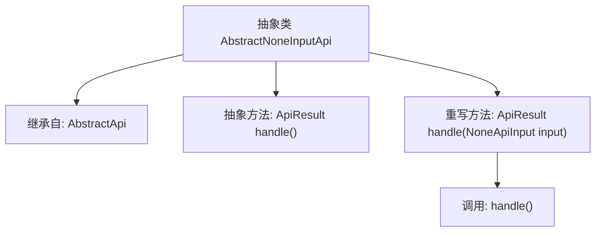

# 基础信息

|      |      |
|------|------|
| 名称 | AbstractNoneInputApi |
| 编码语言 | .java |
| 代码路径 | WeFe/common/java/common-web/src/main/java/com/welab/wefe/common/web/api/base/AbstractNoneInputApi.java |
| 包名 | com.welab.wefe.common.web.api.base |
| 依赖项 | ['com.welab.wefe.common.exception.StatusCodeWithException', 'com.welab.wefe.common.web.dto.ApiResult', 'com.welab.wefe.common.web.dto.NoneApiInput'] |
| 概述说明 | 抽象类AbstractNoneInputApi继承AbstractApi，定义无输入参数的API处理接口，通过handle方法返回结果，可能抛出StatusCodeWithException异常。 |

# 说明

这是一个名为AbstractNoneInputApi的抽象类，继承自AbstractApi类。它使用泛型类型Out作为输出类型，输入类型固定为NoneApiInput。该类定义了一个抽象方法handle，该方法不接收参数，返回ApiResult<Out>类型结果，可能抛出StatusCodeWithException异常。同时重写了父类的handle方法，使其忽略输入参数，直接调用无参的handle方法。这个类主要用于处理不需要输入参数的API请求场景。

# 类列表 Class Summary

| 名称   | 类型  | 说明 |
|-------|------|-------------|
| AbstractNoneInputApi | class | 抽象类AbstractNoneInputApi继承AbstractApi，定义无输入参数的API处理逻辑，通过handle方法返回结果，可能抛出StatusCodeWithException异常。 |


## 类 AbstractNoneInputApi

|      |      |
|------|------|
| 访问范围 | public abstract |
| 类型 | class |
| 名称 | AbstractNoneInputApi |
| 说明 | 抽象类AbstractNoneInputApi继承AbstractApi，定义无输入参数的API处理逻辑，通过handle方法返回结果，可能抛出StatusCodeWithException异常。 |


### UML类图

```mermaid
classDiagram
    class AbstractApi~T, R~ {
        <<abstract>>
        +ApiResult~R~ handle(T input) throws StatusCodeWithException
    }
    
    class AbstractNoneInputApi~Out~ {
        <<abstract>>
        ~NoneApiInput~
        ~Out~
        +ApiResult~Out~ handle() throws StatusCodeWithException
        +ApiResult~Out~ handle(NoneApiInput input) throws StatusCodeWithException
    }
    
    AbstractNoneInputApi --|> AbstractApi : 继承
    // AbstractNoneInputApi 是 AbstractApi 的具体实现，专用于无输入参数的API调用
    // 通过泛型参数Out指定输出类型，NoneApiInput作为固定输入类型占位符
```

这段代码展示了一个抽象类`AbstractNoneInputApi`，它继承自泛型类`AbstractApi`，专门用于处理无输入参数的API调用场景。该类通过`NoneApiInput`作为输入类型占位符，并定义了一个无参数的`handle()`抽象方法，同时重写了父类的带参`handle`方法。类图清晰地体现了泛型参数传递（Out继承自父类的R）和模板方法模式的应用，其中具体业务逻辑由子类实现的无参`handle()`方法决定。


### 内部方法调用关系图



这段代码展示了一个泛型抽象类`AbstractNoneInputApi<Out>`，它继承自`AbstractApi<NoneApiInput, Out>`。核心功能是提供无输入参数的API处理框架，包含一个必须由子类实现的抽象方法`handle()`，以及重写了父类的`handle(NoneApiInput input)`方法。重写方法会忽略输入参数直接调用无参的`handle()`方法，实现了输入参数的自动屏蔽处理，适用于不需要输入参数的API场景。

### 字段列表 Field List

| 名称  | 类型  | 说明 |
|-------|-------|------|

### 方法列表

| 名称  | 类型  | 说明 |
|-------|-------|------|
| handle | ApiResult<Out> | 这是一个Java方法重写，处理无输入参数的API请求，返回封装结果或抛出异常。 |
| handle | ApiResult<Out> | 抽象方法handle返回ApiResult<Out>，可能抛出StatusCodeWithException异常。 |


