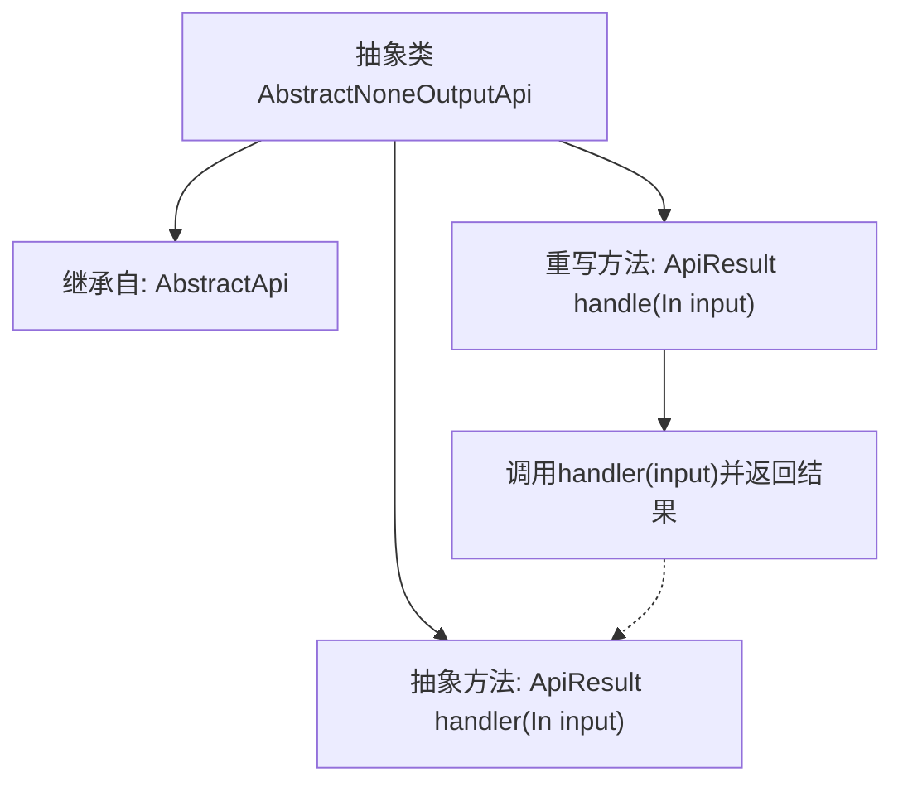

# 基础信息

|      |      |
|------|------|
| 名称 | AbstractNoneOutputApi |
| 编码语言 | .java |
| 代码路径 | WeFe/common/java/common-web/src/main/java/com/welab/wefe/common/web/api/base/AbstractNoneOutputApi.java |
| 包名 | com.welab.wefe.common.web.api.base |
| 依赖项 | ['com.welab.wefe.common.web.dto.AbstractApiInput', 'com.welab.wefe.common.web.dto.ApiResult', 'com.welab.wefe.common.web.dto.NoneApiOutput'] |
| 概述说明 | 抽象类AbstractNoneOutputApi继承AbstractApi，定义无输出API模板，要求子类实现handler方法处理输入并返回结果，覆盖父类handle方法直接调用handler。 |

# 说明

这是一个名为AbstractNoneOutputApi的抽象类，继承自AbstractApi类。它使用了泛型，限定输入类型In必须继承自AbstractApiInput，输出类型固定为NoneApiOutput。类中包含一个受保护的抽象方法handler，需要子类实现，该方法接收输入参数并返回ApiResult。重写了父类的handle方法，直接调用handler方法处理输入。整个类设计用于处理无输出结果的API请求。

# 类列表 Class Summary

| 名称   | 类型  | 说明 |
|-------|------|-------------|
| AbstractNoneOutputApi | class | 抽象类AbstractNoneOutputApi定义无输出API模板，泛型输入需继承AbstractApiInput。重写handle方法调用抽象方法handler处理输入并返回ApiResult，不返回具体输出。 |


## 类 AbstractNoneOutputApi

|      |      |
|------|------|
| 访问范围 | public abstract |
| 类型 | class |
| 名称 | AbstractNoneOutputApi |
| 说明 | 抽象类AbstractNoneOutputApi定义无输出API模板，泛型输入需继承AbstractApiInput。重写handle方法调用抽象方法handler处理输入并返回ApiResult，不返回具体输出。 |


### UML类图

```mermaid
classDiagram
    class AbstractApi~In, Out~ {
        <<abstract>>
        +handle(In input) ApiResult~Out~
    }
    // AbstractApi是基础抽象类，定义泛型处理接口

    class AbstractNoneOutputApi~In~ {
        <<abstract>>
        -handler(In input) ApiResult
        +handle(In input) ApiResult~NoneApiOutput~
    }
    // 继承自AbstractApi并固定输出类型为NoneApiOutput

    class NoneApiOutput {
        // 标记性空输出类
    }

    AbstractApi <|-- AbstractNoneOutputApi
    // 实现泛型参数特化继承

    AbstractNoneOutputApi ..> NoneApiOutput : 固定使用
    // 限定输出类型依赖关系
```

这段代码展示了一个处理无输出API请求的抽象类结构。AbstractNoneOutputApi继承自泛型基类AbstractApi，通过固定输出类型为NoneApiOutput实现特化，同时保留输入类型的泛化能力。核心设计在于将实际处理逻辑委托给子类实现的handler方法，而统一处理结果包装逻辑，体现了模板方法模式的思想。类图中清晰呈现了泛型参数特化、抽象方法继承和固定类型依赖三种关键关系。


### 内部方法调用关系图



这段代码展示了一个抽象类`AbstractNoneOutputApi`的设计结构，该类继承自泛型基类`AbstractApi`并指定了无输出的`NoneApiOutput`类型。核心包含一个需要子类实现的抽象方法`handler()`，以及重写父类的`handle()`方法直接将调用委托给`handler()`。流程图清晰地反映了类继承关系、方法重写逻辑和内部调用链，体现了模板方法模式的设计思想，其中父类定义处理框架而子类实现具体逻辑。

### 字段列表 Field List

| 名称  | 类型  | 说明 |
|-------|-------|------|

### 方法列表

| 名称  | 类型  | 说明 |
|-------|-------|------|
| handle | ApiResult<NoneApiOutput> | 这是一个Java方法重写，处理输入并返回ApiResult对象，可能抛出异常。 |
| handler | ApiResult | 抽象方法handler，接收In类型输入，返回ApiResult，可能抛出异常。 |


