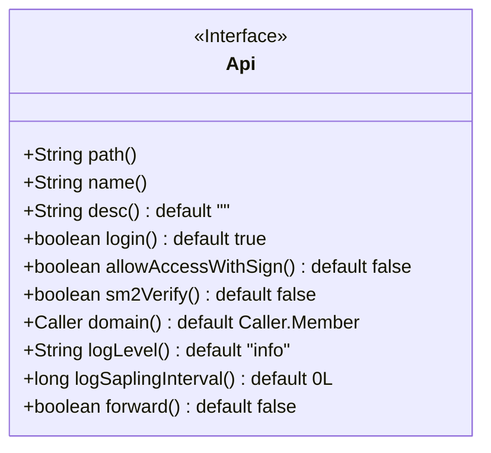

# 基础信息

|      |      |
|------|------|
| 名称 | Api |
| 编码语言 | .java |
| 代码路径 | WeFe/common/java/common-web/src/main/java/com/welab/wefe/common/web/api/base/Api.java |
| 包名 | com.welab.wefe.common.web.api.base |
| 依赖项 | ['org.springframework.stereotype.Component', 'java.lang.annotation.ElementType', 'java.lang.annotation.Retention', 'java.lang.annotation.RetentionPolicy', 'java.lang.annotation.Target'] |
| 概述说明 | 定义API接口的注解，包含路径、名称、描述、登录要求、签名访问、SM2验证、调用方、日志级别、日志采样周期和转发匹配等配置项。 |

# 说明

该代码定义了一个名为Api的Java注解，用于标记接口类。注解包含多个配置项：path表示接口路径，name为接口名称，desc为描述信息。login控制是否需要登录访问，allowAccessWithSign和sm2Verify分别控制签名访问和SM2验证。domain指定调用方，logLevel设置日志级别。logSaplingInterval定义日志采样周期以减少磁盘占用，forward控制是否转发匹配URI。各配置项大多设有默认值。

# 类列表 Class Summary

| 名称   | 类型  | 说明 |
|-------|------|-------------|
| Api | annotation | 定义API接口的注解，包含路径、名称、描述、登录要求、签名访问、SM2验证、调用方、日志级别、日志采样周期和转发匹配等配置项。 |

## 类 Api

|      |      |
|------|------|
| 访问范围 | @Retention(RetentionPolicy.RUNTIME);@Target(ElementType.TYPE);@Component;public |
| 类型 | annotation |
| 名称 | Api |
| 说明 | 定义API接口的注解，包含路径、名称、描述、登录要求、签名访问、SM2验证、调用方、日志级别、日志采样周期和转发匹配等配置项。 |

### UML类图

该代码定义了一个名为`Api`的注解接口，用于标记和配置API接口的元数据。接口包含多个可配置属性，如路径(path)、名称(name)、描述(desc)、登录要求(login)、签名访问控制(allowAccessWithSign)、SM2验证(sm2Verify)、调用方(domain)、日志级别(logLevel)、日志采样间隔(logSaplingInterval)和转发匹配(forward)等。这些属性提供了灵活的API行为控制，包括安全验证、日志管理和请求转发等功能。注解通过`@Retention(RetentionPolicy.RUNTIME)`确保在运行时可用，`@Target(ElementType.TYPE)`限定其只能用于类或接口声明。

### 内部方法调用关系图

```mermaid
graph TD
    A["注解@interface Api"]
    B["元注解: @Retention(RetentionPolicy.RUNTIME)"]
    C["元注解: @Target(ElementType.TYPE)"]
    D["元注解: @Component"]
    E["属性: String path()"]
    F["属性: String name()"]
    G["属性: String desc() default ''"]
    H["属性: boolean login() default true"]
    I["属性: boolean allowAccessWithSign() default false"]
    J["属性: boolean sm2Verify() default false"]
    K["属性: Caller domain() default Caller.Member"]
    L["属性: String logLevel() default 'info'"]
    M["属性: long logSaplingInterval() default 0L"]
    N["属性: boolean forward() default false"]

    A --> B
    A --> C
    A --> D
    A --> E
    A --> F
    A --> G
    A --> H
    A --> I
    A --> J
    A --> K
    A --> L
    A --> M
    A --> N
```

该流程图展示了自定义注解`@Api`的结构，包含3个元注解和10个可配置属性。元注解定义其运行时保留策略（RUNTIME）、目标类型（TYPE）和组件标识。属性涵盖接口路径、名称、描述等基础配置，以及登录控制、签名访问、SM2验证等安全设置，还包括日志级别、采样间隔等运维参数，最后是请求转发标志。所有属性均提供默认值，形成一个灵活的接口定义规范。

### 字段列表 Field List

| 名称  | 类型  | 说明 |
|-------|-------|------|
| domain | Caller | 调用方默认域为Caller.Member。 |
| logLevel | String | 定义日志级别默认值为"info"。 |
| sm2Verify | boolean | SM2验证默认关闭。 |
| logSaplingInterval | long | 长整型日志采样间隔，默认值为0。 |
| login | boolean | 登录功能默认启用。 |
| desc | String | 方法desc默认返回空字符串。 |
| allowAccessWithSign | boolean | 允许通过签名控制访问权限，默认关闭。 |
| path | String | 获取路径字符串的方法。 |
| name | String | 获取名称字符串的方法。 |
| forward | boolean | 布尔类型参数forward，默认值为false。 |

### 方法列表

| 名称  | 类型  | 说明 |
|-------|-------|------|

