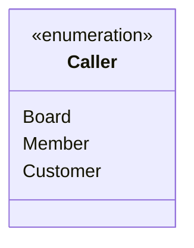
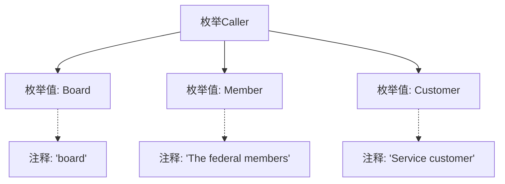

# 基础信息

|      |      |
|------|------|
| 名称 | Caller |
| 编码语言 | .java |
| 代码路径 | WeFe/common/java/common-web/src/main/java/com/welab/wefe/common/web/api/base/Caller.java |
| 包名 | com.welab.wefe.common.web.api.base |
| 依赖项 | [] |
| 概述说明 | 枚举Caller定义三种调用者类型：Board（董事会）、Member（联邦成员）、Customer（服务客户）。 |

# 说明

这是一个名为Caller的公共枚举类型，定义了三种不同的调用者身份。第一种是Board，表示董事会身份；第二种是Member，表示联邦成员身份；第三种是Customer，表示服务客户身份。每种身份都通过注释进行了简要说明，清晰地表明了各自代表的角色类型。该枚举结构简洁明了，适用于需要区分不同调用者类型的场景。

# 类列表 Class Summary

| 名称   | 类型  | 说明 |
|-------|------|-------------|
| Caller | enum | 枚举Caller定义三种调用者类型：Board（董事会）、Member（联邦成员）、Customer（服务客户）。 |

## 类 Caller

|      |      |
|------|------|
| 访问范围 | public |
| 类型 | enum |
| 名称 | Caller |
| 说明 | 枚举Caller定义三种调用者类型：Board（董事会）、Member（联邦成员）、Customer（服务客户）。 |

### UML类图

这段代码定义了一个名为Caller的枚举类型，包含三个枚举常量：Board（董事会）、Member（联邦成员）和Customer（服务客户）。枚举用于表示固定的调用方类型，每个常量通过注释说明了其代表的角色。该设计适用于需要明确区分不同调用方来源的场景，如权限控制或日志记录。

### 内部方法调用关系图

该流程图展示了Caller枚举的结构，包含三个枚举值（Board、Member、Customer）及其对应的注释说明。Board关联注释"board"，Member关联"The federal members"，Customer关联"Service customer"。图形清晰地呈现了枚举定义与文档注释的对应关系，适用于需要快速理解该枚举业务含义的场景。

### 字段列表 Field List

| 名称  | 类型  | 说明 |
|-------|-------|------|

### 方法列表

| 名称  | 类型  | 说明 |
|-------|-------|------|

