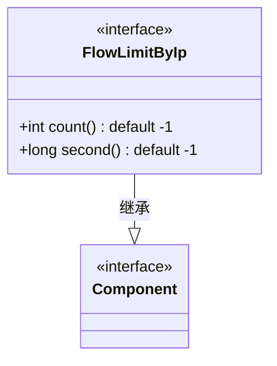
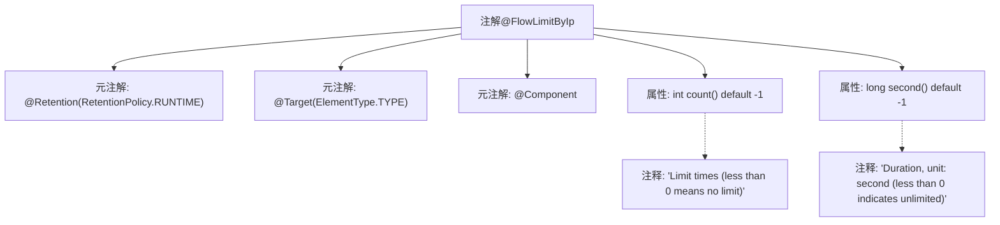

# 基础信息

|      |      |
|------|------|
| 名称 | FlowLimitByIp |
| 编码语言 | .java |
| 代码路径 | WeFe/common/java/common-web/src/main/java/com/welab/wefe/common/web/api/base/FlowLimitByIp.java |
| 包名 | com.welab.wefe.common.web.api.base |
| 依赖项 | ['org.springframework.stereotype.Component', 'java.lang.annotation.ElementType', 'java.lang.annotation.Retention', 'java.lang.annotation.RetentionPolicy', 'java.lang.annotation.Target'] |
| 概述说明 | 自定义注解FlowLimitByIp用于IP限流，可设置次数（默认不限）和时间（秒，默认不限），运行时保留，作用于类。 |

# 说明

这是一个名为FlowLimitByIp的Java注解，用于基于IP地址进行流量限制控制。注解保留策略为运行时（RUNTIME），目标对象为类（TYPE），同时标记为Spring组件（@Component）。它包含两个可配置参数：count表示限制次数（默认值-1表示无限制），second表示限制时间窗口（单位为秒，默认值-1表示无限制）。该注解适用于需要对类级别进行IP访问频率控制的场景。

# 类列表 Class Summary

| 名称   | 类型  | 说明 |
|-------|------|-------------|
| FlowLimitByIp | annotation | 自定义注解FlowLimitByIp用于IP限流，设置次数(count)和时间(second)，默认无限制(-1)。运行时生效，作用于类。 |

## 类 FlowLimitByIp

|      |      |
|------|------|
| 访问范围 | @Retention(RetentionPolicy.RUNTIME);@Target(ElementType.TYPE);@Component;public |
| 类型 | annotation |
| 名称 | FlowLimitByIp |
| 说明 | 自定义注解FlowLimitByIp用于IP限流，设置次数(count)和时间(second)，默认无限制(-1)。运行时生效，作用于类。 |

### UML类图

这段代码定义了一个名为`FlowLimitByIp`的注解接口，用于基于IP地址进行流量限制控制。该注解具有两个可配置参数：`count`表示限制次数（默认-1表示无限制），`second`表示时间窗口长度（单位秒，默认-1表示无限制）。注解被标记为`@Component`且保留策略为RUNTIME，可在运行时通过反射获取。类图展示了注解接口与Spring组件标记的继承关系，适用于AOP切面或拦截器实现IP限流功能。

### 内部方法调用关系图

该流程图展示了`@FlowLimitByIp`注解的结构，包含三个元注解声明（运行时保留、类级目标、Spring组件标记），两个带默认值的属性（count和second），以及对应的注释说明。注解用于实现基于IP的流量限制功能，通过count和second参数分别控制时间窗口内的最大请求次数和统计周期时长，负值表示无限制。

### 字段列表 Field List

| 名称  | 类型  | 说明 |
|-------|-------|------|
| second | long | long类型参数second默认值为-1。 |
| count | int | 默认返回-1的计数方法。 |

### 方法列表

| 名称  | 类型  | 说明 |
|-------|-------|------|

